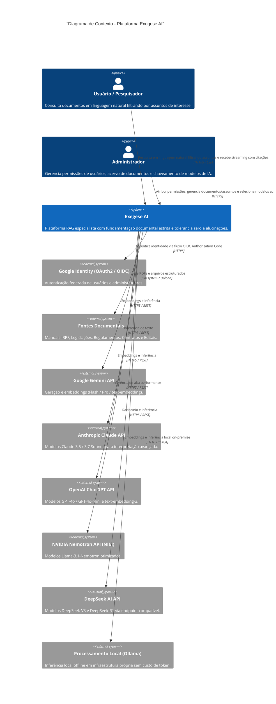

# EXEGESE AI — DEFINIÇÃO DA APLICAÇÃO, FINALIDADE E ESCOPO

**Plataforma de Inteligência Artificial para Recuperação Aumentada por Geração (RAG) Especialista & Agnóstica a Acervos Documentais**  
*Interpretação Fidedigna, Citação Canônica e Tolerância Zero a Alucinações*

---

## 1. IDENTIFICAÇÃO E CONCEITO

- **Nome Oficial da Aplicação**: **Exegese AI**
- **Identificador Técnico (Maven Artifact / Docker)**: `exegese-ai`
- **Pacote Base da Aplicação**: `br.org.rivelino.exegese_ai` (GroupId: `br.org.rivelino`)
- **Etimologia**: Do grego *exēgēsis* (ἐξήγησις) — *ex* ("para fora") + *hēgeisthai* ("conduzir/guiar") —, que significa a interpretação minuciosa, crítica e objetiva para extrair o sentido genuíno de um texto, sem distorções nem extrapolações.

---

## 2. FINALIDADE DA APLICAÇÃO

O **Exegese AI** é uma plataforma corporativa e institucional de **Recuperação Aumentada por Geração (RAG)** em malha fechada, projetada para responder a consultas em linguagem natural fundamentando-se **estrita e exclusivamente** em acervos documentais previamente homologados e indexados.

Diferente de assistentes generativos genéricos de mercado — que sintetizam respostas a partir de dados dispersos e opacos com elevado risco de alucinação —, o **Exegese AI** atua sob a premissa de **fidelidade documental absoluta**:
1. Cada afirmação gerada é acompanhada da sua **fonte primária** (identificador do documento, número da questão ou artigo, página e referência normativa aplicável).
2. Se a informação solicitada pelo usuário não estiver contida nos documentos autorizados, o sistema **recusa-se formalmente a especular**, informando com transparência a inexistência de subsídios documentais.
3. A pesquisa pode ser segmentada por **Assuntos Temáticos** selecionáveis pelo usuário, garantindo foco contextual e precisão semântica.

---

## 3. ESCOPO DO SISTEMA

### 3.1 Escopo Funcional (In Scope)

1. **Gestão de Acervos e Assuntos (Multi-Corpus & Multi-Topic)**:
   - Cadastramento e organização de documentos em múltiplos **Assuntos/Temas** (relação N:N, permitindo que um documento pertença a mais de um assunto).
   - O usuário pode selecionar um ou mais assuntos disponíveis na interface de pesquisa para restringir o universo de busca.
   - Suporte a manuais estruturados de perguntas e respostas (como o manual oficial do **IRPF 2026 da Receita Federal do Brasil** com 745 questões e 340 páginas), bem como legislações, normas internas, relatórios técnicos e regulamentos.

2. **Módulo de Administração e Governança**:
   - **Gestão de Usuários e Permissões (RBAC)**: Atribuição de papéis (`ROLE_ADMIN`, `ROLE_OPERATOR`, `ROLE_USER`) e permissões granulares de acesso por assunto documental.
   - **Manutenção do Banco de Documentos**: Upload de arquivos (PDF e texto), visualização de status de processamento, reindexação atômica e exclusão segura.
   - **Central de Seleção e Configuração de Modelos de IA**: Seleção dinâmica pelo administrador do modelo ativo de inferência e parametrização de temperatura e tokens máximos.

3. **Multi-Provedor de Modelos de Linguagem**:
   - O administrador pode alternar em tempo de execução entre 6 provedores homologados:
     - **Google Gemini** (Gemini 2.5 Flash / Gemini 1.5 Pro)
     - **Anthropic Claude** (Claude 3.5 Sonnet / Claude 3.7 Sonnet)
     - **OpenAI ChatGPT** (GPT-4o / GPT-4o-mini)
     - **NVIDIA Nemotron** (Llama-3.1-Nemotron via NVIDIA NIM)
     - **DeepSeek AI** (DeepSeek-V3 / DeepSeek-R1)
     - **Processamento Local (Ollama)** (Qwen 2.5, Llama 3.2, DeepSeek R1 em rede local/on-premise)
   - Gerenciamento híbrido de chaves de API: carregamento seguro via variáveis de ambiente (`.env`) ou configuração direta criptografada (AES-256) na interface administrativa.

4. **Autenticação Segura via Google (OAuth2 / OIDC)**:
   - Login federado via Google Sign-In.
   - Provisionamento automático de perfil com bootstrap do primeiro administrador através da variável `INITIAL_ADMIN_EMAIL`.

5. **Interface do Usuário Reativa com Streaming (Thymeleaf + HTMX + SSE)**:
   - Chat conversacional fluido com streaming token-a-token via *Server-Sent Events*.
   - Chips de fontes clicáveis que abrem modais com o trecho canônico e a base legal.
   - Layout institucional responsivo, acessível e compatível com modo claro e escuro.

---

### 3.2 Escopo Não-Funcional (Requisitos Técnicos)

- **Linguagem & Runtime**: Java 25 (LTS) com *Virtual Threads* (`Thread.ofVirtual()`) para chamadas de I/O de alta concorrência.
- **Framework Base**: Spring Boot 4.x / Spring Framework 7 (compatível com Jakarta EE 11 e HTTP/2).
- **Banco de Dados & Vetores**: PostgreSQL 17 com extensão `pgvector 0.8.0` e índices HNSW (768 dimensões) associados a busca textual em português (`tsvector` GIN).
- **Idempotência**: Cálculo de checksum SHA-256 de cada chunk semântico para evitar consumo redundante de embeddings.
- **Segurança & Resiliência**: Filtro contra *Prompt Injection*, sanitização de entradas Unicode, cabeçalhos de segurança OWASP e rate limiting via Bucket4j.
- **Infraestrutura**: Orquestração multi-container via `docker compose` com inicialização assistida pelo script `install.sh`.

---

### 3.3 Fora do Escopo (Out of Scope)

- Criação ou edição manual de documentos diretamente na plataforma (a plataforma é receptora e indexadora de documentos finais).
- Fornecimento de pareceres jurídicos ou fiscais conclusivos sem lastro nos documentos (o sistema é estritamente um assistente de consulta informacional).
- Treinamento do zero (*pre-training*) ou fine-tuning de pesos de modelos fundacionais (o foco é RAG com modelos pré-treinados).

---

## 4. DIAGRAMA DE CONTEXTO DO SISTEMA

O diagrama a seguir sintetiza as interações entre usuários, a plataforma Exegese AI, o provedor de identidade Google e os ecossistemas de IA integrados:

*Arquivo Mermaid independente*: [`diagrams/c4_context.mmd`](diagrams/c4_context.mmd)