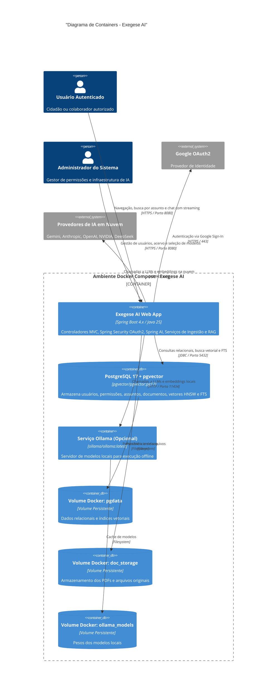
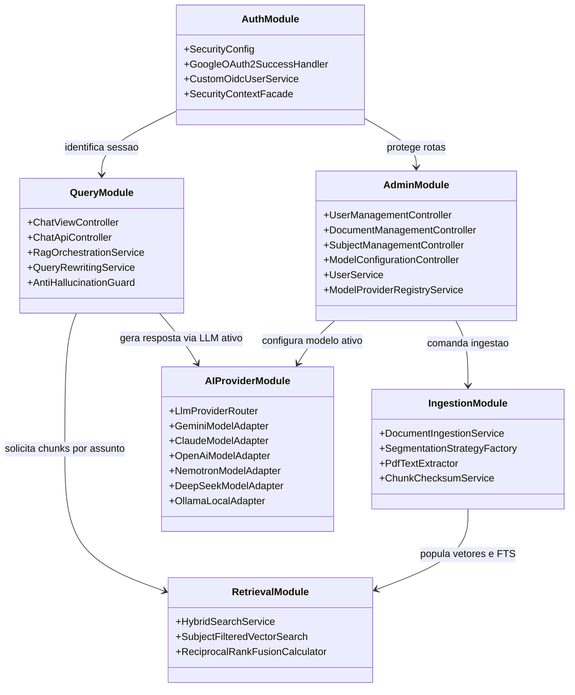
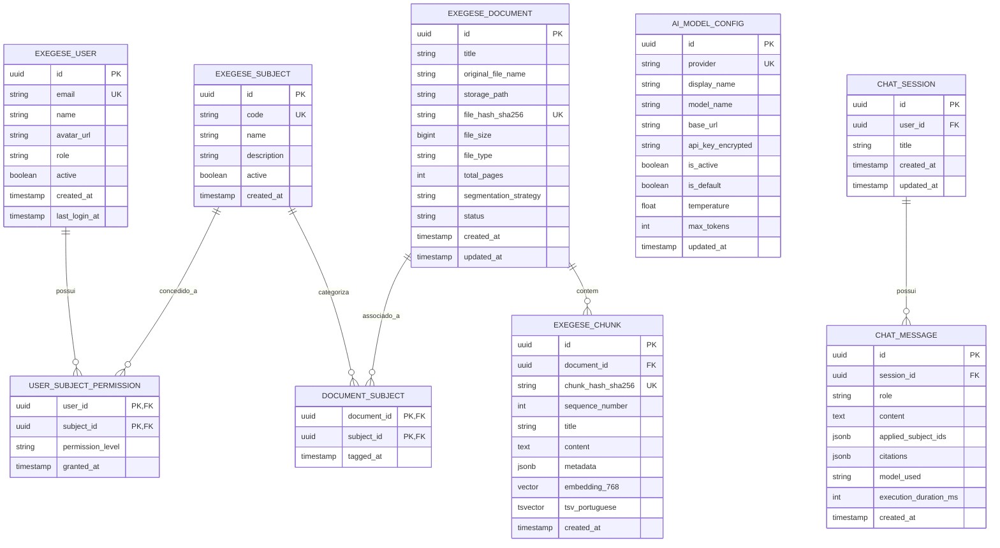
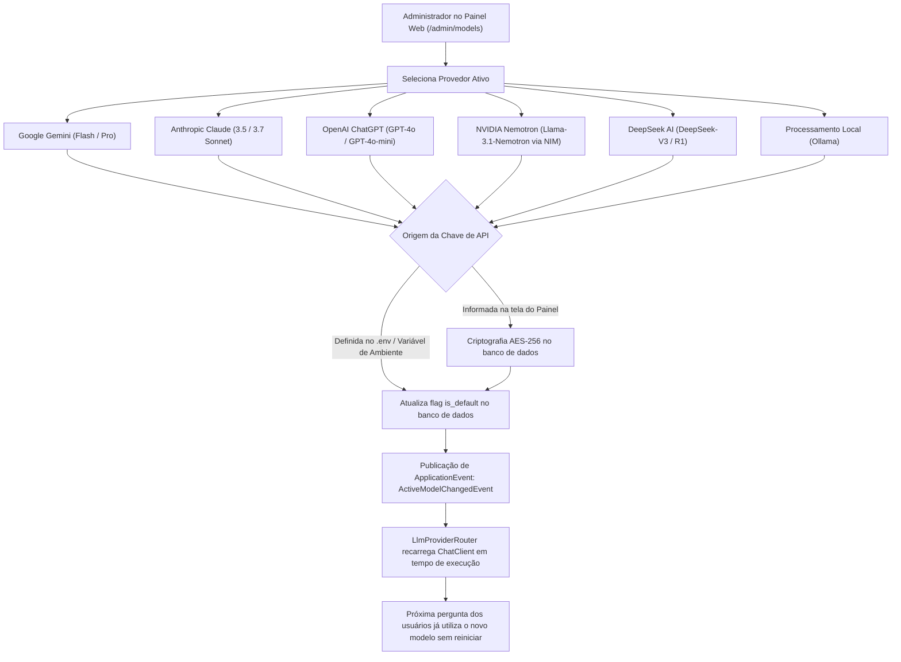
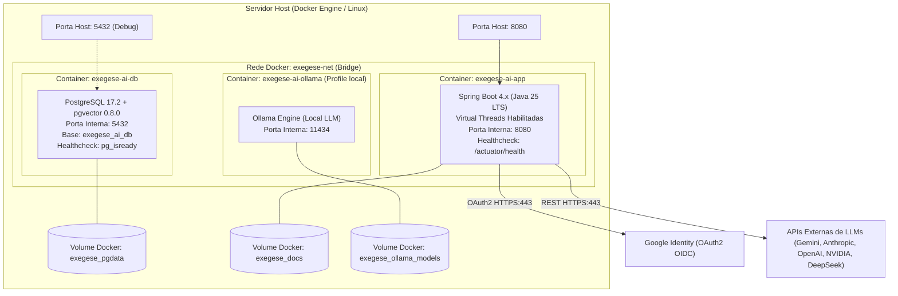

# EXEGESE AI — ARQUITETURA DETALHADA E JUSTIFICATIVAS TÉCNICAS

**Documento de Arquitetura de Software (SAD) da Plataforma Exegese AI**  
*Java 25 (LTS) | Spring Boot 4.x | Spring AI | PostgreSQL 17 + pgvector | Thymeleaf + HTMX + SSE*

---

## 1. VISÃO GERAL ARQUITETURAL

A arquitetura do **Exegese AI** foi projetada para atender a três requisitos não-negociáveis:
1. **Fidelidade e Rigor Exegético**: Todas as inferências geradas pelo LLM devem ser restritas ao contexto recuperado da base documental, com citação explícita das fontes e recusa imediata de alucinação.
2. **Independência e Multi-Provedor de IA**: O sistema não pode ser refém de uma única nuvem ou fornecedor, permitindo ao administrador alternar em tempo de execução entre **Google Gemini, Anthropic Claude, OpenAI ChatGPT, NVIDIA Nemotron, DeepSeek AI e Processamento Local (Ollama)**.
3. **Eficiência e Baixo Acoplamento**: Construção sobre a plataforma Java moderna com Virtual Threads (Loom), renderização reativa server-side (sem a sobrecarga de SPAs pesadas) e banco de dados único combinando metadados relacionais, vetores HNSW e busca léxica em português.

---

## 2. JUSTIFICATIVAS TÉCNICAS DE CADA COMPONENTE

### 2.1 Runtime: Java 25 (LTS)
- **Virtual Threads (Project Loom)**: Em uma aplicação RAG, a maioria das operações é intensiva em I/O (consultas de banco de dados, requisições HTTP para endpoints de embedding e chamadas de streaming para LLMs). As Virtual Threads (`java.lang.Thread.ofVirtual()`) eliminam a necessidade de programação reativa excessivamente verbosa ou piscinas restritas de threads de SO, escalando milhares de conexões simultâneas com pegada de memória desprezível.
- **Records & Pattern Matching**: Utilizados para modelar DTOs imutáveis (`ChatRequestDTO`, `CitationDTO`, `QuestionChunk`) e despachar eventos de forma concisa e segura através de `switch` com pattern matching exhaustivo.
- **ZGC Geracional**: Garante tempos de pausa de Garbage Collection na casa dos microssegundos mesmo sob ingestão massiva de documentos grandes em memória.

### 2.2 Framework Base: Spring Boot 4.x / Spring Framework 7
- **Injeção de Dependências Estrita por Construtor**: Alinhamento com a diretriz mandatória de qualidade do projeto (`JAVA_CONSTRUCTOR_PARAMETER_INJECTION`). Campos declarados como `private final`, garantindo imutabilidade e testabilidade trivial com Mockito.
- **Adoção do Jakarta EE 11**: Compatibilidade nativa com Servlets 6.1 e Tomcat 11 embarcado, oferecendo suporte robusto a HTTP/2 e streaming de alta taxa.
- **Spring Boot Actuator & Micrometer**: Telemetria out-of-the-box para monitoramento de latência de busca vetorial, tempo de geração de tokens e contagem de recusas por anti-alucinação.

### 2.3 Framework de RAG: Spring AI 1.0.x
- **Abstração Fluente de Primeira Classe**: O `ChatClient` do Spring AI unifica a comunicação com múltiplos provedores via API declarativa.
- **Advisors Interceptores**: Permite plugar de forma limpa componentes de memória de conversa (`MessageChatMemoryAdvisor`), reescrita de perguntas e injeção contextual de grounding (`QuestionAnswerAdvisor`).
- **Eliminação de Dependências Externas (Python/Bridges)**: Evita a introdução de microsserviços intermediários em Python (como LangChain ou LlamaIndex), mantendo toda a lógica de negócio compilada em um fat-jar único de alta performance.

### 2.4 Armazenamento e Recuperação: PostgreSQL 17 + pgvector 0.8.0
A opção pelo PostgreSQL com `pgvector` em detrimento de bancos vetoriais dedicados (como Qdrant, Milvus, Chroma ou Pinecone) baseia-se em critérios de engenharia pragmáticos:
1. **Transacionalidade ACID Unificada**: Usuários, permissões de acesso, assuntos (topics), metadados de documentos e vetores de embeddings coabitam o mesmo banco. Não há risco de descompasso de dados entre o banco relacional e o índice vetorial.
2. **Busca Híbrida Nativa no Mesmo Nó**: O PostgreSQL executa tanto a similaridade de cosseno (índice HNSW) quanto a busca léxica por relevância (índice GIN sobre `tsvector` com parser em português).
3. **Filtragem Relacional Eficiente**: Permite aplicar filtros complexos de controle de acesso e de assuntos selecionados pelo usuário diretamente na cláusula `WHERE` da consulta vetorial (`WHERE collection_id IN (...) AND subject_id IN (...)`).
4. **Baixa Complexidade Operacional**: Um único container de banco de dados para gerenciar, realizar backup (`pg_dump`) e replicar.

### 2.5 Algoritmo de Busca Híbrida: Reciprocal Rank Fusion (RRF)
Perguntas técnicas e fiscais apresentam dois desafios complementares:
- **Desafio Semântico**: Usuários usam linguagem leiga ("posso descontar escola de filho de 24 anos?"), onde a busca vetorial brilha por capturar sinônimos e paráfrases.
- **Desafio Léxico/Normativo**: Usuários citam identificadores exatos ("Lei 14.754", "Dabim", "DARF 0190", "art. 733", "Cosit 354"), onde a busca vetorial pura frequentemente erra por diluir tokens numéricos e siglas.

O **Exegese AI** combina ambas as abordagens através do **Reciprocal Rank Fusion**:
$$RRF(d) = \sum_{m \in M} \frac{1}{60 + r_m(d)}$$
Onde $r_m(d)$ representa a posição do documento no ranking do método $m$ (vetorial ou textual). O documento com maior score combinado emerge como topo do ranking.

### 2.6 Multi-Provedor Dinâmico de Modelos de Linguagem
A camada `LlmProviderRouter` implementa o padrão *Strategy/Adapter*, permitindo alternar entre 6 ecossistemas:
1. **Google Gemini**: Excelente custo-benefício, tier gratuito generoso (15 RPM / 1.500 RPD no Google AI Studio), janela de contexto superior a 1 milhão de tokens e excelente compreensão do português formal.
2. **Anthropic Claude**: Líder em exegese analítica, raciocínio contextual complexo e obediência a restrições negativas de prompt.
3. **OpenAI ChatGPT**: Padrão de interoperabilidade com modelos GPT-4o e GPT-4o-mini.
4. **NVIDIA Nemotron**: Inferência de alta velocidade com modelos open-source otimizados no ecossistema NVIDIA NIM.
5. **DeepSeek AI**: Excelente custo por milhão de tokens e forte capacidade de raciocínio lógico (DeepSeek-R1 e V3).
6. **Processamento Local (Ollama)**: Soberania total de dados, custo zero de tráfego e conformidade estrita com LGPD para documentos sigilosos, rodando on-premise com modelos como Qwen 2.5 7B ou Llama 3.2.

**Gestão Híbrida de Chaves**: As chaves podem ser injetadas de forma tradicional via variáveis de ambiente no `.env` OU configuradas diretamente pelo Administrador na interface web, sendo persistidas criptografadas com **AES-256-GCM** na tabela `ai_model_config`.

### 2.7 Autenticação e Autorização: Google OAuth2 / OIDC + RBAC
- **Google Sign-In**: Elimina armazenamento e gerenciamento arriscado de senhas de usuários no banco. Integração via `spring-boot-starter-oauth2-client`.
- **RBAC (Role-Based Access Control)**:
  - `ROLE_ADMIN`: Acesso irrestrito a todos os assuntos, gestão de usuários, concessão de permissões, manutenção de documentos e troca de modelo de IA ativo.
  - `ROLE_OPERATOR`: Permissão para upload e manutenção de documentos nos assuntos autorizados.
  - `ROLE_USER`: Pesquisa e consulta em linguagem natural nos assuntos permitidos.
- **Bootstrap do Primeiro Administrador**: Configuração da variável `INITIAL_ADMIN_EMAIL` no `.env`. Quando o usuário correspondente realizar o primeiro login via Google, o sistema automaticamente lhe confere a credencial `ROLE_ADMIN`.

### 2.8 Interface do Usuário: Thymeleaf + HTMX + Server-Sent Events (SSE)
- **Simplicidade Operacional**: Elimina a necessidade de manter um pipeline separado em Node.js / React / Angular. O binário da aplicação entrega o HTML já renderizado no servidor.
- **Reatividade sem SPA**: O **HTMX** permite substituições parciais de elementos do DOM sem recarregamento da página.
- **Streaming Fluido de Respostas**: O endpoint de chat emite eventos `text/event-stream` (SSE), permitindo que o usuário veja a resposta ser digitada token-a-token em tempo real.
- **Chips Interativos de Citação**: Cada citação é um componente clicável que abre um modal ou popover detalhando o trecho oficial original do documento, eliminando qualquer dúvida sobre a autenticidade da resposta.

---

## 3. DIAGRAMAS ARQUITETURAIS DETALHADOS

### 3.1 Diagrama de Containers Docker

*Arquivo Mermaid independente*: [`diagrams/c4_container.mmd`](diagrams/c4_container.mmd)

---

### 3.2 Diagrama de Componentes Internos do Backend

*Arquivo Mermaid independente*: [`diagrams/c4_components.mmd`](diagrams/c4_components.mmd)

---

### 3.3 Diagrama Entidade-Relacionamento (ERD)

*Arquivo Mermaid independente*: [`diagrams/erd_datamodel.mmd`](diagrams/erd_datamodel.mmd)

---

### 3.4 Fluxo de Chaveamento Dinâmico de Modelos pelo Administrador

*Arquivo Mermaid independente*: [`diagrams/model_selection_flow.mmd`](diagrams/model_selection_flow.mmd)

---

### 3.5 Diagrama de Implantação e Redes

*Arquivo Mermaid independente*: [`diagrams/deployment.mmd`](diagrams/deployment.mmd)