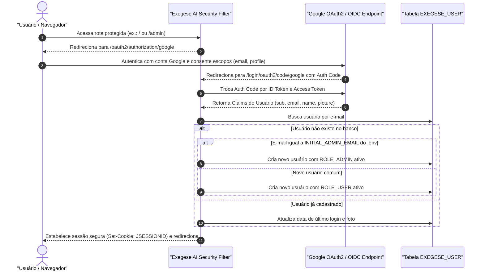
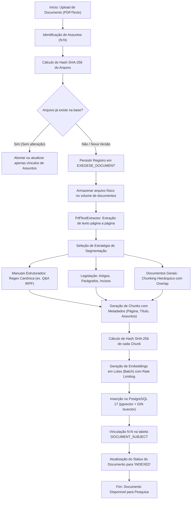
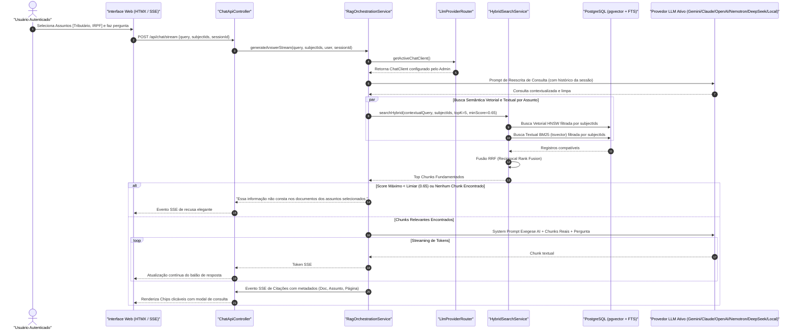

# EXEGESE AI — ESPECIFICAÇÃO TÉCNICA E FUNCIONAL DA APLICAÇÃO

**Especificação de Requisitos, Modelo de Dados, Endpoints e Regras de Negócio**  
*Pacote Base: br.org.rivelino.exegese_ai | ArtifactId: exegese-ai*

---

## 1. ESCOPO DOS MÓDULOS E REGRAS DE NEGÓCIO

A plataforma é dividida em quatro módulos integrados:
1. **Módulo de Autenticação e Segurança (Auth)**: Autenticação exclusiva via Google OAuth2 / OIDC, sincronização de usuários no banco local, atribuição de Roles e bootstrap automático de administradores.
2. **Módulo de Pesquisa e RAG (Query & Chat)**: Interface de consulta em linguagem natural com seleção múltipla de Assuntos, reescrita de perguntas com histórico, busca híbrida (pgvector + FTS) e streaming SSE.
3. **Módulo de Gestão de Documentos e Assuntos (Ingestion & Catalog)**: Cadastro de assuntos (topics), upload de arquivos, seleção N:N de assuntos por documento, pipeline de segmentação semântica e persistência vetorial idempotente.
4. **Módulo de Governança de IA (Model Management)**: Catálogo dos 6 provedores homologados, parametrização em tempo de execução e armazenamento seguro de credenciais via criptografia AES-256.

---

## 2. MODELO DE DADOS COMPLETO (POSTGRESQL 17 + PGVECTOR)

```sql
-- Habilitação das extensões necessárias
CREATE EXTENSION IF NOT EXISTS "uuid-ossp";
CREATE EXTENSION IF NOT EXISTS "vector";

-- 1. Tabela de Usuários (Sincronizada via Google OAuth2)
CREATE TABLE IF NOT EXISTS exegese_user (
    id UUID PRIMARY KEY DEFAULT uuid_generate_v4(),
    email VARCHAR(255) NOT NULL UNIQUE,
    name VARCHAR(255) NOT NULL,
    avatar_url VARCHAR(500),
    role VARCHAR(50) NOT NULL DEFAULT 'ROLE_USER', -- ROLE_ADMIN, ROLE_OPERATOR, ROLE_USER
    active BOOLEAN NOT NULL DEFAULT TRUE,
    created_at TIMESTAMP WITH TIME ZONE DEFAULT CURRENT_TIMESTAMP,
    last_login_at TIMESTAMP WITH TIME ZONE
);

-- 2. Tabela de Assuntos / Temas (Agrupamento de documentos)
CREATE TABLE IF NOT EXISTS exegese_subject (
    id UUID PRIMARY KEY DEFAULT uuid_generate_v4(),
    code VARCHAR(64) NOT NULL UNIQUE, -- e.g., 'tributario-irpf', 'trabalhista', 'contratos'
    name VARCHAR(255) NOT NULL,
    description TEXT,
    active BOOLEAN NOT NULL DEFAULT TRUE,
    created_at TIMESTAMP WITH TIME ZONE DEFAULT CURRENT_TIMESTAMP
);

-- 3. Tabela de Permissões de Usuários por Assunto (RBAC Granular)
CREATE TABLE IF NOT EXISTS user_subject_permission (
    user_id UUID NOT NULL REFERENCES exegese_user(id) ON DELETE CASCADE,
    subject_id UUID NOT NULL REFERENCES exegese_subject(id) ON DELETE CASCADE,
    permission_level VARCHAR(50) NOT NULL DEFAULT 'READ', -- READ, WRITE, MANAGE
    granted_at TIMESTAMP WITH TIME ZONE DEFAULT CURRENT_TIMESTAMP,
    PRIMARY KEY (user_id, subject_id)
);

-- 4. Tabela de Documentos
CREATE TABLE IF NOT EXISTS exegese_document (
    id UUID PRIMARY KEY DEFAULT uuid_generate_v4(),
    title VARCHAR(255) NOT NULL,
    original_file_name VARCHAR(255) NOT NULL,
    storage_path VARCHAR(500) NOT NULL,
    file_hash_sha256 VARCHAR(64) NOT NULL UNIQUE,
    file_size BIGINT NOT NULL,
    file_type VARCHAR(50) NOT NULL, -- PDF, TXT, DOCX
    total_pages INT DEFAULT 1,
    segmentation_strategy VARCHAR(50) NOT NULL DEFAULT 'STRUCTURED_QA', -- STRUCTURED_QA, LEGAL_SECTION, RECURSIVE
    status VARCHAR(50) NOT NULL DEFAULT 'UPLOADED', -- UPLOADED, PROCESSING, INDEXED, ERROR
    error_message TEXT,
    created_at TIMESTAMP WITH TIME ZONE DEFAULT CURRENT_TIMESTAMP,
    updated_at TIMESTAMP WITH TIME ZONE DEFAULT CURRENT_TIMESTAMP
);

-- 5. Tabela de Associação N:N entre Documentos e Assuntos
CREATE TABLE IF NOT EXISTS document_subject (
    document_id UUID NOT NULL REFERENCES exegese_document(id) ON DELETE CASCADE,
    subject_id UUID NOT NULL REFERENCES exegese_subject(id) ON DELETE CASCADE,
    tagged_at TIMESTAMP WITH TIME ZONE DEFAULT CURRENT_TIMESTAMP,
    PRIMARY KEY (document_id, subject_id)
);

-- 6. Tabela Principal de Vetores, Chunks e Busca Textual (pgvector)
CREATE TABLE IF NOT EXISTS exegese_chunk (
    id UUID PRIMARY KEY DEFAULT uuid_generate_v4(),
    document_id UUID NOT NULL REFERENCES exegese_document(id) ON DELETE CASCADE,
    chunk_hash_sha256 VARCHAR(64) NOT NULL UNIQUE,
    sequence_number INT NOT NULL,
    title VARCHAR(500),
    content TEXT NOT NULL,
    metadata JSONB NOT NULL,
    embedding VECTOR(768) NOT NULL,
    tsv TSVECTOR GENERATED ALWAYS AS (
        to_tsvector('portuguese', coalesce(title, '') || ' ' || content)
    ) STORED,
    created_at TIMESTAMP WITH TIME ZONE DEFAULT CURRENT_TIMESTAMP
);

-- 7. Tabela de Configuração Dinâmica dos Modelos de IA
CREATE TABLE IF NOT EXISTS ai_model_config (
    id UUID PRIMARY KEY DEFAULT uuid_generate_v4(),
    provider VARCHAR(50) NOT NULL UNIQUE, -- GEMINI, CLAUDE, OPENAI, NEMOTRON, DEEPSEEK, OLLAMA_LOCAL
    display_name VARCHAR(100) NOT NULL,
    model_name VARCHAR(100) NOT NULL,
    base_url VARCHAR(255),
    api_key_encrypted VARCHAR(500),
    is_active BOOLEAN NOT NULL DEFAULT FALSE,
    is_default BOOLEAN NOT NULL DEFAULT FALSE,
    temperature NUMERIC(3, 2) NOT NULL DEFAULT 0.10,
    max_tokens INT NOT NULL DEFAULT 1024,
    updated_at TIMESTAMP WITH TIME ZONE DEFAULT CURRENT_TIMESTAMP
);

-- 8. Tabelas de Sessão e Mensagens do Chat
CREATE TABLE IF NOT EXISTS chat_session (
    id UUID PRIMARY KEY DEFAULT uuid_generate_v4(),
    user_id UUID NOT NULL REFERENCES exegese_user(id) ON DELETE CASCADE,
    title VARCHAR(255) NOT NULL DEFAULT 'Nova Consulta',
    created_at TIMESTAMP WITH TIME ZONE DEFAULT CURRENT_TIMESTAMP,
    updated_at TIMESTAMP WITH TIME ZONE DEFAULT CURRENT_TIMESTAMP
);

CREATE TABLE IF NOT EXISTS chat_message (
    id UUID PRIMARY KEY DEFAULT uuid_generate_v4(),
    session_id UUID NOT NULL REFERENCES chat_session(id) ON DELETE CASCADE,
    role VARCHAR(20) NOT NULL, -- USER, ASSISTANT, SYSTEM
    content TEXT NOT NULL,
    applied_subject_ids JSONB,
    citations JSONB,
    model_used VARCHAR(100),
    execution_duration_ms INT,
    created_at TIMESTAMP WITH TIME ZONE DEFAULT CURRENT_TIMESTAMP
);

-- Índices Especializados
CREATE INDEX IF NOT EXISTS idx_exegese_chunk_hnsw 
ON exegese_chunk USING hnsw (embedding vector_cosine_ops)
WITH (m = 16, ef_construction = 64);

CREATE INDEX IF NOT EXISTS idx_exegese_chunk_tsv 
ON exegese_chunk USING gin (tsv);

CREATE INDEX IF NOT EXISTS idx_exegese_chunk_metadata 
ON exegese_chunk USING gin (metadata jsonb_path_ops);

CREATE INDEX IF NOT EXISTS idx_exegese_chunk_doc 
ON exegese_chunk (document_id);

CREATE INDEX IF NOT EXISTS idx_doc_subject_subject 
ON document_subject (subject_id);
```

---

## 3. ESTRUTURA DE PACOTES JAVA (`br.org.rivelino.exegese_ai`)

```text
br.org.rivelino.exegese_ai
├── ExegeseAiApplication.java
├── config/
│   ├── AiModelProperties.java
│   ├── JacksonConfiguration.java
│   ├── RateLimitFilter.java
│   ├── SecurityConfiguration.java
│   └── VectorStoreConfiguration.java
├── controller/
│   ├── AdminDocumentController.java
│   ├── AdminModelController.java
│   ├── AdminSubjectController.java
│   ├── AdminUserController.java
│   ├── ChatApiController.java
│   └── ChatViewController.java
├── domain/
│   ├── dto/
│   │   ├── ChatRequestDTO.java
│   │   ├── ChatResponseChunkDTO.java
│   │   ├── CitationDTO.java
│   │   ├── DocumentUploadDTO.java
│   │   ├── ModelConfigDTO.java
│   │   ├── SubjectDTO.java
│   │   └── UserDTO.java
│   ├── entity/
│   │   ├── AiModelConfig.java
│   │   ├── ChatMessage.java
│   │   ├── ChatSession.java
│   │   ├── DocumentSubject.java
│   │   ├── ExegeseChunk.java
│   │   ├── ExegeseDocument.java
│   │   ├── ExegeseSubject.java
│   │   └── ExegeseUser.java
│   └── enums/
│       ├── ModelProvider.java
│       ├── SegmentationStrategyType.java
│       └── UserRole.java
├── repository/
│   ├── AiModelConfigRepository.java
│   ├── ChatMessageRepository.java
│   ├── ChatSessionRepository.java
│   ├── ExegeseChunkRepository.java
│   ├── ExegeseDocumentRepository.java
│   ├── ExegeseSubjectRepository.java
│   └── ExegeseUserRepository.java
├── security/
│   ├── CustomOidcUserService.java
│   ├── GoogleOAuth2SuccessHandler.java
│   └── SecurityContextFacade.java
└── service/
    ├── CryptoService.java
    ├── DocumentIngestionService.java
    ├── HybridSearchService.java
    ├── LlmProviderRouter.java
    ├── PdfTextExtractor.java
    ├── QueryRewritingService.java
    ├── RagOrchestrationService.java
    ├── UserService.java
    └── segmentation/
        ├── GeneralSegmentationStrategy.java
        ├── LegalSectionSegmentationStrategy.java
        ├── SegmentationStrategy.java
        ├── SegmentationStrategyFactory.java
        └── StructuredQuestionSegmentationStrategy.java
```

---

## 4. ESPECIFICAÇÃO DE ENDPOINTS HTTP

### 4.1 Autenticação & Usuários
- `GET /login`: Renderiza página de login institucional com botão Google Sign-In.
- `GET /oauth2/authorization/google`: Gatilho do fluxo OAuth2 com escopos `openid`, `email`, `profile`.
- `GET /login/oauth2/code/google`: Callback do Google tratado pelo Spring Security.
- `GET /logout`: Encerra a sessão HTTP e limpa o contexto de segurança.

### 4.2 Pesquisa e Conversação (Público Autorizado: `ROLE_USER`, `ROLE_OPERATOR`, `ROLE_ADMIN`)
- `GET /`: Interface principal do chat com carregamento dos assuntos permitidos ao usuário logado.
- `GET /api/subjects`: Retorna JSON com os assuntos ativos disponíveis para seleção do usuário.
- `POST /api/chat/stream`:
  - **Entrada (JSON)**:
    ```json
    {
      "query": "Como declarar ganhos com criptoativos no exterior?",
      "subjectIds": ["0873a4b0-394f-4a0b-9ff3-c351e3678091"],
      "sessionId": "b421c0de-8899-4455-8899-aabbccddeeff"
    }
    ```
  - **Saída**: `text/event-stream` com eventos `token`, `citation`, `error`, `complete`.
- `POST /api/chat/clear`: Limpa o histórico de mensagens da sessão atual.

### 4.3 Módulo Administrativo: Gestão de Usuários (`ROLE_ADMIN`)
- `GET /admin/users`: Interface Thymeleaf com a tabela de usuários registrados.
- `POST /admin/users/{id}/role`:
  - **Payload**: `{"role": "ROLE_OPERATOR"}`
- `POST /admin/users/{id}/permissions`:
  - **Payload**: `{"subjectIds": ["uuid-1", "uuid-2"], "level": "READ"}`
- `POST /admin/users/{id}/toggle-active`: Ativa ou suspende o acesso de um usuário.

### 4.4 Módulo Administrativo: Manutenção de Documentos e Assuntos (`ROLE_ADMIN`, `ROLE_OPERATOR`)
- `GET /admin/subjects`: Listagem e modal de criação de assuntos.
- `POST /admin/subjects`: Cadastro de novo assunto (`code`, `name`, `description`).
- `PUT /admin/subjects/{id}`: Atualização cadastral do assunto.
- `GET /admin/documents`: Listagem com filtros por assunto, status de processamento e data.
- `POST /admin/documents/upload`:
  - **Content-Type**: `multipart/form-data`
  - **Parâmetros**: `file` (arquivo binário), `title` (texto), `subjectIds` (lista de UUIDs), `strategy` (`STRUCTURED_QA`, `LEGAL_SECTION`, `RECURSIVE`).
- `POST /admin/documents/{id}/reindex`: Dispara reindexação em lote do documento.
- `DELETE /admin/documents/{id}`: Remove documento, chunks associados e arquivos físicos.

### 4.5 Módulo Administrativo: Configuração e Chaveamento de Modelos (`ROLE_ADMIN`)
- `GET /admin/models`: Visão geral dos 6 provedores homologados, indicando qual está ativo, modelo configurado e status da chave.
- `POST /admin/models/activate`:
  - **Payload**: `{"provider": "GEMINI"}` (ou `CLAUDE`, `OPENAI`, `NEMOTRON`, `DEEPSEEK`, `OLLAMA_LOCAL`).
- `POST /admin/models/configure`:
  - **Payload**:
    ```json
    {
      "provider": "CLAUDE",
      "modelName": "claude-3-7-sonnet-20250219",
      "apiKey": "sk-ant-api03-...",
      "temperature": 0.1,
      "maxTokens": 1024
    }
    ```

---

## 5. FLUXOS DE PROCESSAMENTO E INTERAÇÃO

### 5.1 Fluxo de Autenticação com Google e Bootstrap


*Arquivo Mermaid independente*: [`diagrams/auth_flow.mmd`](diagrams/auth_flow.mmd)

---

### 5.2 Fluxo de Ingestão e Processamento Documental


*Arquivo Mermaid independente*: [`diagrams/ingestion_flow.mmd`](diagrams/ingestion_flow.mmd)

---

### 5.3 Fluxo de Consulta com Filtro de Assunto e Streaming


*Arquivo Mermaid independente*: [`diagrams/query_retrieval_flow.mmd`](diagrams/query_retrieval_flow.mmd)