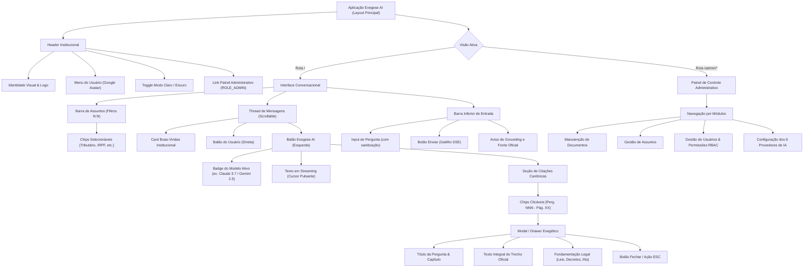

# EXEGESE AI — ESPECIFICAÇÃO DE DESIGN SYSTEM, UI/UX E FRAMEWORK CSS

**Diretrizes Visuais, Arquitetura CSS, Paleta de Cores, Acessibilidade e Componentes**  
*Plataforma Exegese AI | Pacote: br.org.rivelino.exegese_ai*

---

## 1. FILOSOFIA DE DESIGN E IDENTIDADE VISUAL

O **Exegese AI** adota a filosofia de design **Clean & Authoritative** (Corporativo, Institucional e Sóbrio). Como a plataforma lida com matérias jurídicas, fiscais, regulatórias e documentais sensíveis, a interface deve transmitir:
1. **Autoridade e Segurança**: Tipografia nítida, paleta sóbria de azuis marinhos e ardósia neutra, eliminando elementos puramente decorativos que distraiam da leitura crítica.
2. **Ergonomia e Legibilidade**: Espaçamentos generosos, contraste estrito em conformidade com as diretrizes **WCAG 2.1 nível AA**, e largura de leitura contida (`max-w-4xl`) para evitar fadiga ocular em textos longos.
3. **Transparência Factual Exegética**: As respostas do assistente destacam visualmente as fontes oficiais através de **chips de citação** com abertura instantânea de **modal/drawer** para conferência da letra da lei.

---

## 2. ARQUITETURA E FRAMEWORK DE CSS

### 2.1 Decisão Arquitetural: Híbrido Utility-First + Vanilla Design Tokens
A camada visual combina a agilidade do **Tailwind CSS** com a estabilidade de **Design Tokens em Vanilla CSS**:

* **Tailwind CSS (Utility-First)**:
  * Utilizado diretamente nas classes dos templates Thymeleaf para estruturação de grid, flexbox, espaçamentos (`p-4`, `m-2`), alinhamentos e responsividade (`md:`, `lg:`).
  * Pode ser consumido no build Maven via plugin frontend ou distribuído através de arquivo compilado estático em `src/main/resources/static/css/tailwind.min.css` (sem dependência externa de Node.js em runtime).
* **Vanilla CSS Personalizado (`app.css`)**:
  * Centraliza os **Design Tokens** via variáveis CSS nativas (`--color-primary`, `--color-bg`, etc.).
  * Encapsula estilos de componentes complexos (animação de cursor pulsante no streaming SSE, modal exegético com backdrop blur, chips de citação, custom scrollbars e temas claro/escuro).

---

## 3. PALETA DE CORES E TEMAS (LIGHT / DARK MODE)

### 3.1 Tabela de Cores e Tokens

| Token CSS | Modo Claro (Light) | Modo Escuro (Dark) | Finalidade e Aplicação |
| :--- | :--- | :--- | :--- |
| `--color-primary` | `#1e3a8a` (Navy Blue) | `#3b82f6` (Blue 500) | Identidade institucional, botões de ação e headers |
| `--color-primary-hover` | `#1d4ed8` (Blue 700) | `#60a5fa` (Blue 400) | Estado hover de botões primários |
| `--color-accent` | `#2563eb` (Royal Blue) | `#38bdf8` (Sky 400) | Links, destaques de seleção e chips ativos |
| `--color-bg` | `#f8fafc` (Slate 50) | `#0b1120` (Dark Navy 950) | Plano de fundo geral da página |
| `--color-surface` | `#ffffff` (Pure White) | `#1e293b` (Slate 800) | Balões do assistente, cards e modais |
| `--color-surface-user` | `#eff6ff` (Blue 50) | `#172554` (Blue 950) | Balão de mensagem do usuário |
| `--color-text-main` | `#0f172a` (Slate 900) | `#f1f5f9` (Slate 100) | Texto principal de leitura |
| `--color-text-muted` | `#64748b` (Slate 500) | `#94a3b8` (Slate 400) | Subtítulos, metadados e notas de rodapé |
| `--color-border` | `#e2e8f0` (Slate 200) | `#334155` (Slate 700) | Linhas divisórias, bordas de inputs e cards |
| `--color-citation-bg` | `#e0f2fe` (Sky 100) | `#082f49` (Sky 950) | Fundo do chip de citação de fonte oficial |
| `--color-citation-text` | `#0369a1` (Sky 700) | `#7dd3fc` (Sky 300) | Texto do chip de citação oficial |
| `--color-gold-badge` | `#facc15` (Yellow 400) | `#eab308` (Yellow 500) | Destaque de badges institucionais (RFB / Oficial) |

### 3.2 Alternância de Tema
A comutação de tema é controlada via classe `.dark` no elemento `<html>`, sincronizada com a preferência do sistema operacional (`prefers-color-scheme`) e salva no `localStorage`:
```javascript
function toggleTheme() {
    const isDark = document.documentElement.classList.toggle('dark');
    localStorage.setItem('exegese-theme', isDark ? 'dark' : 'light');
}
```

---

## 4. TIPOGRAFIA E ESCALA

- **Família Tipográfica**:
  ```css
  font-family: -apple-system, BlinkMacSystemFont, "Segoe UI", Roboto, "Helvetica Neue", Arial, sans-serif;
  ```
  Prioriza fontes nativas de alta qualidade do sistema operacional para renderização imediata com zero tempo de bloqueio (FOIT/FOUT).
- **Escala de Tamanhos**:
  - `text-xs`: 0.75rem (12px) — Badges, referências normativas e metadados de páginas.
  - `text-sm`: 0.875rem (14px) — Texto corrido de respostas, inputs de formulário e botões.
  - `text-base`: 1.00rem (16px) — Perguntas do usuário e títulos de chips.
  - `text-lg`: 1.125rem (18px) — Títulos de modais e cabeçalhos de cards administrativos.
  - `text-xl`: 1.25rem (20px) — Header principal da aplicação.
- **Line-Height**: Fixado em `1.6` para respostas longas e trechos legais, prevenindo aglomeração de linhas.

---

## 5. COMPONENTES VISUAIS DA INTERFACE

### 5.1 Diagrama de Hierarquia dos Componentes


*Arquivo Mermaid independente*: [`diagrams/ui_component_hierarchy.mmd`](diagrams/ui_component_hierarchy.mmd)

---

### 5.2 Barra de Seleção de Assuntos (Topic Chips N:N)
Permite ao usuário marcar um ou mais assuntos disponíveis para delimitar o escopo da recuperação:

```html
<div class="subject-bar flex items-center gap-2 overflow-x-auto py-2 px-1 border-b border-slate-200 dark:border-slate-800">
    <span class="text-xs font-semibold text-slate-500 dark:text-slate-400">Assuntos:</span>
    <button type="button" class="subject-chip active" data-subject-id="all">
        <span>Todos os Assuntos</span>
    </button>
    <button type="button" class="subject-chip" data-subject-id="uuid-tributario-irpf">
        <span>Tributário - IRPF 2026</span>
        <span class="chip-count">745</span>
    </button>
    <button type="button" class="subject-chip" data-subject-id="uuid-trabalhista">
        <span>Legislação Trabalhista</span>
        <span class="chip-count">120</span>
    </button>
</div>
```

---

### 5.3 Balões de Mensagem e Badge do Modelo Ativo
O balão do assistente identifica formalmente qual provedor/modelo de inteligência artificial gerou a resposta:

```html
<!-- Mensagem do Assistente com Badge do Modelo -->
<div class="flex items-start gap-3 message-assistant">
    <div class="avatar-assistant">EX</div>
    <div class="bubble-surface space-y-3">
        <!-- Badge de Identificação do Modelo -->
        <div class="flex items-center justify-between text-[11px] text-slate-400 border-b border-slate-200 dark:border-slate-700 pb-1.5">
            <span class="font-semibold text-blue-600 dark:text-blue-400">Exegese AI</span>
            <span class="model-badge">Modelo: Anthropic Claude 3.7 Sonnet</span>
        </div>
        <!-- Conteúdo Textual com Streaming -->
        <div class="prose-content text-sm leading-relaxed" id="stream-target">
            O valor máximo para dedução de despesas com instrução no exercício de 2026 é de <strong>R$ 3.561,50</strong>.
            <span class="typing-cursor"></span>
        </div>
        <!-- Seção de Citações -->
        <div class="citations-container pt-2 border-t border-slate-100 dark:border-slate-700/60">
            <span class="text-[11px] font-semibold text-slate-500 uppercase tracking-wider block mb-1">Fontes Oficiais:</span>
            <div class="flex flex-wrap gap-1.5">
                <button type="button" class="citation-chip" onclick="openCitationModal('401')">
                    📜 Perg. 401 — Despesas com instrução - limite (Pág. 193)
                </button>
            </div>
        </div>
    </div>
</div>
```

---

### 5.4 Modal Exegético para Visualização da Fonte Canônica
Aberto com animação suave e `backdrop-filter: blur(4px)`, exibindo o trecho oficial sem sair da conversa:

```html
<div id="citation-modal" class="modal-backdrop hidden" role="dialog" aria-modal="true">
    <div class="modal-card">
        <div class="modal-header">
            <div>
                <span class="text-xs font-semibold text-blue-600 dark:text-blue-400 uppercase tracking-wider">Capítulo: DEDUÇÕES - DESPESAS COM INSTRUÇÃO</span>
                <h3 class="text-base font-bold text-slate-900 dark:text-slate-100">401 — As deduções de despesas com instrução estão sujeitas a algum limite?</h3>
            </div>
            <button onclick="closeCitationModal()" class="modal-close-btn" aria-label="Fechar">&times;</button>
        </div>
        <div class="modal-body space-y-3">
            <div class="canonical-text bg-slate-50 dark:bg-slate-900/80 p-4 rounded-lg border border-slate-200 dark:border-slate-700 text-xs leading-relaxed">
                Sim. Estão sujeitas ao limite anual individual de R$ 3.561,50, para o ano-calendário de 2025. O valor dos gastos com um dependente que ultrapassar esse limite não pode ser aproveitado nem mesmo para compensar gastos de valor inferior efetuados com o próprio contribuinte...
            </div>
            <div class="legal-reference text-xs text-slate-500 dark:text-slate-400">
                <strong>Fundamentação Legal:</strong> Lei nº 9.250/1995, art. 8º, II, 'b'; RIR/2018, art. 74; IN RFB nº 1.500/2014, art. 91.
            </div>
            <div class="text-xs text-slate-400">
                <strong>Localização:</strong> Página 193 do documento oficial IRPF 2026 (v1.0).
            </div>
        </div>
    </div>
</div>
```

---

### 5.5 Painel Administrativo (`/admin`): Cards e Seletor de Modelos
Grid limpo para parametrização dos 6 ecossistemas de inteligência artificial:

```html
<div class="grid grid-cols-1 md:grid-cols-3 gap-4 mb-6">
    <!-- Card de Métrica -->
    <div class="metric-card">
        <span class="metric-label">Documentos Catalogados</span>
        <span class="metric-value">42</span>
        <span class="metric-meta text-emerald-600">✓ Todos indexados</span>
    </div>
    <div class="metric-card">
        <span class="metric-label">Total de Chunks Vetoriais</span>
        <span class="metric-value">12.480</span>
        <span class="metric-meta text-blue-600">Dimensão: 768d (HNSW)</span>
    </div>
    <div class="metric-card">
        <span class="metric-label">Modelo LLM em Operação</span>
        <span class="metric-value text-blue-600">Claude 3.7</span>
        <span class="metric-meta">Provedor: Anthropic</span>
    </div>
</div>

<!-- Seletor de Provedor de IA -->
<div class="model-selection-grid grid grid-cols-1 md:grid-cols-2 lg:grid-cols-3 gap-3">
    <!-- Card de Provedor -->
    <label class="provider-card active">
        <input type="radio" name="activeProvider" value="GEMINI" checked class="sr-only">
        <div class="flex justify-between items-start">
            <span class="font-bold text-sm">Google Gemini</span>
            <span class="status-indicator online">Online</span>
        </div>
        <p class="text-xs text-slate-500 mt-1">Modelos: Gemini 2.5 Flash / Pro (Free Tier)</p>
    </label>
    <label class="provider-card">
        <input type="radio" name="activeProvider" value="CLAUDE" class="sr-only">
        <div class="flex justify-between items-start">
            <span class="font-bold text-sm">Anthropic Claude</span>
            <span class="status-indicator ready">Configurado</span>
        </div>
        <p class="text-xs text-slate-500 mt-1">Modelos: Claude 3.5 / 3.7 Sonnet</p>
    </label>
    <!-- Demais provedores: OpenAI, Nemotron, DeepSeek, Local Ollama -->
</div>
```

---

## 6. FOLHA DE ESTILOS COMPLETA (`src/main/resources/static/css/app.css`)

```css
/*******************************************************************************
 * Exegese AI — Stylesheet Principal & Design Tokens
 * Framework: Vanilla CSS Custom Properties + Utilitários Integrados
 *******************************************************************************/

:root {
  --color-primary: #1e3a8a;
  --color-primary-hover: #1d4ed8;
  --color-accent: #2563eb;
  --color-bg: #f8fafc;
  --color-surface: #ffffff;
  --color-surface-user: #eff6ff;
  --color-text-main: #0f172a;
  --color-text-muted: #64748b;
  --color-border: #e2e8f0;
  --color-citation-bg: #e0f2fe;
  --color-citation-text: #0369a1;
  --radius-sm: 6px;
  --radius-md: 12px;
  --radius-lg: 16px;
  --shadow-sm: 0 1px 2px 0 rgb(0 0 0 / 0.05);
  --shadow-md: 0 4px 6px -1px rgb(0 0 0 / 0.1);
  --shadow-lg: 0 10px 15px -3px rgb(0 0 0 / 0.1);
}

.dark {
  --color-primary: #3b82f6;
  --color-primary-hover: #60a5fa;
  --color-accent: #38bdf8;
  --color-bg: #0b1120;
  --color-surface: #1e293b;
  --color-surface-user: #172554;
  --color-text-main: #f1f5f9;
  --color-text-muted: #94a3b8;
  --color-border: #334155;
  --color-citation-bg: #082f49;
  --color-citation-text: #7dd3fc;
  --shadow-sm: 0 1px 2px 0 rgb(0 0 0 / 0.5);
}

body {
  background-color: var(--color-bg);
  color: var(--color-text-main);
  font-family: -apple-system, BlinkMacSystemFont, "Segoe UI", Roboto, "Helvetica Neue", Arial, sans-serif;
  margin: 0;
  padding: 0;
  -webkit-font-smoothing: antialiased;
}

/* Chips de Assuntos (Topics) */
.subject-chip {
  display: inline-flex;
  align-items: center;
  gap: 6px;
  padding: 5px 12px;
  border-radius: 9999px;
  font-size: 0.75rem;
  font-weight: 500;
  background-color: var(--color-surface);
  border: 1px solid var(--color-border);
  color: var(--color-text-muted);
  cursor: pointer;
  transition: all 0.15s ease-in-out;
  white-space: nowrap;
}

.subject-chip:hover {
  border-color: var(--color-accent);
  color: var(--color-text-main);
}

.subject-chip.active {
  background-color: var(--color-primary);
  border-color: var(--color-primary);
  color: #ffffff;
}

.chip-count {
  font-size: 0.65rem;
  background-color: rgba(0, 0, 0, 0.08);
  padding: 2px 6px;
  border-radius: 9999px;
}

.dark .chip-count {
  background-color: rgba(255, 255, 255, 0.15);
}

/* Balões de Conversa */
.bubble-surface {
  background-color: var(--color-surface);
  border: 1px solid var(--color-border);
  border-radius: var(--radius-lg);
  border-top-left-radius: 4px;
  padding: 16px;
  box-shadow: var(--shadow-sm);
  max-width: 48rem;
}

.bubble-user {
  background-color: var(--color-surface-user);
  border: 1px solid var(--color-border);
  border-radius: var(--radius-lg);
  border-top-right-radius: 4px;
  padding: 14px 18px;
  margin-left: auto;
  max-width: 40rem;
}

.avatar-assistant {
  width: 34px;
  height: 34px;
  border-radius: 50%;
  background: linear-gradient(135deg, #1e3a8a, #2563eb);
  color: #ffffff;
  display: flex;
  align-items: center;
  justify-content: center;
  font-weight: 700;
  font-size: 0.8rem;
  flex-shrink: 0;
}

/* Animação do Cursor de Streaming SSE */
.typing-cursor {
  display: inline-block;
  width: 7px;
  height: 15px;
  background-color: var(--color-accent);
  margin-left: 3px;
  vertical-align: middle;
  animation: blink 0.8s infinite;
}

@keyframes blink {
  0%, 100% { opacity: 1; }
  50% { opacity: 0; }
}

/* Chips de Citação Canônica */
.citation-chip {
  display: inline-flex;
  align-items: center;
  gap: 4px;
  background-color: var(--color-citation-bg);
  color: var(--color-citation-text);
  border: 1px solid rgba(3, 105, 161, 0.2);
  border-radius: var(--radius-sm);
  padding: 4px 8px;
  font-size: 0.72rem;
  font-weight: 500;
  cursor: pointer;
  transition: transform 0.1s, box-shadow 0.1s;
}

.citation-chip:hover {
  transform: translateY(-1px);
  box-shadow: var(--shadow-sm);
}

.model-badge {
  font-size: 0.68rem;
  background-color: var(--color-bg);
  border: 1px solid var(--color-border);
  padding: 2px 8px;
  border-radius: 9999px;
  color: var(--color-text-muted);
}

/* Modal Exegético Acessível */
.modal-backdrop {
  position: fixed;
  inset: 0;
  background-color: rgba(15, 23, 42, 0.6);
  backdrop-filter: blur(4px);
  z-index: 50;
  display: flex;
  align-items: center;
  justify-content: center;
  padding: 16px;
}

.modal-backdrop.hidden {
  display: none;
}

.modal-card {
  background-color: var(--color-surface);
  border: 1px solid var(--color-border);
  border-radius: var(--radius-lg);
  max-width: 36rem;
  width: 100%;
  padding: 24px;
  box-shadow: var(--shadow-lg);
  animation: modalFadeIn 0.2s ease-out;
}

@keyframes modalFadeIn {
  from { opacity: 0; transform: scale(0.97); }
  to { opacity: 1; transform: scale(1); }
}

.modal-header {
  display: flex;
  justify-content: space-between;
  align-items: flex-start;
  border-bottom: 1px solid var(--color-border);
  padding-bottom: 12px;
}

.modal-close-btn {
  background: none;
  border: none;
  font-size: 1.5rem;
  color: var(--color-text-muted);
  cursor: pointer;
  line-height: 1;
}

.modal-close-btn:hover {
  color: var(--color-text-main);
}

/* Painel Administrativo */
.metric-card {
  background-color: var(--color-surface);
  border: 1px solid var(--color-border);
  border-radius: var(--radius-md);
  padding: 16px;
  display: flex;
  flex-direction: column;
  gap: 4px;
}

.metric-label {
  font-size: 0.75rem;
  font-weight: 600;
  color: var(--color-text-muted);
  text-transform: uppercase;
}

.metric-value {
  font-size: 1.75rem;
  font-weight: 800;
}

.metric-meta {
  font-size: 0.7rem;
}

.provider-card {
  display: block;
  background-color: var(--color-surface);
  border: 2px solid var(--color-border);
  border-radius: var(--radius-md);
  padding: 14px;
  cursor: pointer;
  transition: all 0.15s ease-in-out;
}

.provider-card:hover {
  border-color: var(--color-accent);
}

.provider-card.active {
  border-color: var(--color-accent);
  background-color: var(--color-surface-user);
}

.status-indicator {
  font-size: 0.65rem;
  font-weight: 700;
  padding: 2px 6px;
  border-radius: 9999px;
  text-transform: uppercase;
}

.status-indicator.online {
  background-color: #dcfce7;
  color: #15803d;
}

.status-indicator.ready {
  background-color: #e0f2fe;
  color: #0369a1;
}
```

---

## 7. CONFORMIDADE COM ACESSIBILIDADE (WCAG 2.1 AA)

1. **Relação de Contraste**: Todos os textos principais mantêm contraste $\ge 7:1$ e textos secundários $\ge 4.5:1$ em relação aos planos de fundo correspondentes.
2. **Navegação por Teclado**: Todos os elementos interativos (chips de assunto, botões de envio, links e chips de citação) possuem indicador de foco visível (`outline: 2px solid var(--color-accent)`).
3. **Modais Acessíveis**: O modal possui `role="dialog"`, `aria-modal="true"`, foco aprisionado (*focus trap*) e fecha automaticamente na tecla `Escape`.
4. **Semântica HTML5**: Uso rigoroso de tags semânticas (`<header>`, `<main>`, `<nav>`, `<aside>`, `<footer>`, `<form>`, `<button>`).