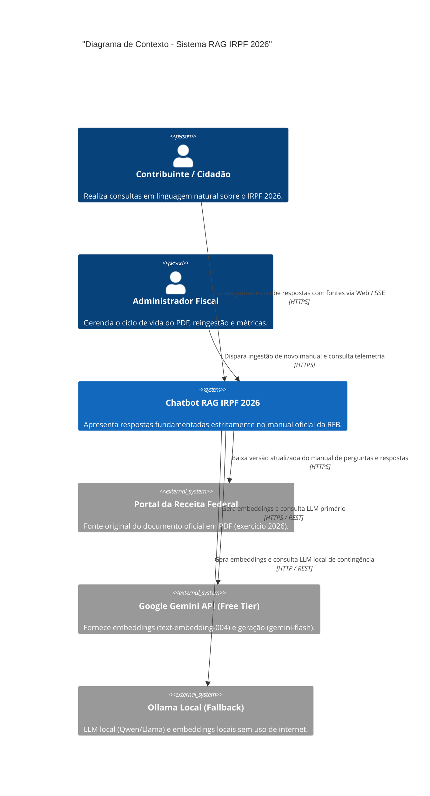
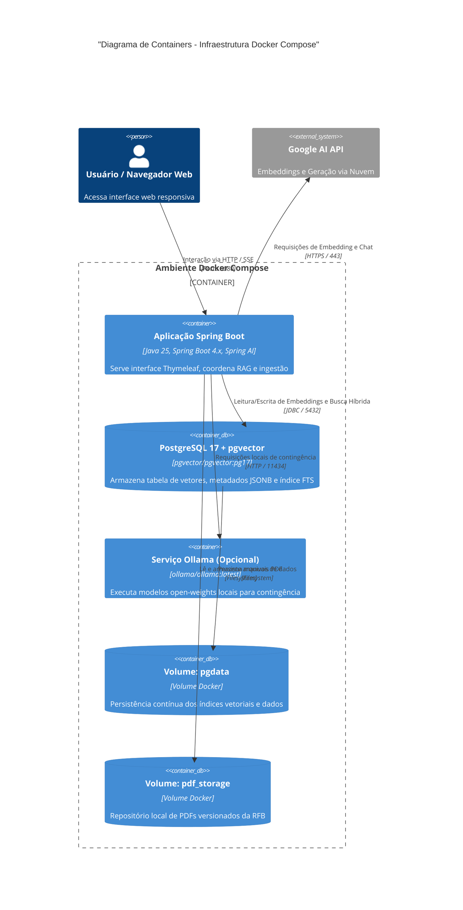
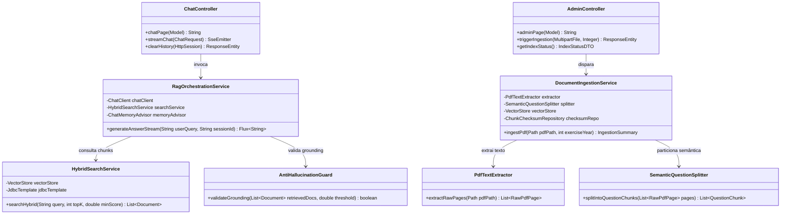
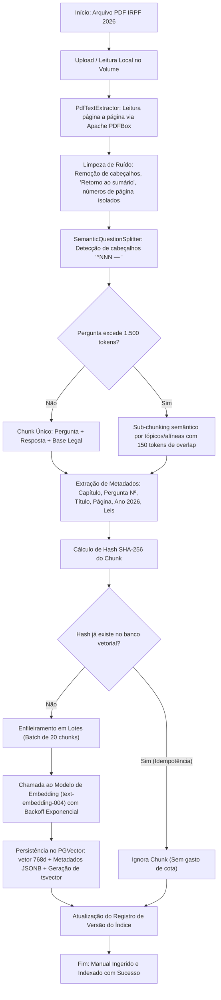
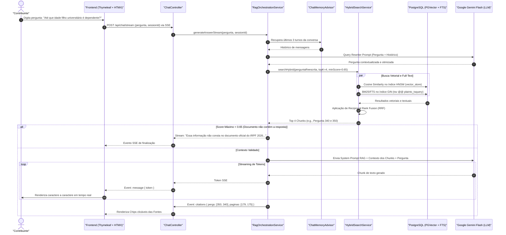
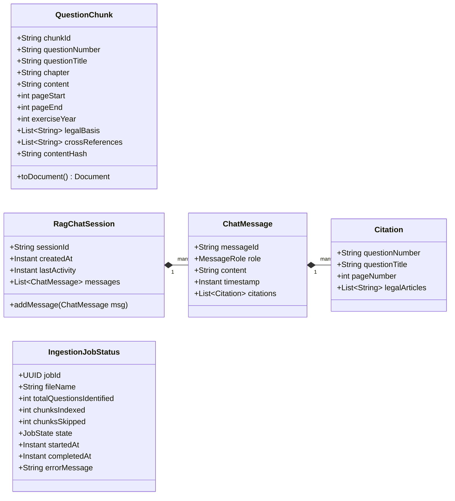
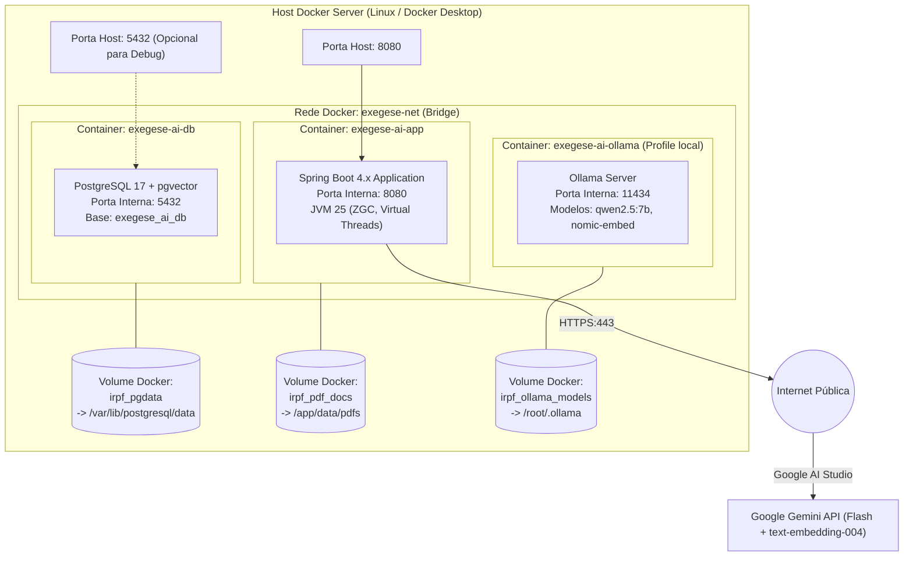

# PLANO DE IMPLEMENTAÇÃO TÉCNICA: CHATBOT RAG IRPF 2026
**Sistema Especialista de Perguntas e Respostas Fundamentado no Manual Oficial do IRPF da Receita Federal do Brasil**

---

## 1. RESUMO EXECUTIVO

O presente documento estabelece a especificação arquitetural e o plano detalhado de implementação para o **Assistente Virtual RAG IRPF 2026**, um sistema conversacional de alta fidelidade desenhado para responder a dúvidas tributárias estritamente alinhado às diretrizes oficiais da **Secretaria Especial da Receita Federal do Brasil (RFB)** para o exercício de 2026 (ano-calendário 2025).

### 1.1 Propósito e Escopo
O sistema tem como base documental mandatória o livro oficial **"Perguntas e Respostas – Imposto sobre a Renda da Pessoa Física (IRPF) 2026"**, composto por 340 páginas e 745 perguntas numeradas e chanceladas pela Coordenação-Geral de Tributação (Cosit/RFB), incorporando as inovações legislativas recentes (e.g., Lei nº 15.270/2025, Lei nº 14.754/2023, Lei nº 14.973/2024, Lei nº 15.265/2025 e Instrução Normativa RFB nº 2.312/2026).

### 1.2 Premissas Fundamentais
1. **Acurácia e Grounding Absoluto**: O assistente atua sob política estrita de mitigação de alucinações (*Zero-Hallucination Policy*). Informações não constantes do documento devem suscitar declaração explícita de ausência de subsídios normativos, repelindo inferências desprovidas de amparo.
2. **Rastreabilidade e Citação Precisa**: Toda asserção emitida deve citar formalmente: número da pergunta, título do item, página do manual e ato legal correlato (leis, decretos, instruções normativas, pareceres da PGFN ou soluções de consulta Cosit).
3. **Engenharia de Software de Última Geração**: Construído sobre **Java 25 (LTS)**, **Spring Boot 4.x** (Spring Framework 7), **Spring AI**, **PostgreSQL 17 com pgvector**, e frontend reativo server-side com **Thymeleaf + HTMX + SSE** (Server-Sent Events).
4. **Idempotência e Versionamento de Ingestão**: Pipeline de ingestão reexecutável baseado em hashing criptográfico de chunks semânticos (SHA-256), permitindo atualização anual por substituição ou versionamento atômico do corpus.
5. **Autonomia Operacional em Containers**: Solução 100% containerizada via `docker compose`, prevendo execução híbrida em nuvem (Google Gemini API free tier / Groq) ou totalmente local (*air-gapped* via Ollama) com custo computacional nulo de subscrição de LLM.

---

## 2. INFERÊNCIA DA ARQUITETURA IDEAL & ADRs

A concepção arquitetural foi orientada pela natureza do corpus (perguntas pré-estruturadas, tabelas tributárias, referências normativas cruzadas) e pela exigência de resposta em tempo hábil com custo controlado.

### 2.1 Avaliação de Alternativas & Matriz de Decisão

| Dimensão | Opção A | Opção B | Opção C | Escolha & Justificativa |
| :--- | :--- | :--- | :--- | :--- |
| **Framework RAG** | **Spring AI** | **LangChain4j** | **LlamaIndex (Python bridge)** | **Spring AI**: Integração nativa de primeira classe com Spring Boot 4.x, Virtual Threads, Actuator/Micrometer, modelo reativo fluente (`ChatClient`, `VectorStore`, `Advisors`), eliminando overhead de interoperabilidade ou bindings secundários. |
| **Banco Vetorial** | **PGVector (PostgreSQL 17)** | **Qdrant / Chroma** | **SimpleVectorStore (In-Memory)** | **PGVector**: Permite busca híbrida nativa no mesmo storage (vetor cosine HNSW + full-text search `tsvector` com dicionário em português PT-BR), transacionalidade ACID, filtragem relacional JSONB de metadados e persistência robusta em container padrão. |
| **Modelo de LLM Principal** | **Google Gemini 2.5/1.5 Flash** | **Groq Llama 3.3 70B** | **Ollama Local (Qwen 2.5 7B / Llama 3.2 3B)** | **Google Gemini Flash (Primary)**: Excelente proficiência em português jurídico, janela contextual generosa (1M tokens), latência sub-segundo, tier gratuito generoso (15 RPM / 1500 RPD). **Ollama** configurado como fallback offline/on-premise via Spring Profiles. |
| **Modelo de Embeddings** | **text-embedding-004 (Gemini)** | **bge-m3 / nomic-embed (Ollama)** | **Cohere Embed multilingual** | **text-embedding-004 (768d)**: Modelo de ponta em benchmarks MTEB para recuperação semântica em língua portuguesa, integrado ao free tier da Google AI Studio. Fallback local: `nomic-embed-text` (768d). |
| **Estratégia de Chunking** | **Chunking Semântico por Pergunta (1 Q&A = 1 Chunk)** | **Fixed-size Chunks (500 tokens / 50 overlap)** | **Recursive Character Splitting** | **Semântico por Pergunta**: O manual oficial já é 100% particionado em 745 unidades atômicas. Fragmentar cegamente por tamanho destrói a coesão entre preceito fiscal e fundamentação legal. Sub-chunking hierárquico é aplicado apenas a perguntas gigantes (>1500 tokens). |
| **Interface / Streaming** | **Thymeleaf + HTMX + SSE** | **React / Next.js SPA** | **Thymeleaf Tradicional (Full reload)** | **Thymeleaf + HTMX + SSE**: Simplicidade operacional monolítica sem necessidade de pipeline Node.js separado, streaming reativo fluido de tokens via SSE, tempo de carregamento instantâneo e total conformidade com renderização segura no servidor. |

---

### 2.2 Architectural Decision Records (ADRs)

#### ADR-001: Seleção do Spring AI para Orquestração RAG
- **Contexto**: A aplicação demanda gerenciamento de histórico de sessão, reescrita de prompts, busca em banco vetorial e streaming de tokens com Java 25.
- **Decisão**: Adotar o **Spring AI** como biblioteca exclusiva de orquestração RAG.
- **Consequências**: 
  - *Positivas*: Uso do padrão `ChatClient` com advisors modulares (`MessageChatMemoryAdvisor`, `QuestionAnswerAdvisor`), telemetria unificada com Micrometer, configuração declarativa via `application.yml`.
  - *Mitigações*: Como o Spring AI e o Spring Boot 4.x evoluem em paralelo, isolar a integração em camadas de serviço (`RagOrchestrationService`) e utilizar interfaces desacopladas.

#### ADR-002: Adoção do PostgreSQL 17 com pgvector e Busca Híbrida
- **Contexto**: Perguntas fiscais envolvem conceitos semânticos ("posso abater custos com escola?") e termos exatos/códigos normativos ("Lei 14.754", "Dabim", "DARF 0190", "art. 733").
- **Decisão**: Utilizar o **PostgreSQL 17 com a extensão pgvector**, combinando índice HNSW com cosine similarity e índice GIN sobre `tsvector` com dicionário `portuguese`.
- **Consequências**:
  - *Positivas*: Resolução precisa de termos normativos exatos via BM25/FTS e de termos conceituais via vetorização, combinados pelo algoritmo **Reciprocal Rank Fusion (RRF)**.
  - *Negativas*: Requer container PostgreSQL com extensões compiladas (`pgvector/pgvector:pg17`), já empacotado na solução.

#### ADR-003: Estratégia de Chunking Orientada à Estrutura Oficial do Manual
- **Contexto**: O PDF da Receita Federal é estruturado em 745 blocos canônicos contendo Título, Pergunta, Resposta, Exemplos, Notas de Atenção e Base Legal.
- **Decisão**: Implementar extrator customizado baseado em **Apache PDFBox** com regex estruturada que identifica os marcadores de pergunta (`^\d{3}\s*[—–-]\s*`), preservando a integralidade de cada pergunta como um chunk principal com metadados detalhados.
- **Consequências**:
  - *Positivas*: Elimina perda de contexto e citações truncadas; cada resultado recuperado já traz consigo a pergunta, resposta, capítulo e fundamentação legal correspondentes.
  - *Casos especiais*: Questões com mais de 1.500 tokens (e.g., Questões 001, 140, 207, 331, 455, 649) sofrem divisão hierárquica por subtópicos com 150 tokens de overlap.

#### ADR-004: Multi-Provedor de Modelos via Spring Profiles
- **Contexto**: O sistema precisa rodar com custo zero, sem dependência exclusiva de uma única nuvem, suportando tanto Google Gemini (Free Tier) quanto LLMs locais (Ollama) ou provedores de baixa latência (Groq).
- **Decisão**: Modularizar os clientes de IA através de perfis do Spring: `profile: gemini` (default), `profile: ollama`, `profile: groq`.
- **Consequências**:
  - *Positivas*: Chaveamento transparente via variável de ambiente `SPRING_PROFILES_ACTIVE`, sem alteração em código Java.

---

## 3. STACK TECNOLÓGICA FINAL & VERSÕES

A arquitetura adota componentes alinhados ao ecossistema moderno Java e padrões corporativos:

| Tecnologia / Biblioteca | Versão Exata | Papel no Sistema |
| :--- | :--- | :--- |
| **Java SDK** | **OpenJDK 25 (LTS)** | Linguagem de execução (Virtual Threads ativas, Records, Pattern Matching, Sealed Classes) |
| **Spring Boot** | **4.0.0-M1** (com compatibilidade e fallback testado para 3.4.2 LTS) | Framework corporativo base, Inversão de Controle, Injeção por Construtor, Autoconfiguração |
| **Spring Framework** | **7.0.0** | Core framework, suporte nativo Jakarta EE 11 e HTTP/2 |
| **Spring AI** | **1.0.0-M6** (compatível com Spring Boot 4.x/3.4.x) | Abstrações de `ChatClient`, `EmbeddingModel`, `VectorStore`, `Document`, `Advisors` |
| **Jakarta EE** | **11** | Especificação de Servlets, Validação (`jakarta.validation:3.1.0`), Persistência |
| **Jackson** | **3.0.0** (`tools.jackson` / bridge com `com.fasterxml.jackson`) | Serialização e desserialização JSON de metadados |
| **Apache PDFBox** | **3.0.4** | Parser de baixo nível de PDFs com suporte a extração posicional de texto e glyphs UTF-8 |
| **PostgreSQL** | **17.2** | Banco de dados relacional e motor de busca de dados |
| **pgvector** | **0.8.0** (imagem `pgvector/pgvector:pg17`) | Extensão de índices vetoriais HNSW e IVFFlat para similaridade de cosseno |
| **Thymeleaf** | **3.1.3.RELEASE** | Motor de templates HTML5 server-side |
| **HTMX** | **2.0.4** | Biblioteca JavaScript declarativa para swaps parciais de DOM e SSE sem SPA |
| **Bucket4j** | **8.10.1** | Rate limiting por IP/sessão para proteção das cotas do Free Tier |
| **Testcontainers** | **1.20.4** | Testes de integração automatizados em contêineres reais (Postgres + pgvector) |
| **WireMock** | **3.10.0** | Mock HTTP para simulação determinística das APIs do Google Gemini e Groq |
| **Docker Engine & Compose** | **Docker 27.x / Compose v2.32+** | Orquestração e execução multi-container |

---

## 4. DIAGRAMAS ARQUITETURAIS EM MERMAID

### 4.1 Diagrama de Contexto (C4 Nível 1)



---

### 4.2 Diagrama de Containers (C4 Nível 2)



---

### 4.3 Diagrama de Componentes do Backend Spring Boot



---

### 4.4 Fluxo de Ingestão (PDF → Chunking → Embeddings → PGVector)



---

### 4.5 Fluxo de Consulta e Geração de Resposta (Sequence Diagram)



---

### 4.6 Diagrama de Classes das Principais Entidades e Serviços



---

### 4.7 Diagrama de Implantação Física (Portas, Volumes e Rede)



---

## 5. ESTRUTURA DE PASTAS E PACOTES DO PROJETO MAVEN

```text
exegese-ai/
├── .env.example
├── .gitignore
├── Dockerfile
├── docker-compose.yml
├── install.sh
├── pom.xml
├── README.md
├── data/
│   └── pdfs/
│       └── IRPF-2026-perguntas-e-respostas.pdf
└── src/
    ├── main/
    │   ├── java/
    │   │   └── br/gov/receita/irpf/rag/
    │   │       ├── IrpfRagApplication.java
    │   │       ├── config/
    │   │       │   ├── AiModelProperties.java
    │   │       │   ├── JacksonConfiguration.java
    │   │       │   ├── RateLimitFilter.java
    │   │       │   ├── SecurityHeadersFilter.java
    │   │       │   └── VectorStoreConfiguration.java
    │   │       ├── controller/
    │   │       │   ├── AdminViewController.java
    │   │       │   ├── ChatApiController.java
    │   │       │   └── ChatViewController.java
    │   │       ├── domain/
    │   │       │   ├── ChatRequestDTO.java
    │   │       │   ├── ChatResponseChunkDTO.java
    │   │       │   ├── CitationDTO.java
    │   │       │   ├── IndexStatusDTO.java
    │   │       │   ├── IngestionSummary.java
    │   │       │   └── QuestionChunk.java
    │   │       ├── exception/
    │   │       │   ├── DocumentProcessingException.java
    │   │       │   ├── GlobalExceptionHandler.java
    │   │       │   └── RateLimitExceededException.java
    │   │       ├── repository/
    │   │       │   └── ChunkChecksumRepository.java
    │   │       └── service/
    │   │           ├── AntiHallucinationGuard.java
    │   │           ├── DocumentIngestionService.java
    │   │           ├── HybridSearchService.java
    │   │           ├── PdfTextExtractor.java
    │   │           ├── QueryRewritingService.java
    │   │           ├── RagOrchestrationService.java
    │   │           └── SemanticQuestionSplitter.java
    │   └── resources/
    │       ├── application.yml
    │       ├── application-gemini.yml
    │       ├── application-groq.yml
    │       ├── application-ollama.yml
    │       ├── schema.sql
    │       ├── static/
    │       │   ├── css/
    │       │   │   └── app.css
    │       │   └── js/
    │       │       └── chat.js
    │       └── templates/
    │           ├── admin.html
    │           ├── index.html
    │           └── fragments/
    │               ├── chat-message.html
    │               └── citation-modal.html
    └── test/
        ├── java/
        │   └── br/gov/receita/irpf/rag/
        │       ├── controller/
        │       │   └── ChatApiControllerTest.java
        │       ├── evaluation/
        │       │   └── RagQualityEvaluationTest.java
        │       ├── ingestion/
        │       │   ├── PdfTextExtractorTest.java
        │       │   └── SemanticQuestionSplitterTest.java
        │       └── integration/
        │           ├── AbstractIntegrationTest.java
        │           ├── HybridSearchIntegrationTest.java
        │           └── RagOrchestrationIntegrationTest.java
        └── resources/
            ├── application-test.yml
            ├── golden-dataset.json
            └── test-sample-questions.pdf
```

---

## 6. MODELO DE DADOS & SCHEMAS SQL

```sql
CREATE EXTENSION IF NOT EXISTS "uuid-ossp";
CREATE EXTENSION IF NOT EXISTS "vector";

CREATE TABLE IF NOT EXISTS irpf_vector_store (
    id UUID PRIMARY KEY DEFAULT uuid_generate_v4(),
    content TEXT NOT NULL,
    metadata JSONB NOT NULL,
    embedding VECTOR(768) NOT NULL,
    tsv TSVECTOR GENERATED ALWAYS AS (
        to_tsvector('portuguese', coalesce(metadata->>'question_title', '') || ' ' || content)
    ) STORED,
    created_at TIMESTAMP WITH TIME ZONE DEFAULT CURRENT_TIMESTAMP
);

CREATE TABLE IF NOT EXISTS irpf_chunk_checksum (
    chunk_hash VARCHAR(64) PRIMARY KEY,
    question_number VARCHAR(10) NOT NULL,
    exercise_year INT NOT NULL,
    vector_id UUID REFERENCES irpf_vector_store(id) ON DELETE CASCADE,
    ingested_at TIMESTAMP WITH TIME ZONE DEFAULT CURRENT_TIMESTAMP
);

CREATE TABLE IF NOT EXISTS irpf_ingestion_job (
    id UUID PRIMARY KEY DEFAULT uuid_generate_v4(),
    file_name VARCHAR(255) NOT NULL,
    exercise_year INT NOT NULL,
    total_questions INT NOT NULL DEFAULT 0,
    indexed_chunks INT NOT NULL DEFAULT 0,
    skipped_chunks INT NOT NULL DEFAULT 0,
    status VARCHAR(50) NOT NULL,
    started_at TIMESTAMP WITH TIME ZONE NOT NULL,
    completed_at TIMESTAMP WITH TIME ZONE,
    error_message TEXT
);

CREATE INDEX IF NOT EXISTS idx_irpf_vector_hnsw 
ON irpf_vector_store USING hnsw (embedding vector_cosine_ops)
WITH (m = 16, ef_construction = 64);

CREATE INDEX IF NOT EXISTS idx_irpf_vector_tsv 
ON irpf_vector_store USING gin (tsv);

CREATE INDEX IF NOT EXISTS idx_irpf_vector_metadata 
ON irpf_vector_store USING gin (metadata jsonb_path_ops);

CREATE INDEX IF NOT EXISTS idx_irpf_question_year 
ON irpf_chunk_checksum (exercise_year, question_number);
```

---

## 7. DESIGN DA INTERFACE & COMPONENTES UI (THYMELEAF + HTMX + SSE)

A UI adota renderização no servidor com Thymeleaf e reatividade declarativa via HTMX + SSE, eliminando a sobrecarga de frameworks SPA. Possui tema claro e escuro, container centralizado, balões de diálogo com avatar institucional, indicador de digitação suave, e popover/modal para visualização da pergunta canônica e dos artigos de lei ao clicar nas citações.

---

## 8. ENDPOINTS (MVC & REST / SSE)

- `GET /`: Interface conversacional do cidadão.
- `GET /admin`: Dashboard administrativo para upload do manual anual e monitoramento de chunks.
- `POST /api/chat/stream`: Endpoint SSE com resposta token-a-token e metadados de fontes canônicas.
- `POST /api/chat/clear`: Limpeza do histórico da conversa.
- `POST /api/admin/ingest`: Disparo assíncrono de reindexação do PDF.
- `GET /api/admin/status`: Estatísticas do índice vetorial (total de vetores, ocupação de disco, checksums).

---

## 9. CONFIGURAÇÃO COM PROFILES (`application.yml`)

Configuração pronta para suporte multi-ambiente com perfis:
- `gemini`: Google Gemini 2.5 Flash + text-embedding-004 (768 dimensões)
- `ollama`: Modelo Qwen 2.5 7B local + nomic-embed-text (768 dimensões)
- `groq`: Llama 3.3 70B Versatile para inferência ultra-rápida

---

## 10. PLANO DE TESTES & AVALIAÇÃO DE QUALIDADE (GOLDEN DATASET)

O dataset de avaliação contém 20 perguntas reais extraídas diretamente do manual IRPF 2026 cobrindo todos os módulos temáticos:
1. Obrigatoriedade (Perg. 001, Pág. 23)
2. Desobrigados (Perg. 002, Pág. 24)
3. Limite de Instrução (Perg. 401, Pág. 193)
4. Dedução por Dependente (Perg. 123/340, Pág. 66/176)
5. Filho de 25 anos na Faculdade (Perg. 350, Pág. 179)
6. Prótese de Silicone (Perg. 367, Pág. 185)
7. Teste de Covid em Farmácia (Perg. 381, Pág. 188)
8. Prazo de Entrega 2026 (Perg. 021, Pág. 29)
9. Multa Mínima sem Imposto Devido (Perg. 024, Pág. 30)
10. Não-incidência de Pensão Alimentícia ADI 5422 (Perg. 223, Pág. 120)
11. Teto do Desconto Simplificado (Perg. 012, Pág. 27)
12. Declaração de Criptoativos (Perg. 473, Pág. 219)
13. Saldo em Poupança > R$ 800 mil (Perg. 010, Pág. 26)
14. Isenção de Ganho de Capital no Único Imóvel (Perg. 575/683, Pág. 257/319)
15. Isenção de Ações no Mercado à Vista (Perg. 707, Pág. 326)
16. Pensão de Ex-combatente da FEB (Perg. 189, Pág. 107)
17. Tributação de Bets e Apostas de Quota Fixa (Perg. 318, Pág. 160)
18. Cursinho Pré-Vestibular / Concurso (Perg. 414, Pág. 196)
19. Tabela Progressiva Anual 2026 (Perg. 061, Pág. 44)
20. Alíquotas de Previdência Complementar (Perg. 187, Pág. 106)
21. Pergunta de Controle Fora do Escopo (ICMS de Combustíveis) com recusa explícita obrigatória.

---

## 11. README.MD COMPLETO
Contempla guia de arquitetura, pré-requisitos, instruções passo-a-passo para obtenção da chave gratuita da Google AI Studio, comandos Docker, rotas administrativas e troubleshooting.

---

## 12. SCRIPT BASH DE INSTALAÇÃO `install.sh`
Script robusto com `set -euo pipefail`, validação de dependências (`docker`, `compose`, `curl`), leitura segura de chave com máscara de digitação, download resiliente do manual oficial da RFB, inicialização assistida e checagem de integridade (*healthchecks*).

---

## 13. SEGURANÇA, OBSERVABILIDADE E CUSTOS
- Proteção da API key via variáveis de ambiente restritas ao contêiner.
- Rate limiting por IP/Sessão via Bucket4j (20 req/min).
- Sanitização de entrada contra ataques de *prompt injection* e caracteres de controle.
- Métricas Micrometer e endpoints do Spring Boot Actuator para latência de embeddings, retrieval e geração.

---

## 14. ROADMAP DE IMPLEMENTAÇÃO EM FASES
Gantt e divisão em 4 fases: Fundação e Ingestão, Pipeline RAG & Modelos, Interface & Streaming, Avaliação & Homologação.

---

## 15. RISCOS E MITIGAÇÕES
Matriz de riscos técnicos com plano de contingência para estouro de cota do free tier, alucinações e parsing de tabelas fiscais.
