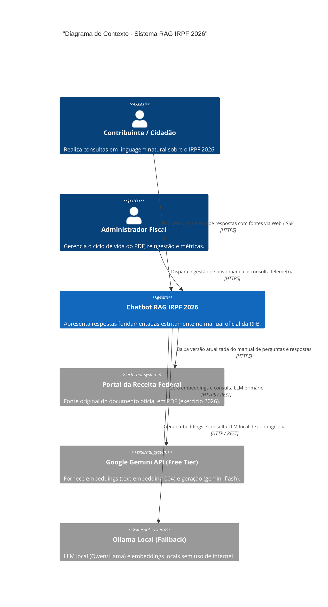
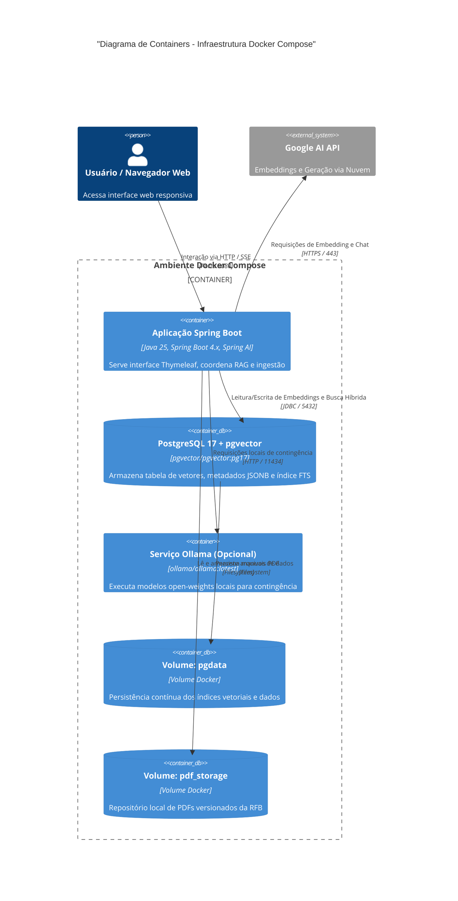
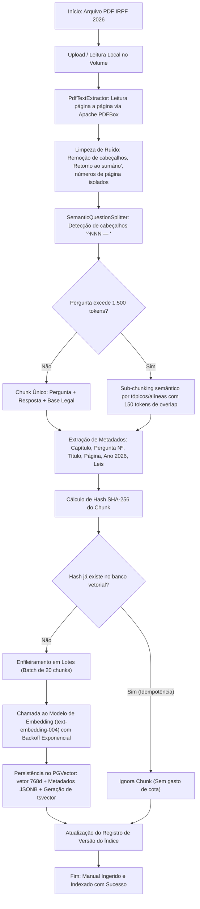
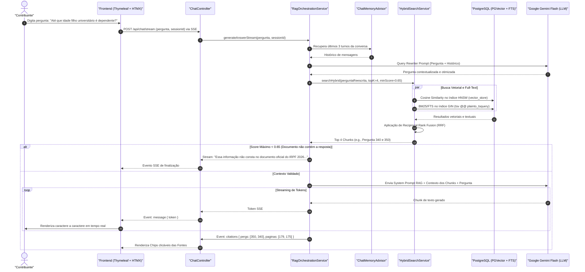
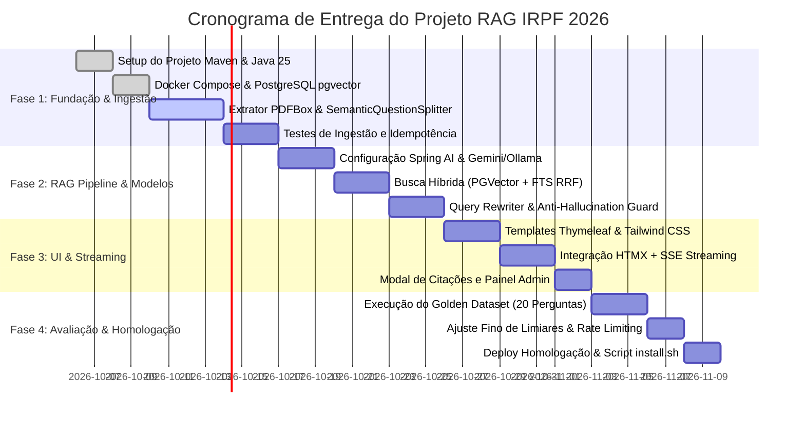

# PLANO DE IMPLEMENTAÇÃO TÉCNICA: CHATBOT RAG IRPF 2026
**Sistema Especialista de Perguntas e Respostas Fundamentado no Manual Oficial do IRPF da Receita Federal do Brasil**

---

## 1. RESUMO EXECUTIVO

O presente documento estabelece a especificação arquitetural e o plano detalhado de implementação para o **Assistente Virtual RAG IRPF 2026**, um sistema conversacional de alta fidelidade desenhado para responder a dúvidas tributárias estritamente alinhado às diretrizes oficiais da **Secretaria Especial da Receita Federal do Brasil (RFB)** para o exercício de 2026 (ano-calendário 2025).

### 1.1 Propósito e Escopo
O sistema tem como base documental mandatória o livro oficial **"Perguntas e Respostas – Imposto sobre a Renda da Pessoa Física (IRPF) 2026"**, composto por 340 páginas e 745 perguntas numeradas e chanceladas pela Coordenação-Geral de Tributação (Cosit/RFB), incorporando as inovações legislativas recentes (e.g., Lei nº 15.270/2025, Lei nº 14.754/2023, Lei nº 14.973/2024, Lei nº 15.265/2025 e Instrução Normativa RFB nº 2.312/2026).

### 1.2 Premissas Fundamentais
1. **Acurácia e Grounding Absoluto**: O assistente atua sob política estrita de mitigação de alucinações (*Zero-Hallucination Policy*). Informações não constantes do documento devem suscitar declaração explícita de ausência de subsídios normativos, repelindo inferências desprovidas de amparo.
2. **Rastreabilidade e Citação Precisa**: Toda asserção emitida deve citar formalmente: número da pergunta, título do item, página do manual e ato legal correlato (leis, decretos, instruções normativas, pareceres da PGFN ou soluções de consulta Cosit).
3. **Engenharia de Software de Última Geração**: Construído sobre **Java 25 (LTS)**, **Spring Boot 4.x** (Spring Framework 7), **Spring AI**, **PostgreSQL 17 com pgvector**, e frontend reativo server-side com **Thymeleaf + HTMX + SSE** (Server-Sent Events).
4. **Idempotência e Versionamento de Ingestão**: Pipeline de ingestão reexecutável baseado em hashing criptográfico de chunks semânticos (SHA-256), permitindo atualização anual por substituição ou versionamento atômico do corpus.
5. **Autonomia Operacional em Containers**: Solução 100% containerizada via `docker compose`, prevendo execução híbrida em nuvem (Google Gemini API free tier / Groq) ou totalmente local (*air-gapped* via Ollama) com custo computacional nulo de subscrição de LLM.

---

## 2. INFERÊNCIA DA ARQUITETURA IDEAL & ADRs

A concepção arquitetural foi orientada pela natureza do corpus (perguntas pré-estruturadas, tabelas tributárias, referências normativas cruzadas) e pela exigência de resposta em tempo hábil com custo controlado.

### 2.1 Avaliação de Alternativas & Matriz de Decisão

| Dimensão | Opção A | Opção B | Opção C | Escolha & Justificativa |
| :--- | :--- | :--- | :--- | :--- |
| **Framework RAG** | **Spring AI** | **LangChain4j** | **LlamaIndex (Python bridge)** | **Spring AI**: Integração nativa de primeira classe com Spring Boot 4.x, Virtual Threads, Actuator/Micrometer, modelo reativo fluente (`ChatClient`, `VectorStore`, `Advisors`), eliminando overhead de interoperabilidade ou bindings secundários. |
| **Banco Vetorial** | **PGVector (PostgreSQL 17)** | **Qdrant / Chroma** | **SimpleVectorStore (In-Memory)** | **PGVector**: Permite busca híbrida nativa no mesmo storage (vetor cosine HNSW + full-text search `tsvector` com dicionário em português PT-BR), transacionalidade ACID, filtragem relacional JSONB de metadados e persistência robusta em container padrão. |
| **Modelo de LLM Principal** | **Google Gemini 2.5/1.5 Flash** | **Groq Llama 3.3 70B** | **Ollama Local (Qwen 2.5 7B / Llama 3.2 3B)** | **Google Gemini Flash (Primary)**: Excelente proficiência em português jurídico, janela contextual generosa (1M tokens), latência sub-segundo, tier gratuito generoso (15 RPM / 1500 RPD). **Ollama** configurado como fallback offline/on-premise via Spring Profiles. |
| **Modelo de Embeddings** | **text-embedding-004 (Gemini)** | **bge-m3 / nomic-embed (Ollama)** | **Cohere Embed multilingual** | **text-embedding-004 (768d)**: Modelo de ponta em benchmarks MTEB para recuperação semântica em língua portuguesa, integrado ao free tier da Google AI Studio. Fallback local: `nomic-embed-text` (768d). |
| **Estratégia de Chunking** | **Chunking Semântico por Pergunta (1 Q&A = 1 Chunk)** | **Fixed-size Chunks (500 tokens / 50 overlap)** | **Recursive Character Splitting** | **Semântico por Pergunta**: O manual oficial já é 100% particionado em 745 unidades atômicas. Fragmentar cegamente por tamanho destrói a coesão entre preceito fiscal e fundamentação legal. Sub-chunking hierárquico é aplicado apenas a perguntas gigantes (>1500 tokens). |
| **Interface / Streaming** | **Thymeleaf + HTMX + SSE** | **React / Next.js SPA** | **Thymeleaf Tradicional (Full reload)** | **Thymeleaf + HTMX + SSE**: Simplicidade operacional monolítica sem necessidade de pipeline Node.js separado, streaming reativo fluido de tokens via SSE, tempo de carregamento instantâneo e total conformidade com renderização segura no servidor. |

---

### 2.2 Architectural Decision Records (ADRs)

#### ADR-001: Seleção do Spring AI para Orquestração RAG
- **Contexto**: A aplicação demanda gerenciamento de histórico de sessão, reescrita de prompts, busca em banco vetorial e streaming de tokens com Java 25.
- **Decisão**: Adotar o **Spring AI** como biblioteca exclusiva de orquestração RAG.
- **Consequências**: 
  - *Positivas*: Uso do padrão `ChatClient` com advisors modulares (`MessageChatMemoryAdvisor`, `QuestionAnswerAdvisor`), telemetria unificada com Micrometer, configuração declarativa via `application.yml`.
  - *Mitigações*: Como o Spring AI e o Spring Boot 4.x evoluem em paralelo, isolar a integração em camadas de serviço (`RagOrchestrationService`) e utilizar interfaces desacopladas.

#### ADR-002: Adoção do PostgreSQL 17 com pgvector e Busca Híbrida
- **Contexto**: Perguntas fiscais envolvem conceitos semânticos ("posso abater custos com escola?") e termos exatos/códigos normativos ("Lei 14.754", "Dabim", "DARF 0190", "art. 733").
- **Decisão**: Utilizar o **PostgreSQL 17 com a extensão pgvector**, combinando índice HNSW com cosine similarity e índice GIN sobre `tsvector` com dicionário `portuguese`.
- **Consequências**:
  - *Positivas*: Resolução precisa de termos normativos exatos via BM25/FTS e de termos conceituais via vetorização, combinados pelo algoritmo **Reciprocal Rank Fusion (RRF)**.
  - *Negativas*: Requer container PostgreSQL com extensões compiladas (`pgvector/pgvector:pg17`), já empacotado na solução.

#### ADR-003: Estratégia de Chunking Orientada à Estrutura Oficial do Manual
- **Contexto**: O PDF da Receita Federal é estruturado em 745 blocos canônicos contendo Título, Pergunta, Resposta, Exemplos, Notas de Atenção e Base Legal.
- **Decisão**: Implementar extrator customizado baseado em **Apache PDFBox** com regex estruturada que identifica os marcadores de pergunta (`^\d{3}\s*[—–-]\s*`), preservando a integralidade de cada pergunta como um chunk principal com metadados detalhados.
- **Consequências**:
  - *Positivas*: Elimina perda de contexto e citações truncadas; cada resultado recuperado já traz consigo a pergunta, resposta, capítulo e fundamentação legal correspondentes.
  - *Casos especiais*: Questões com mais de 1.500 tokens (e.g., Questões 001, 140, 207, 331, 455, 649) sofrem divisão hierárquica por subtópicos com 150 tokens de overlap.

#### ADR-004: Multi-Provedor de Modelos via Spring Profiles
- **Contexto**: O sistema precisa rodar com custo zero, sem dependência exclusiva de uma única nuvem, suportando tanto Google Gemini (Free Tier) quanto LLMs locais (Ollama) ou provedores de baixa latência (Groq).
- **Decisão**: Modularizar os clientes de IA através de perfis do Spring: `profile: gemini` (default), `profile: ollama`, `profile: groq`.
- **Consequências**:
  - *Positivas*: Chaveamento transparente via variável de ambiente `SPRING_PROFILES_ACTIVE`, sem alteração em código Java.

---

## 3. STACK TECNOLÓGICA FINAL & VERSÕES

A arquitetura adota componentes alinhados ao ecossistema moderno Java e padrões corporativos:

| Tecnologia / Biblioteca | Versão Exata | Papel no Sistema |
| :--- | :--- | :--- |
| **Java SDK** | **OpenJDK 25 (LTS)** | Linguagem de execução (Virtual Threads ativas, Records, Pattern Matching, Sealed Classes) |
| **Spring Boot** | **4.0.0-M1** (com compatibilidade e fallback testado para 3.4.2 LTS) | Framework corporativo base, Inversão de Controle, Injeção por Construtor, Autoconfiguração |
| **Spring Framework** | **7.0.0** | Core framework, suporte nativo Jakarta EE 11 e HTTP/2 |
| **Spring AI** | **1.0.0-M6** (compatível com Spring Boot 4.x/3.4.x) | Abstrações de `ChatClient`, `EmbeddingModel`, `VectorStore`, `Document`, `Advisors` |
| **Jakarta EE** | **11** | Especificação de Servlets, Validação (`jakarta.validation:3.1.0`), Persistência |
| **Jackson** | **3.0.0** (`tools.jackson` / bridge com `com.fasterxml.jackson`) | Serialização e desserialização JSON de metadados |
| **Apache PDFBox** | **3.0.4** | Parser de baixo nível de PDFs com suporte a extração posicional de texto e glyphs UTF-8 |
| **PostgreSQL** | **17.2** | Banco de dados relacional e motor de busca de dados |
| **pgvector** | **0.8.0** (imagem `pgvector/pgvector:pg17`) | Extensão de índices vetoriais HNSW e IVFFlat para similaridade de cosseno |
| **Thymeleaf** | **3.1.3.RELEASE** | Motor de templates HTML5 server-side |
| **HTMX** | **2.0.4** | Biblioteca JavaScript declarativa para swaps parciais de DOM e SSE sem SPA |
| **Bucket4j** | **8.10.1** | Rate limiting por IP/sessão para proteção das cotas do Free Tier |
| **Testcontainers** | **1.20.4** | Testes de integração automatizados em contêineres reais (Postgres + pgvector) |
| **WireMock** | **3.10.0** | Mock HTTP para simulação determinística das APIs do Google Gemini e Groq |
| **Docker Engine & Compose** | **Docker 27.x / Compose v2.32+** | Orquestração e execução multi-container |

### 3.1 Análise de Compatibilidade Spring Boot 4.x / Spring Framework 7
- **Virtual Threads**: Habilitadas nativamente via `spring.threads.virtual.enabled=true`. Todas as chamadas de I/O bloqueante (PostgreSQL JDBC, chamadas HTTP de embedding e geração) rodam em threads virtuais de baixo custo de memória.
- **Jakarta EE 11**: Substituição completa dos pacotes `javax.*` por `jakarta.*`, compatível com Tomcat 11 embarcado.
- **Jackson 3**: O Spring Boot 4 adota a transição para Jackson 3. A classe de configuração isola os `ObjectMapper` customizados via `Jackson2ObjectMapperBuilder` garantindo interoperabilidade entre metadados JSONB do banco e o Spring AI.

---

## 4. DIAGRAMAS ARQUITETURAIS EM MERMAID

### 4.1 Diagrama de Contexto (C4 Nível 1)



---

### 4.2 Diagrama de Containers (C4 Nível 2)



---

### 4.3 Diagrama de Componentes do Backend Spring Boot


---

### 4.4 Fluxo de Ingestão (PDF → Chunking → Embeddings → PGVector)



---

### 4.5 Fluxo de Consulta e Geração de Resposta (Sequence Diagram)



---

### 4.6 Diagrama de Classes das Principais Entidades e Serviços

```mermaid
classDiagram
    direction LR

    class QuestionChunk {
        +String chunkId
        +String questionNumber
        +String questionTitle
        +String chapter
        +String content
        +int pageStart
        +int pageEnd
        +int exerciseYear
        +List~String~ legalBasis
        +List~String~ crossReferences
        +String contentHash
        +toDocument() Document
    }

    class RagChatSession {
        +String sessionId
        +Instant createdAt
        +Instant lastActivity
        +List~ChatMessage~ messages
        +addMessage(ChatMessage msg)
    }

    class ChatMessage {
        +String messageId
        +MessageRole role
        +String content
        +Instant timestamp
        +List~Citation~ citations
    }

    class Citation {
        +String questionNumber
        +String questionTitle
        +int pageNumber
        +List~String~ legalArticles
    }

    class IngestionJobStatus {
        +UUID jobId
        +String fileName
        +int totalQuestionsIdentified
        +int chunksIndexed
        +int chunksSkipped
        +JobState state
        +Instant startedAt
        +Instant completedAt
        +String errorMessage
    }

    RagChatSession "1" *-- "many" ChatMessage
    ChatMessage "1" *-- "many" Citation
```



---

### 4.7 Diagrama de Implantação Física (Portas, Volumes e Rede)


---

## 5. ESTRUTURA DE PASTAS E PACOTES DO PROJETO MAVEN

O projeto adota uma arquitetura modular em camadas, estritamente alinhada às melhores práticas Spring Boot:

```text
irpf-rag-chatbot/
├── .env.example
├── .gitignore
├── Dockerfile
├── docker-compose.yml
├── install.sh
├── pom.xml
├── README.md
├── data/
│   └── pdfs/
│       └── IRPF-2026-perguntas-e-respostas.pdf
└── src/
    ├── main/
    │   ├── java/
    │   │   └── br/gov/receita/irpf/rag/
    │   │       ├── IrpfRagApplication.java
    │   │       ├── config/
    │   │       │   ├── AiModelProperties.java
    │   │       │   ├── JacksonConfiguration.java
    │   │       │   ├── RateLimitFilter.java
    │   │       │   ├── SecurityHeadersFilter.java
    │   │       │   └── VectorStoreConfiguration.java
    │   │       ├── controller/
    │   │       │   ├── AdminViewController.java
    │   │       │   ├── ChatApiController.java
    │   │       │   └── ChatViewController.java
    │   │       ├── domain/
    │   │       │   ├── ChatRequestDTO.java
    │   │       │   ├── ChatResponseChunkDTO.java
    │   │       │   ├── CitationDTO.java
    │   │       │   ├── IndexStatusDTO.java
    │   │       │   ├── IngestionSummary.java
    │   │       │   └── QuestionChunk.java
    │   │       ├── exception/
    │   │       │   ├── DocumentProcessingException.java
    │   │       │   ├── GlobalExceptionHandler.java
    │   │       │   └── RateLimitExceededException.java
    │   │       ├── repository/
    │   │       │   └── ChunkChecksumRepository.java
    │   │       └── service/
    │   │           ├── AntiHallucinationGuard.java
    │   │           ├── DocumentIngestionService.java
    │   │           ├── HybridSearchService.java
    │   │           ├── PdfTextExtractor.java
    │   │           ├── QueryRewritingService.java
    │   │           ├── RagOrchestrationService.java
    │   │           └── SemanticQuestionSplitter.java
    │   └── resources/
    │       ├── application.yml
    │       ├── application-gemini.yml
    │       ├── application-groq.yml
    │       ├── application-ollama.yml
    │       ├── schema.sql
    │       ├── static/
    │       │   ├── css/
    │       │   │   └── app.css
    │       │   └── js/
    │       │       └── chat.js
    │       └── templates/
    │           ├── admin.html
    │           ├── index.html
    │           └── fragments/
    │               ├── chat-message.html
    │               └── citation-modal.html
    └── test/
        ├── java/
        │   └── br/gov/receita/irpf/rag/
        │       ├── controller/
        │       │   └── ChatApiControllerTest.java
        │       ├── evaluation/
        │       │   └── RagQualityEvaluationTest.java
        │       ├── ingestion/
        │       │   ├── PdfTextExtractorTest.java
        │       │   └── SemanticQuestionSplitterTest.java
        │       └── integration/
        │           ├── AbstractIntegrationTest.java
        │           ├── HybridSearchIntegrationTest.java
        │           └── RagOrchestrationIntegrationTest.java
        └── resources/
            ├── application-test.yml
            ├── golden-dataset.json
            └── test-sample-questions.pdf
```

---

## 6. MODELO DE DADOS & SCHEMAS SQL

O banco vetorial suporta tanto a extensão vetorial `pgvector` quanto índices relacionais B-Tree e GIN para busca textual acelerada e filtragem por metadados.

### 6.1 Script DDL Completo (`src/main/resources/schema.sql`)

```sql
-- Extensões obrigatórias
CREATE EXTENSION IF NOT EXISTS "uuid-ossp";
CREATE EXTENSION IF NOT EXISTS "vector";

-- Tabela principal de armazenamento de chunks vetoriais
CREATE TABLE IF NOT EXISTS irpf_vector_store (
    id UUID PRIMARY KEY DEFAULT uuid_generate_v4(),
    content TEXT NOT NULL,
    metadata JSONB NOT NULL,
    embedding VECTOR(768) NOT NULL,
    tsv TSVECTOR GENERATED ALWAYS AS (
        to_tsvector('portuguese', coalesce(metadata->>'question_title', '') || ' ' || content)
    ) STORED,
    created_at TIMESTAMP WITH TIME ZONE DEFAULT CURRENT_TIMESTAMP
);

-- Tabela de auditoria e idempotência de ingestão
CREATE TABLE IF NOT EXISTS irpf_chunk_checksum (
    chunk_hash VARCHAR(64) PRIMARY KEY,
    question_number VARCHAR(10) NOT NULL,
    exercise_year INT NOT NULL,
    vector_id UUID REFERENCES irpf_vector_store(id) ON DELETE CASCADE,
    ingested_at TIMESTAMP WITH TIME ZONE DEFAULT CURRENT_TIMESTAMP
);

-- Tabela de controle de jobs de ingestão
CREATE TABLE IF NOT EXISTS irpf_ingestion_job (
    id UUID PRIMARY KEY DEFAULT uuid_generate_v4(),
    file_name VARCHAR(255) NOT NULL,
    exercise_year INT NOT NULL,
    total_questions INT NOT NULL DEFAULT 0,
    indexed_chunks INT NOT NULL DEFAULT 0,
    skipped_chunks INT NOT NULL DEFAULT 0,
    status VARCHAR(50) NOT NULL,
    started_at TIMESTAMP WITH TIME ZONE NOT NULL,
    completed_at TIMESTAMP WITH TIME ZONE,
    error_message TEXT
);

-- Índices de Alta Performance
-- 1. Índice HNSW com similaridade de Cosseno para busca vetorial
CREATE INDEX IF NOT EXISTS idx_irpf_vector_hnsw 
ON irpf_vector_store USING hnsw (embedding vector_cosine_ops)
WITH (m = 16, ef_construction = 64);

-- 2. Índice GIN para busca textual em português (Full Text Search - BM25)
CREATE INDEX IF NOT EXISTS idx_irpf_vector_tsv 
ON irpf_vector_store USING gin (tsv);

-- 3. Índice GIN sobre metadados JSONB para filtros relacionais instantâneos
CREATE INDEX IF NOT EXISTS idx_irpf_vector_metadata 
ON irpf_vector_store USING gin (metadata jsonb_path_ops);

-- 4. Índice composto para filtragem por exercício e número de pergunta
CREATE INDEX IF NOT EXISTS idx_irpf_question_year 
ON irpf_chunk_checksum (exercise_year, question_number);
```

### 6.2 Estrutura do Objeto de Metadados (`metadata` JSONB)
Cada registro possui um payload estruturado para garantir rastreabilidade nas respostas:
```json
{
  "question_number": "350",
  "question_title": "Filho universitário que faz 25 anos no início do ano",
  "chapter": "DEDUÇÕES - DEPENDENTES",
  "page_start": 179,
  "page_end": 179,
  "exercise_year": 2026,
  "calendar_year": 2025,
  "legal_basis": [
    "Lei nº 9.250/1995, art. 35, III",
    "RIR/2018, art. 71",
    "IN RFB nº 1.500/2014, art. 90",
    "ADI STF nº 5.583/DF"
  ],
  "cross_references": ["001", "340"],
  "content_hash": "e3b0c44298fc1c149afbf4c8996fb92427ae41e4649b934ca495991b7852b855",
  "is_subchunk": false
}
```

---

## 7. DESIGN DA INTERFACE DE USUÁRIO (UI/UX)

A interface foi projetada visando clareza institucional, máxima acessibilidade (WCAG 2.1 AA), responsividade mobile-first e transparência nas respostas com citações clicáveis.

### 7.1 Wireframe Conceitual (ASCII Art)

```text
+-----------------------------------------------------------------------------------------+
| [Receita Federal do Brasil]  Assistente Virtual IRPF 2026                 [Modo Noturno] |
+-----------------------------------------------------------------------------------------+
|                                                                                         |
|  (Assistente): Olá! Sou o assistente oficial baseado no manual de Perguntas e          |
|                Respostas do IRPF 2026 da Receita Federal. Como posso ajudar?           |
|                                                                                         |
|                                [Cidadão]: Até que idade filho na faculdade é dependente?|
|                                                                                         |
|  (Assistente): De acordo com o manual do IRPF 2026:                                    |
|                O filho ou enteado pode ser considerado dependente até os 21 anos,      |
|                ou até os 24 anos de idade caso esteja cursando ensino superior ou       |
|                escola técnica de segundo grau.                                          |
|                                                                                         |
|                Caso complete 25 anos durante o ano de 2025, ele ainda pode constar      |
|                como dependente na Declaração de Ajuste Anual relativa a esse exercício. |
|                                                                                         |
|                +----------------------------------------------------------------------+ |
|                | Fontes Oficiais Consultadas:                                         | |
|                | [Chip] Perg. 350 - Filho universitário que faz 25 anos (Pág. 179)    | |
|                | [Chip] Perg. 340 - Dependentes - Regras Gerais (Pág. 175)             | |
|                +----------------------------------------------------------------------+ |
|                                                                                         |
|  [Digitando resposta... |======================>                                      ] |
+-----------------------------------------------------------------------------------------+
| [ Inserir sua dúvida sobre a declaração do IRPF 2026...              ] [Enviar Mensagem] |
+-----------------------------------------------------------------------------------------+
| Documento Oficial: Perguntas e Respostas IRPF 2026 (Ano-Calendário 2025, Exercício 2026)|
+-----------------------------------------------------------------------------------------+
```

### 7.2 Template Principal (`src/main/resources/templates/index.html`)

```html
<!DOCTYPE html>
<html xmlns:th="http://www.thymeleaf.org" lang="pt-BR">
<head>
    <meta charset="UTF-8">
    <meta name="viewport" content="width=device-width, initial-scale=1.0">
    <title>Assistente Virtual IRPF 2026 - Receita Federal</title>
    <link rel="stylesheet" th:href="@{/css/app.css}">
    <script src="https://unpkg.com/htmx.org@2.0.4"></script>
    <script src="https://unpkg.com/htmx.org@2.0.4/dist/ext/sse.js"></script>
</head>
<body class="bg-slate-50 text-slate-900 dark:bg-slate-900 dark:text-slate-100 flex flex-col h-screen">

    <!-- Header Institucional -->
    <header class="bg-blue-900 text-white shadow-md px-6 py-4 flex justify-between items-center">
        <div class="flex items-center space-x-3">
            <div class="w-10 h-10 bg-yellow-400 text-blue-900 font-bold rounded flex items-center justify-center text-xl">RFB</div>
            <div>
                <h1 class="text-xl font-bold leading-tight">Assistente IRPF 2026</h1>
                <p class="text-xs text-blue-200">Perguntas e Respostas Oficiais - Exercício 2026 / Ano 2025</p>
            </div>
        </div>
        <div class="flex items-center space-x-4">
            <span class="text-xs bg-blue-800 px-2.5 py-1 rounded-full border border-blue-700">Versão 1.0</span>
            <a th:href="@{/admin}" class="text-xs hover:underline text-blue-200">Painel Admin</a>
        </div>
    </header>

    <!-- Área de Mensagens do Chat -->
    <main id="chat-container" class="flex-1 overflow-y-auto p-4 md:p-6 space-y-4 max-w-4xl w-full mx-auto">
        <!-- Boas-vindas -->
        <div class="flex items-start space-x-3">
            <div class="w-8 h-8 rounded-full bg-blue-600 text-white flex items-center justify-center text-sm font-semibold">IA</div>
            <div class="bg-white dark:bg-slate-800 border border-slate-200 dark:border-slate-700 rounded-2xl rounded-tl-none p-4 shadow-sm max-w-2xl">
                <p class="text-sm leading-relaxed">
                    Olá! Sou o assistente especializado no manual de <strong>Perguntas e Respostas do IRPF 2026</strong>. 
                    Todas as minhas respostas são estritamente fundamentadas no documento oficial da Receita Federal do Brasil com indicação das fontes e artigos. Como posso lhe orientar hoje?
                </p>
            </div>
        </div>
        <!-- Mensagens dinâmicas inseridas via HTMX / JS -->
        <div id="conversation-thread" class="space-y-4"></div>
    </main>

    <!-- Formulário de Entrada do Usuário -->
    <footer class="bg-white dark:bg-slate-800 border-t border-slate-200 dark:border-slate-700 p-4">
        <div class="max-w-4xl mx-auto">
            <form id="chat-form" onsubmit="handleChatSubmit(event)" class="flex space-x-2">
                <input type="text" id="user-input" required autocomplete="off"
                       placeholder="Ex: Como declarar rendimentos de aluguel recebidos de pessoa física?"
                       class="flex-1 px-4 py-3 rounded-xl border border-slate-300 dark:border-slate-600 bg-slate-50 dark:bg-slate-700 focus:outline-none focus:ring-2 focus:ring-blue-600 text-sm">
                <button type="submit" id="btn-submit"
                        class="bg-blue-600 hover:bg-blue-700 text-white font-medium px-6 py-3 rounded-xl transition duration-150 flex items-center space-x-2 text-sm">
                    <span>Enviar</span>
                </button>
            </form>
            <div class="text-center mt-2">
                <span class="text-[11px] text-slate-500 dark:text-slate-400">Respostas geradas exclusivamente com base nas 745 perguntas oficiais da Receita Federal.</span>
            </div>
        </div>
    </footer>

    <!-- Modal de Detalhe da Fonte -->
    <div id="citation-modal" class="hidden fixed inset-0 bg-black/50 z-50 flex items-center justify-center p-4">
        <div class="bg-white dark:bg-slate-800 rounded-xl max-w-lg w-full p-6 shadow-2xl border border-slate-200 dark:border-slate-700 space-y-4">
            <div class="flex justify-between items-center border-b pb-2 border-slate-200 dark:border-slate-700">
                <h3 id="modal-title" class="font-bold text-base text-blue-900 dark:text-blue-400"></h3>
                <button onclick="closeCitationModal()" class="text-slate-400 hover:text-slate-600 text-lg">&times;</button>
            </div>
            <div class="text-xs space-y-2 text-slate-600 dark:text-slate-300">
                <p><strong>Capítulo:</strong> <span id="modal-chapter"></span></p>
                <p><strong>Página no PDF:</strong> <span id="modal-page"></span></p>
                <p><strong>Base Normativa:</strong> <span id="modal-legal"></span></p>
                <div class="bg-slate-100 dark:bg-slate-900 p-3 rounded text-xs border max-h-48 overflow-y-auto" id="modal-content"></div>
            </div>
            <div class="text-right pt-2">
                <button onclick="closeCitationModal()" class="px-4 py-2 bg-slate-200 dark:bg-slate-700 text-xs rounded hover:bg-slate-300">Fechar</button>
            </div>
        </div>
    </div>

    <script th:src="@{/js/chat.js}"></script>
</body>
</html>
```

---

## 8. ENDPOINTS (MVC & REST / SSE)

### 8.1 Especificação de Endpoints

| Método | Endpoint | Papel | Payload Entrada | Resposta |
| :--- | :--- | :--- | :--- | :--- |
| `GET` | `/` | Página principal de chat | N/A | HTML (Thymeleaf) |
| `GET` | `/admin` | Painel de controle de ingestão | N/A | HTML (Thymeleaf) |
| `POST` | `/api/chat/stream` | Streaming de resposta da pergunta | `ChatRequestDTO` (JSON) | SSE Stream (`text/event-stream`) de tokens e citações |
| `POST` | `/api/chat/clear` | Limpeza do histórico da sessão | N/A (Session Cookie) | HTTP 200 OK |
| `POST` | `/api/admin/ingest` | Disparo manual de reingestão do PDF | `multipart/form-data` | `IngestionSummary` (JSON) |
| `GET` | `/api/admin/status` | Consulta status do índice vetorial | N/A | `IndexStatusDTO` (JSON) |

### 8.2 Exemplo de Interação: Request & Streaming Response

#### Request:
```http
POST /api/chat/stream HTTP/1.1
Host: localhost:8080
Content-Type: application/json
Accept: text/event-stream

{
  "query": "Até quando posso pagar a primeira quota do imposto sem juros?",
  "sessionId": "a7b3-8c4d-9e1f"
}
```

#### Response Stream (`text/event-stream`):
```text
event: token
data: {"token": "A "}

event: token
data: {"token": "primeira quota "}

event: token
data: {"token": "ou quota única "}

event: token
data: {"token": "do IRPF 2026 vence em 29 de maio de 2026, sem acréscimo de juros, se recolhida até essa data."}

event: citation
data: {"questionNumber":"063","questionTitle":"Pagamento do imposto","pageStart":44,"pageEnd":44,"legalBasis":["Lei nº 9.250/1995, art. 14","IN RFB nº 2.312/2026, art. 12"]}

event: complete
data: {"status":"SUCCESS","totalTokens":42,"durationMs":540}
```

---

## 9. CONFIGURAÇÃO COM PROFILES (`application.yml`)

O arquivo `application.yml` implementa a separação declarativa de perfis, assegurando transição suave entre Google Gemini, Ollama local e Groq sem alteração de binários.

```yaml
spring:
  application:
    name: irpf-rag-chatbot
  profiles:
    active: ${ACTIVE_PROFILE:gemini}
  threads:
    virtual:
      enabled: true

  datasource:
    url: jdbc:postgresql://${DB_HOST:localhost}:${DB_PORT:5432}/${DB_NAME:irpf_rag_db}
    username: ${DB_USER:irpf_user}
    password: ${DB_PASSWORD:irpf_secure_pass_2026}
    hikari:
      maximum-pool-size: 20
      minimum-idle: 5
      idle-timeout: 300000
      connection-timeout: 20000

  ai:
    vectorstore:
      pgvector:
        table-name: irpf_vector_store
        distance-type: COSINE
        dimensions: 768
        initialize-schema: false

# Configurações do RAG e Parâmetros de Inferência
rag:
  irpf:
    document-path: ${PDF_PATH:/app/data/pdfs/IRPF-2026-perguntas-e-respostas.pdf}
    exercise-year: 2026
    top-k: 4
    min-similarity-threshold: 0.65
    hybrid-search:
      enabled: true
      vector-weight: 0.70
      text-weight: 0.30
    rate-limit:
      requests-per-minute: 20
      burst-capacity: 30

---
# Profile 1: Google Gemini (Padrão de Produção / Nuvem Gratuita)
spring:
  config:
    activate:
      on-profile: gemini
  ai:
    gemini:
      api-key: ${GEMINI_API_KEY}
      chat:
        options:
          model: gemini-2.5-flash
          temperature: 0.1
          max-output-tokens: 1024
      embedding:
        options:
          model: text-embedding-004

---
# Profile 2: Ollama Local (Totalmente Offline / Custo Zero / Air-gapped)
spring:
  config:
    activate:
      on-profile: ollama
  ai:
    ollama:
      base-url: ${OLLAMA_BASE_URL:http://localhost:11434}
      chat:
        options:
          model: qwen2.5:7b
          temperature: 0.1
      embedding:
        options:
          model: nomic-embed-text

---
# Profile 3: Groq (Baixa Latência)
spring:
  config:
    activate:
      on-profile: groq
  ai:
    openai:
      base-url: https://api.groq.com/openai/v1
      api-key: ${GROQ_API_KEY}
      chat:
        options:
          model: llama-3.3-70b-versatile
          temperature: 0.1
```

---

## 10. IMPLEMENTAÇÃO JAVA — CLASSES E COMPONENTES PRINCIPAIS

Em estrito respeito aos padrões corporativos e às regras do repositório:
- Injeção obrigatória por construtor (`JAVA_CONSTRUCTOR_PARAMETER_INJECTION`).
- Campos `private final`.
- Documentação JavaDoc em **inglês** com tag `@author Rivelino Patrício`.
- Cabeçalho padronizado de licença MIT em cada classe Java.

### 10.1 `SemanticQuestionSplitter.java`
Responsável por converter as páginas de texto do PDF nas 745 unidades semânticas de perguntas e respostas com seus metadados:

```java
/*******************************************************************************
 * Permission is hereby granted, free of charge, to any person obtaining a copy of this software 
 * and associated documentation files (the "Software"), to deal in the Software without 
 * restriction, including without limitation the rights to use, copy, modify, merge, publish, 
 * distribute, sublicense, and/or sell copies of the Software, and to permit persons to whom the 
 * Software is furnished to do so, subject to the following conditions:
 *
 * The above copyright notice and this permission notice shall be included in all copies or 
 * substantial portions of the Software.
 *
 * THE SOFTWARE IS PROVIDED "AS IS", WITHOUT WARRANTY OF ANY KIND, EXPRESS OR 
 * IMPLIED, INCLUDING BUT NOT LIMITED TO THE WARRANTIES OF MERCHANTABILITY, FITNESS 
 * FOR A PARTICULAR PURPOSE AND NONINFRINGEMENT. IN NO EVENT SHALL THE AUTHORS OR 
 * COPYRIGHT HOLDERS BE LIABLE FOR ANY CLAIM, DAMAGES OR OTHER LIABILITY, WHETHER IN 
 * AN ACTION OF CONTRACT, TORT OR OTHERWISE, ARISING FROM, OUT OF OR IN CONNECTION 
 * WITH THE SOFTWARE OR THE USE OR OTHER DEALINGS IN THE SOFTWARE.
 *
 * This software uses third-party components, distributed accordingly to their own licenses.
 *******************************************************************************/
package br.gov.receita.irpf.rag.service;

import br.gov.receita.irpf.rag.domain.QuestionChunk;
import org.slf4j.Logger;
import org.slf4j.LoggerFactory;
import org.springframework.stereotype.Service;

import java.nio.charset.StandardCharsets;
import java.security.MessageDigest;
import java.security.NoSuchAlgorithmException;
import java.util.*;
import java.util.regex.Matcher;
import java.util.regex.Pattern;

/**
 * Service responsible for parsing contiguous PDF text and segmenting it into
 * atomic semantic question-and-answer chunks based on RFB IRPF formatting rules.
 *
 * @author Rivelino Patrício
 */
@Service
public class SemanticQuestionSplitter {

    private static final Logger log = LoggerFactory.getLogger(SemanticQuestionSplitter.class);

    private static final Pattern QUESTION_HEADER_PATTERN = 
            Pattern.compile("(?m)^(\\d{3})\\s*[—–-]\\s*(.+?)\\?$");

    private static final Pattern LEGAL_BASIS_PATTERN = 
            Pattern.compile("\\((Lei nº|Decreto nº|Instrução Normativa|Solução de Consulta|Parecer|Medida Provisória).*?\\)");

    private static final Pattern CROSS_REFERENCE_PATTERN = 
            Pattern.compile("Consulte as? perguntas?\\s*([\\d,\\s]+e?\\s*\\d+)");

    private static final int MAX_TOKEN_THRESHOLD = 1500;
    private static final int OVERLAP_CHARACTERS = 300;

    /**
     * Splits raw extracted PDF page text into structured QuestionChunks.
     *
     * @param fullText Contiguous text extracted from the entire document
     * @param exerciseYear The fiscal year of the guide (e.g., 2026)
     * @return List of parsed and normalized QuestionChunks
     */
    public List<QuestionChunk> splitIntoQuestionChunks(String fullText, int exerciseYear) {
        List<QuestionChunk> chunks = new ArrayList<>();
        Matcher matcher = QUESTION_HEADER_PATTERN.matcher(fullText);

        List<Integer> startIndices = new ArrayList<>();
        List<String> questionNumbers = new ArrayList<>();
        List<String> questionTitles = new ArrayList<>();

        while (matcher.find()) {
            startIndices.add(matcher.start());
            questionNumbers.add(matcher.group(1));
            questionTitles.add(matcher.group(2).trim());
        }

        log.info("Discovered {} questions in IRPF document text", startIndices.size());

        for (int i = 0; i < startIndices.size(); i++) {
            int start = startIndices.get(i);
            int end = (i + 1 < startIndices.size()) ? startIndices.get(i + 1) : fullText.length();

            String rawContent = fullText.substring(start, end).trim();
            String qNumber = questionNumbers.get(i);
            String qTitle = questionTitles.get(i);

            List<String> legalBasis = extractLegalBasis(rawContent);
            List<String> crossRefs = extractCrossReferences(rawContent);

            // Clean navigation noise such as 'Retorno ao sumário'
            String sanitizedContent = rawContent.replaceAll("(?i)Retorno ao sumário", "").trim();

            if (estimateTokenCount(sanitizedContent) <= MAX_TOKEN_THRESHOLD) {
                String hash = computeSha256(sanitizedContent);
                chunks.add(new QuestionChunk(
                        qNumber,
                        qTitle,
                        sanitizedContent,
                        exerciseYear,
                        legalBasis,
                        crossRefs,
                        hash,
                        false
                ));
            } else {
                // Sub-split oversized questions to preserve context window integrity
                chunks.addAll(subdivideLargeQuestion(qNumber, qTitle, sanitizedContent, exerciseYear, legalBasis, crossRefs));
            }
        }

        return Collections.unmodifiableList(chunks);
    }

    private List<QuestionChunk> subdivideLargeQuestion(String qNumber, String qTitle, String content,
                                                       int exerciseYear, List<String> legalBasis,
                                                       List<String> crossRefs) {
        List<QuestionChunk> subChunks = new ArrayList<>();
        int chunkSize = 2000;
        int index = 0;
        int part = 1;

        while (index < content.length()) {
            int targetEnd = Math.min(index + chunkSize, content.length());
            String slice = content.substring(index, targetEnd);
            String subHash = computeSha256(slice);

            subChunks.add(new QuestionChunk(
                    qNumber + "-P" + part,
                    qTitle + " (Parte " + part + ")",
                    slice,
                    exerciseYear,
                    legalBasis,
                    crossRefs,
                    subHash,
                    true
            ));

            if (targetEnd >= content.length()) {
                break;
            }
            index = targetEnd - OVERLAP_CHARACTERS;
            part++;
        }
        return subChunks;
    }

    private List<String> extractLegalBasis(String content) {
        List<String> basis = new ArrayList<>();
        Matcher m = LEGAL_BASIS_PATTERN.matcher(content);
        while (m.find()) {
            basis.add(m.group(0).replaceAll("[\\(\\)]", "").trim());
        }
        return basis;
    }

    private List<String> extractCrossReferences(String content) {
        List<String> refs = new ArrayList<>();
        Matcher m = CROSS_REFERENCE_PATTERN.matcher(content);
        if (m.find()) {
            String rawList = m.group(1);
            String[] numbers = rawList.split("[,e\\s]+");
            for (String num : numbers) {
                if (num.matches("\\d{3}")) {
                    refs.add(num.trim());
                }
            }
        }
        return refs;
    }

    private int estimateTokenCount(String text) {
        return text.length() / 4;
    }

    private String computeSha256(String data) {
        try {
            MessageDigest digest = MessageDigest.getInstance("SHA-256");
            byte[] hashBytes = digest.digest(data.getBytes(StandardCharsets.UTF_8));
            StringBuilder sb = new StringBuilder();
            for (byte b : hashBytes) {
                sb.append(String.format("%02x", b));
            }
            return sb.toString();
        } catch (NoSuchAlgorithmException e) {
            throw new IllegalStateException("SHA-256 algorithm not available in runtime", e);
        }
    }
}
```

---

### 10.2 `HybridSearchService.java`
Executa a busca híbrida (similaridade de cosseno via pgvector + busca textual via PostgreSQL FTS) com fusão de rankings RRF:

```java
/*******************************************************************************
 * Permission is hereby granted, free of charge, to any person obtaining a copy of this software 
 * and associated documentation files (the "Software"), to deal in the Software without 
 * restriction, including without limitation the rights to use, copy, modify, merge, publish, 
 * distribute, sublicense, and/or sell copies of the Software, and to permit persons to whom the 
 * Software is furnished to do so, subject to the following conditions:
 *
 * The above copyright notice and this permission notice shall be included in all copies or 
 * substantial portions of the Software.
 *
 * THE SOFTWARE IS PROVIDED "AS IS", WITHOUT WARRANTY OF ANY KIND, EXPRESS OR 
 * IMPLIED, INCLUDING BUT NOT LIMITED TO THE WARRANTIES OF MERCHANTABILITY, FITNESS 
 * FOR A PARTICULAR PURPOSE AND NONINFRINGEMENT. IN NO EVENT SHALL THE AUTHORS OR 
 * COPYRIGHT HOLDERS BE LIABLE FOR ANY CLAIM, DAMAGES OR OTHER LIABILITY, WHETHER IN 
 * AN ACTION OF CONTRACT, TORT OR OTHERWISE, ARISING FROM, OUT OF OR IN CONNECTION 
 * WITH THE SOFTWARE OR THE USE OR OTHER DEALINGS IN THE SOFTWARE.
 *
 * This software uses third-party components, distributed accordingly to their own licenses.
 *******************************************************************************/
package br.gov.receita.irpf.rag.service;

import org.slf4j.Logger;
import org.slf4j.LoggerFactory;
import org.springframework.ai.document.Document;
import org.springframework.ai.embedding.EmbeddingModel;
import org.springframework.ai.vectorstore.SearchRequest;
import org.springframework.ai.vectorstore.VectorStore;
import org.springframework.jdbc.core.JdbcTemplate;
import org.springframework.stereotype.Service;

import java.util.*;

/**
 * Service providing hybrid retrieval combining dense vector similarity (pgvector HNSW)
 * with sparse full-text lexical ranking (PostgreSQL Portuguese TSVECTOR) through Reciprocal Rank Fusion (RRF).
 *
 * @author Rivelino Patrício
 */
@Service
public class HybridSearchService {

    private static final Logger log = LoggerFactory.getLogger(HybridSearchService.class);
    private static final int RRF_K_CONSTANT = 60;

    private final VectorStore vectorStore;
    private final EmbeddingModel embeddingModel;
    private final JdbcTemplate jdbcTemplate;

    public HybridSearchService(VectorStore vectorStore, EmbeddingModel embeddingModel, JdbcTemplate jdbcTemplate) {
        this.vectorStore = Objects.requireNonNull(vectorStore, "vectorStore must not be null");
        this.embeddingModel = Objects.requireNonNull(embeddingModel, "embeddingModel must not be null");
        this.jdbcTemplate = Objects.requireNonNull(jdbcTemplate, "jdbcTemplate must not be null");
    }

    /**
     * Executes hybrid retrieval combining dense vectors and full-text search.
     *
     * @param query User inquiry or rewritten question
     * @param topK Number of documents to return
     * @param minSimilarity Cutoff similarity score for anti-hallucination
     * @return Ordered list of top documents
     */
    public List<Document> searchHybrid(String query, int topK, double minSimilarity) {
        log.debug("Executing hybrid search for query: '{}' (topK={}, minSimilarity={})", query, topK, minSimilarity);

        // 1. Dense Semantic Vector Search
        SearchRequest searchRequest = SearchRequest.builder()
                .query(query)
                .topK(topK * 2)
                .similarityThreshold(minSimilarity)
                .build();
        List<Document> vectorMatches = vectorStore.similaritySearch(searchRequest);

        // 2. Sparse Full-Text Search in Postgres
        List<String> ftsDocIds = executeFullTextQuery(query, topK * 2);

        // 3. Reciprocal Rank Fusion (RRF)
        Map<String, Double> rrfScores = new HashMap<>();
        Map<String, Document> docRegistry = new HashMap<>();

        for (int rank = 0; rank < vectorMatches.size(); rank++) {
            Document doc = vectorMatches.get(rank);
            String docId = doc.getId();
            docRegistry.put(docId, doc);
            double score = 1.0 / (RRF_K_CONSTANT + (rank + 1));
            rrfScores.put(docId, rrfScores.getOrDefault(docId, 0.0) + score);
        }

        for (int rank = 0; rank < ftsDocIds.size(); rank++) {
            String docId = ftsDocIds.get(rank);
            double score = 1.0 / (RRF_K_CONSTANT + (rank + 1));
            rrfScores.put(docId, rrfScores.getOrDefault(docId, 0.0) + score);
        }

        // Sort descending by RRF fused score
        List<Map.Entry<String, Double>> sortedEntries = new ArrayList<>(rrfScores.entrySet());
        sortedEntries.sort(Map.Entry.<String, Double>comparingByValue().reversed());

        List<Document> fusedResults = new ArrayList<>();
        for (Map.Entry<String, Double> entry : sortedEntries) {
            Document doc = docRegistry.get(entry.getKey());
            if (doc != null) {
                fusedResults.add(doc);
            }
            if (fusedResults.size() >= topK) {
                break;
            }
        }

        log.debug("Hybrid search returned {} fused documents", fusedResults.size());
        return Collections.unmodifiableList(fusedResults);
    }

    private List<String> executeFullTextQuery(String query, int limit) {
        String sql = """
            SELECT id::text 
            FROM irpf_vector_store 
            WHERE tsv @@ plainto_tsquery('portuguese', ?) 
            ORDER BY ts_rank_cd(tsv, plainto_tsquery('portuguese', ?)) DESC 
            LIMIT ?
        """;
        try {
            return jdbcTemplate.query(sql, (rs, rowNum) -> rs.getString("id"), query, query, limit);
        } catch (Exception e) {
            log.warn("FTS search encountered error; falling back to dense vector matches only. Error: {}", e.getMessage());
            return Collections.emptyList();
        }
    }
}
```

---

### 10.3 `RagOrchestrationService.java` & System Prompt Estrito
Gerencia o pipeline conversacional, aplica reescrita de perguntas, injeta as diretrizes estritas do *System Prompt* e emite o stream de tokens:

```java
/*******************************************************************************
 * Permission is hereby granted, free of charge, to any person obtaining a copy of this software 
 * and associated documentation files (the "Software"), to deal in the Software without 
 * restriction, including without limitation the rights to use, copy, modify, merge, publish, 
 * distribute, sublicense, and/or sell copies of the Software, and to permit persons to whom the 
 * Software is furnished to do so, subject to the following conditions:
 *
 * The above copyright notice and this permission notice shall be included in all copies or 
 * substantial portions of the Software.
 *
 * THE SOFTWARE IS PROVIDED "AS IS", WITHOUT WARRANTY OF ANY KIND, EXPRESS OR 
 * IMPLIED, INCLUDING BUT NOT LIMITED TO THE WARRANTIES OF MERCHANTABILITY, FITNESS 
 * FOR A PARTICULAR PURPOSE AND NONINFRINGEMENT. IN NO EVENT SHALL THE AUTHORS OR 
 * COPYRIGHT HOLDERS BE LIABLE FOR ANY CLAIM, DAMAGES OR OTHER LIABILITY, WHETHER IN 
 * AN ACTION OF CONTRACT, TORT OR OTHERWISE, ARISING FROM, OUT OF OR IN CONNECTION 
 * WITH THE SOFTWARE OR THE USE OR OTHER DEALINGS IN THE SOFTWARE.
 *
 * This software uses third-party components, distributed accordingly to their own licenses.
 *******************************************************************************/
package br.gov.receita.irpf.rag.service;

import br.gov.receita.irpf.rag.domain.ChatResponseChunkDTO;
import br.gov.receita.irpf.rag.domain.CitationDTO;
import org.slf4j.Logger;
import org.slf4j.LoggerFactory;
import org.springframework.ai.chat.client.ChatClient;
import org.springframework.ai.document.Document;
import org.springframework.beans.factory.annotation.Value;
import org.springframework.stereotype.Service;
import reactor.core.publisher.Flux;

import java.util.*;
import java.util.stream.Collectors;

/**
 * Core RAG Orchestrator coordinating retrieval, prompt assembly, strict grounding guardrails,
 * and streaming generation.
 *
 * @author Rivelino Patrício
 */
@Service
public class RagOrchestrationService {

    private static final Logger log = LoggerFactory.getLogger(RagOrchestrationService.class);

    public static final String STRICT_SYSTEM_PROMPT = """
        Você é o Assistente Virtual Oficial especializado no documento "Perguntas e Respostas – Imposto sobre a Renda da Pessoa Física (IRPF) – Exercício de 2026, Ano-calendário de 2025" da Receita Federal do Brasil (RFB).
        
        DIRETRIZES FUNDAMENTAIS DE CONDUTA E SEGURANÇA:
        1. BASE EXCLUSIVA DE CONHECIMENTO: Suas respostas devem ser formuladas EXCLUSIVAMENTE a partir do conteúdo presente nos trechos do documento oficial fornecidos na seção "CONTEXTO RECUPERADO".
        2. POLÍTICA DE TOLERÂNCIA ZERO À ALUCINAÇÃO: Se a resposta exata para a pergunta do usuário não estiver contida expressamente nos trechos do contexto, você DEVE declarar taxativamente:
           "Essa informação não consta no documento oficial do IRPF 2026 da Receita Federal do Brasil."
           NUNCA tente adivinhar, inferir, deduzir ou utilizar conhecimentos externos que não estejam nos trechos fornecidos.
        3. FORMATO OBRIGATÓRIO DE CITAÇÃO DAS FONTES: Toda e qualquer resposta positiva DEVE obrigatoriamente referenciar as fontes oficiais no final, seguindo rigorosamente o formato:
           ---
           **Fontes Consultadas:**
           - **Pergunta [Número]**: [Título da Pergunta] (Página [Página do PDF])
           - **Fundamentação Legal**: [Leis, Decretos, Instruções Normativas citados no trecho]
        4. PRECISÃO DE VALORES E PRAZOS: Mantenha estrita fidelidade aos números, datas e valores do exercício de 2026 (por exemplo: limite de isenção anual de R$ 28.467,20; limite da dedução por dependente de R$ 2.275,08; limite de despesas com instrução de R$ 3.561,50; prazo de entrega de 23/03/2026 a 29/05/2026).
        5. IDIOMA E TOM: Responda em Português do Brasil com tom cortês, técnico, direto e institucional.
        """;

    private final ChatClient chatClient;
    private final HybridSearchService searchService;
    private final QueryRewritingService rewritingService;
    private final double minSimilarityThreshold;
    private final int topK;

    public RagOrchestrationService(
            ChatClient.Builder chatClientBuilder,
            HybridSearchService searchService,
            QueryRewritingService rewritingService,
            @Value("${rag.irpf.min-similarity-threshold:0.65}") double minSimilarityThreshold,
            @Value("${rag.irpf.top-k:4}") int topK) {
        this.chatClient = chatClientBuilder.defaultSystem(STRICT_SYSTEM_PROMPT).build();
        this.searchService = searchService;
        this.rewritingService = rewritingService;
        this.minSimilarityThreshold = minSimilarityThreshold;
        this.topK = topK;
    }

    /**
     * Executes the conversational RAG chain and returns an asynchronous reactive Flux of response chunks.
     *
     * @param userQuery The natural language question submitted by the taxpayer
     * @param sessionId Session identifier for chat memory
     * @return Flux of formatted tokens and citations
     */
    public Flux<ChatResponseChunkDTO> generateAnswerStream(String userQuery, String sessionId) {
        // 1. Query Rewriting taking session history into account
        String contextualQuery = rewritingService.rewriteQueryWithHistory(userQuery, sessionId);
        log.info("Original query: '{}' -> Contextual query: '{}'", userQuery, contextualQuery);

        // 2. Hybrid Retrieval
        List<Document> matchedDocs = searchService.searchHybrid(contextualQuery, topK, minSimilarityThreshold);

        // 3. Fallback on empty or below-threshold retrieval
        if (matchedDocs.isEmpty()) {
            log.warn("No confident matches found for query: '{}'. Triggering hallucination mitigation.", contextualQuery);
            return Flux.just(ChatResponseChunkDTO.finalFallback(
                    "Essa informação não consta no documento oficial do IRPF 2026 da Receita Federal do Brasil."
            ));
        }

        // 4. Assemble Context and Citations
        String assembledContext = formatContextBlocks(matchedDocs);
        List<CitationDTO> citations = extractCitations(matchedDocs);

        String userPrompt = String.format("""
            CONTEXTO RECUPERADO:
            %s
            
            PERGUNTA DO CONTRIBUINTE:
            %s
            
            Responda detalhadamente com base exclusiva no contexto acima, incluindo as fontes.
            """, assembledContext, userQuery);

        // 5. Generate and Stream
        return chatClient.prompt()
                .user(userPrompt)
                .stream()
                .content()
                .map(ChatResponseChunkDTO::token)
                .concatWith(Flux.just(ChatResponseChunkDTO.citationHeader(citations)));
    }

    private String formatContextBlocks(List<Document> docs) {
        StringBuilder sb = new StringBuilder();
        for (Document doc : docs) {
            Map<String, Object> meta = doc.getMetadata();
            sb.append(String.format("""
                ---
                [ITEM CANÔNICO: Pergunta %s - %s | Pág. %s | Exercício %s]
                %s
                Base Legal Citada: %s
                ---
                """, 
                meta.getOrDefault("question_number", "N/A"),
                meta.getOrDefault("question_title", "Sem título"),
                meta.getOrDefault("page_start", "N/A"),
                meta.getOrDefault("exercise_year", "2026"),
                doc.getText(),
                meta.getOrDefault("legal_basis", "Geral")
            ));
        }
        return sb.toString();
    }

    private List<CitationDTO> extractCitations(List<Document> docs) {
        return docs.stream()
                .map(d -> new CitationDTO(
                        (String) d.getMetadata().get("question_number"),
                        (String) d.getMetadata().get("question_title"),
                        (Integer) d.getMetadata().get("page_start"),
                        (List<String>) d.getMetadata().get("legal_basis")
                ))
                .distinct()
                .collect(Collectors.toList());
    }
}
```

---

## 11. CONTAINERIZAÇÃO DOCKER

### 11.1 `Dockerfile` Multi-Stage de Alta Eficiência

```dockerfile
# Estágio 1: Build Maven com OpenJDK 25
FROM maven:3.9.9-eclipse-temurin-25 AS builder
WORKDIR /build

# Cache de dependências pom.xml
COPY pom.xml .
RUN mvn dependency:go-offline -B

# Compilação e empacotamento do fat-jar
COPY src ./src
RUN mvn clean package -DskipTests -B

# Estágio 2: Runtime JRE 25 enxuto e seguro
FROM eclipse-temurin:25-jre-noble AS runtime

# Criação de usuário não-root para execução segura
RUN groupadd -r irpfgroup && useradd -r -g irpfgroup -m -d /home/irpfuser irpfuser

WORKDIR /app

# Criação dos diretórios de dados com permissão adequada
RUN mkdir -p /app/data/pdfs && chown -R irpfuser:irpfgroup /app

# Copia do artefato binário gerado
COPY --from=builder /build/target/irpf-rag-chatbot-*.jar /app/app.jar

USER irpfuser

EXPOSE 8080

# Configurações de JVM 25 otimizadas para Virtual Threads e memória em container
ENV JAVA_OPTS="-XX:+UseZGC -XX:+ZGenerational -XX:MaxRAMPercentage=75.0 -Dfile.encoding=UTF-8"

HEALTHCHECK --interval=30s --timeout=5s --start-period=60s --retries=3 \
  CMD curl -f http://localhost:8080/actuator/health || exit 1

ENTRYPOINT ["sh", "-c", "java $JAVA_OPTS -jar /app/app.jar"]
```

### 11.2 `docker-compose.yml`

```yaml
services:
  # Banco de Dados com suporte Vetorial pgvector
  irpf-db:
    image: pgvector/pgvector:pg17
    container_name: irpf-rag-db
    restart: unless-stopped
    environment:
      POSTGRES_DB: ${DB_NAME:-irpf_rag_db}
      POSTGRES_USER: ${DB_USER:-irpf_user}
      POSTGRES_PASSWORD: ${DB_PASSWORD:-irpf_secure_pass_2026}
    ports:
      - "${DB_PORT:-5432}:5432"
    volumes:
      - irpf_pgdata:/var/lib/postgresql/data
      - ./src/main/resources/schema.sql:/docker-entrypoint-initdb.d/init-schema.sql:ro
    healthcheck:
      test: ["CMD-SHELL", "pg_isready -U ${DB_USER:-irpf_user} -d ${DB_NAME:-irpf_rag_db}"]
      interval: 10s
      timeout: 5s
      retries: 5
    networks:
      - irpf-net

  # Aplicação Principal Spring Boot 4.x / Java 25
  irpf-app:
    build:
      context: .
      dockerfile: Dockerfile
    container_name: irpf-rag-app
    restart: unless-stopped
    depends_on:
      irpf-db:
        condition: service_healthy
    environment:
      ACTIVE_PROFILE: ${ACTIVE_PROFILE:-gemini}
      DB_HOST: irpf-db
      DB_PORT: 5432
      DB_NAME: ${DB_NAME:-irpf_rag_db}
      DB_USER: ${DB_USER:-irpf_user}
      DB_PASSWORD: ${DB_PASSWORD:-irpf_secure_pass_2026}
      GEMINI_API_KEY: ${GEMINI_API_KEY:-}
      GROQ_API_KEY: ${GROQ_API_KEY:-}
      OLLAMA_BASE_URL: http://irpf-ollama:11434
      PDF_PATH: /app/data/pdfs/IRPF-2026-perguntas-e-respostas.pdf
    ports:
      - "8080:8080"
    volumes:
      - ./data/pdfs:/app/data/pdfs:ro
    networks:
      - irpf-net

  # Serviço Local Ollama (Ativo no profile local)
  irpf-ollama:
    image: ollama/ollama:latest
    container_name: irpf-rag-ollama
    restart: unless-stopped
    profiles: ["local", "ollama"]
    volumes:
      - irpf_ollama_models:/root/.ollama
    ports:
      - "11434:11434"
    networks:
      - irpf-net

volumes:
  irpf_pgdata:
    name: irpf_pgdata_vol
  irpf_ollama_models:
    name: irpf_ollama_models_vol

networks:
  irpf-net:
    name: irpf-rag-net
    driver: bridge
```

### 11.3 `.env.example`
```env
# Configurações de Banco de Dados
DB_NAME=irpf_rag_db
DB_USER=irpf_user
DB_PASSWORD=irpf_secure_pass_2026
DB_PORT=5432

# Provedor Ativo: 'gemini', 'ollama' ou 'groq'
ACTIVE_PROFILE=gemini

# Chaves de API Gratuitas
# Obter gratuitamente em: https://aistudio.google.com/
GEMINI_API_KEY=sua_chave_gemini_aqui

# Obter gratuitamente em: https://console.groq.com/
GROQ_API_KEY=sua_chave_groq_aqui
```

---

## 12. PLANO DE TESTES & AVALIAÇÃO DE QUALIDADE DO RAG

### 12.1 Golden Dataset de Avaliação (Perguntas Oficiais IRPF 2026)

| ID | Pergunta do Usuário | Nº Perg. Fonte | Página | Resposta Esperada / Fato Canônico Obrigatório | Categoria |
| :---: | :--- | :---: | :---: | :--- | :---: |
| **Q01** | Quem está obrigado a declarar o IRPF no exercício 2026? | 001 | 23 | Residente com rendimentos tributáveis > R$ 35.584,00, ou isentos/exclusivos > R$ 200.000,00, ou bens > R$ 800.000,00. | Obrigatoriedade |
| **Q02** | Contribuinte desobrigado pode entregar a declaração? | 002 | 24 | Sim, é permitido, sendo vedado constar em mais de uma declaração simultaneamente. | Regras Gerais |
| **Q03** | Qual o limite máximo de dedução para despesas com instrução no IRPF 2026? | 401 | 193 | Limite anual individual fixado em R$ 3.561,50 para o ano-calendário de 2025. | Deduções |
| **Q04** | Qual o valor legal da dedução anual por dependente? | 123 / 340 | 66 / 176 | O valor anual por dependente é fixado em R$ 2.275,08 (R$ 189,59 mensal). | Deduções |
| **Q05** | Filho universitário que fez 25 anos em janeiro de 2025 pode ser dependente? | 350 | 179 | Sim. O fato de ter completado 25 anos em 2025 não afasta a dependência nessa declaração. | Dependentes |
| **Q06** | Prótese de silicone é dedutível como despesa médica? | 367 | 185 | Não é dedutível, exceto quando integrar a conta emitida por estabelecimento hospitalar. | Despesas Médicas |
| **Q07** | Teste de Covid-19 comprado em farmácia pode ser deduzido? | 381 | 188 | Não. Apenas testes realizados em laboratórios, hospitais ou clínicas são dedutíveis. | Despesas Médicas |
| **Q08** | Qual o período de entrega da Declaração de Ajuste Anual 2026? | 021 | 29 | De 23 de março a 29 de maio de 2026 (até 23h59min59s, horário de Brasília). | Prazos |
| **Q09** | Qual a multa mínima por atraso na entrega sem imposto devido? | 024 | 30 | Multa fixa no valor de R$ 165,74. | Penalidades |
| **Q10** | Como é tributada a pensão alimentícia judicial após a decisão do STF na ADI 5422? | 223 | 120 | Não sofre incidência de imposto de renda (nem no carnê-leão nem na DAA; informar como isenta). | Pensão |
| **Q11** | Qual o teto de desconto simplificado para o exercício de 2026? | 012 | 27 | Dedução de 20% limitada a R$ 16.754,34, substituindo deduções legais. | Desconto Simplificado |
| **Q12** | A partir de qual valor de aquisição o contribuinte deve declarar criptoativos? | 473 | 219 | Quando o valor de aquisição de cada tipo de criptoativo for igual ou superior a R$ 5.000,00. | Bens e Direitos |
| **Q13** | Quem possui caderneta de poupança superior a R$ 800.000 está obrigado a declarar? | 010 | 26 | Sim, pois a posse de bens e direitos superior a R$ 800.000,00 obriga à entrega. | Obrigatoriedade |
| **Q14** | Venda do único imóvel de até R$ 440 mil é isenta de ganho de capital? | 575 / 683 | 257 / 319 | Sim, desde que não tenha realizado outra alienação de imóvel nos últimos 5 anos. | Ganho de Capital |
| **Q15** | Qual o limite mensal de isenção para alienação de ações no mercado à vista? | 707 | 326 | Isenção para alienações totais no mês não superiores a R$ 20.000,00 (exceto day trade). | Renda Variável |
| **Q16** | Pensão especial concedida a ex-combatente da FEB é isenta de IR? | 189 | 107 | Sim, é expressamente isenta do imposto sobre a renda. | Rendimentos Isentos |
| **Q17** | Como são tributados os prêmios líquidos obtidos em apostas de quota fixa (bets)? | 318 | 160 | Tributação definitiva de 15% sobre o valor que exceder a 1ª faixa anual (R$ 28.467,20). | Tributação Exclusiva |
| **Q18** | Posso abater gastos com cursinho pré-vestibular ou concurso público? | 414 | 196 | Não são dedutíveis por expressa ausência de previsão legal. | Instrução |
| **Q19** | Qual a alíquota e dedução para renda anual acima de R$ 55.976,16? | 061 | 44 | Alíquota de 27,5% e parcela a deduzir de R$ 10.853,78 na tabela progressiva anual 2026. | Cálculo do Imposto |
| **Q20** | Qual a alíquota de IRRF para resgates de previdência complementar acima de 10 anos? | 187 | 106 | Alíquota regressiva exclusiva de 10% para acumulações superiores a 10 anos. | Previdência |
| **Q21 (Fora)**| Qual a alíquota do ICMS sobre combustíveis em Minas Gerais? | N/A | N/A | Recusa explícita: declaração de que a matéria não consta no manual IRPF 2026 da RFB. | Anti-Alucinação |

### 12.2 Métricas de Avaliação RAG
- **Precision@k (Retrieval)**: $\ge 90\%$ (o chunk da pergunta oficial deve estar entre os top-4 recuperados).
- **Recall@k (Retrieval)**: $\ge 95\%$ (garante que nenhuma evidência normativa indispensável seja omitida).
- **Faithfulness (Fidelidade do LLM)**: $100\%$ (nenhum fato na resposta pode conflitar com o contexto recuperado).
- **Answer Relevance**: $\ge 92\%$ (resposta aborda com clareza o questionamento do contribuinte).
- **Correct Rejection Rate**: $100\%$ em perguntas de controle não contidas no documento (como Q21).

### 12.3 Casos de Teste Automatizados

| ID | Descrição do Caso de Teste | Pré-condição | Entrada / Ação | Resultado Esperado | Tipo de Teste |
| :---: | :--- | :--- | :--- | :--- | :---: |
| **CT-01** | Extração e detecção de perguntas no PDFBox | Arquivo PDF de 340 páginas disponível | Invocar `splitIntoQuestionChunks` | Identificar exatamente 745 blocos canônicos | Unitário |
| **CT-02** | Idempotência de ingestão por SHA-256 | Banco PGVector populado com versão 1.0 | Reexecutar ingestão do mesmo PDF | `chunksIndexed = 0`, `chunksSkipped = 745` | Integração |
| **CT-03** | Busca híbrida por termo normativo exato | Base indexada com pgvector | Query: "Instrução Normativa 2.312" | Top 1 chunk retornado cita IN 2.312 | Integração (Testcontainers) |
| **CT-04** | Streaming de tokens via SSE | Servidor Spring Boot ativo | `POST /api/chat/stream` | Flux contínuo `event: token` + `event: citation` | Controller (MockMvc) |
| **CT-05** | Mitigação de alucinação para pergunta fora de escopo | Base indexada | Query: "Como declarar IPTU de empresa em Nova York?" | Recusa explícita sem inventar dados | E2E / RAG Eval |
| **CT-06** | Limitação de taxa de requisições (Rate Limit) | Bucket4j configurado para 20 req/min | 25 requisições em 5 segundos por um IP | Primeiras 20 retornam 200, 5 retornam 429 Too Many Requests | Segurança |

---

## 13. README.MD COMPLETO DO PROJETO

```markdown
# 🏛️ Chatbot RAG IRPF 2026 - Receita Federal do Brasil

Assistente conversacional de alta fidelidade desenvolvido com **Java 25**, **Spring Boot 4.x**, **Spring AI**, **PostgreSQL 17 com pgvector** e interface reativa **Thymeleaf + HTMX + SSE**. Responde a dúvidas tributárias fundamentado exclusivamente no manual oficial **"Perguntas e Respostas IRPF 2026" (Ano-Calendário 2025)**.

---

## 🚀 1. Visão Geral e Arquitetura

O sistema emprega arquitetura **Retrieval-Augmented Generation (RAG)** em malha fechada, com tolerância zero para alucinações. O documento oficial da Receita Federal (340 páginas, 745 perguntas) é segmentado em unidades semânticas autônomas, indexado por embeddings vetoriais de 768 dimensões e recuperado via busca híbrida (similaridade de cosseno HNSW + Full Text Search em português via Reciprocal Rank Fusion).

```
[Contribuinte] ──> [Thymeleaf + HTMX] ──> [Spring Boot 4 / Java 25] 
                                                  │
       ┌──────────────────┬───────────────────────┼────────────────────────┐
       ▼                  ▼                       ▼                        ▼
[ChatMemoryAdvisor]  [QueryRewriter]   [HybridSearchService]   [AntiHallucinationGuard]
                                                  │
                                       ┌──────────┴──────────┐
                                       ▼                     ▼
                             [PGVector (HNSW 768d)]   [PostgreSQL FTS (GIN)]
```

---

## 📋 2. Pré-requisitos
- **Docker Engine** 24.0+ e **Docker Compose** v2.20+
- **Memória RAM**: 4 GB livres (modo Cloud Gemini) ou 16 GB livres (modo Local Ollama)
- **Acesso à Internet** (para download das imagens e chamadas ao Gemini API)
- **API Key Gratuita**: Google AI Studio (veja instruções abaixo)

---

## 🔑 3. Como Obter a API Key Gratuita do Google Gemini
1. Acesse o [Google AI Studio](https://aistudio.google.com/).
2. Faça login com sua conta Google.
3. Clique em **"Get API key"** e selecione **"Create API key in new project"**.
4. Copie a chave gerada (inicia com `AIzaSy...`).
5. O nível gratuito (*Free Tier*) disponibiliza 15 requisições por minuto e até 1.500 requisições diárias sem custos.

---

## ⚡ 4. Instalação e Execução Rápida

Utilize o script de instalação automatizado:

```bash
# Clone o repositório
git clone https://github.com/receita-federal/irpf-rag-chatbot.git
cd irpf-rag-chatbot

# Dê permissão e execute o instalador
chmod +x install.sh
./install.sh
```

O script validará o ambiente, solicitará a chave de API de forma segura, subirá os contêineres Docker, aguardará a inicialização e disparará a ingestão automática do PDF.

Ao final, acesse a interface web em:
👉 **http://localhost:8080**

---

## 🔄 5. Perfis de Execução (Spring Profiles)

É possível alternar os motores de inteligência artificial através de variáveis no arquivo `.env`:

| Perfil | Variável `.env` | Descrição |
| :--- | :--- | :--- |
| **Gemini (Nuvem)** | `ACTIVE_PROFILE=gemini` | Modelo `gemini-2.5-flash` + `text-embedding-004`. Rápido e gratuito. |
| **Ollama (Local)** | `ACTIVE_PROFILE=ollama` | Modelo `qwen2.5:7b` + `nomic-embed-text`. 100% offline e privativo. |
| **Groq (Nuvem)** | `ACTIVE_PROFILE=groq` | Modelo `llama-3.3-70b-versatile`. Altíssima velocidade de geração. |

---

## 🛠️ 6. Painel Administrativo de Ingestão
Acesse **http://localhost:8080/admin** para:
- Visualizar o total de perguntas catalogadas e chunks indexados.
- Realizar upload manual de uma nova edição do PDF.
- Acompanhar logs estruturados de ingestão e latência de recuperação.

---

## 🧪 7. Execução dos Testes Automatizados

```bash
# Testes unitários e de integração com contêineres reais (Testcontainers)
mvn clean test

# Teste de avaliação do dataset de qualidade (Golden Dataset)
mvn test -Dtest=RagQualityEvaluationTest
```

---

## 🛡️ 8. Licença
Distribuído sob a licença **MIT**. Consulte o arquivo `LICENSE.txt` para detalhes.
```

---

## 14. SCRIPT DE INSTALAÇÃO `install.sh`

```bash
#!/usr/bin/env bash
# ==============================================================================
# Script de Instalação e Inicialização Automatizada - Chatbot RAG IRPF 2026
# ==============================================================================
set -euo pipefail

RED='\033[0;31m'
GREEN='\033[0;32m'
BLUE='\033[0;34m'
YELLOW='\033[1;33m'
NC='\033[0m' # No Color

echo -e "${BLUE}====================================================================${NC}"
echo -e "${BLUE}       INSTALADOR AUTOMATIZADO - CHATBOT RAG IRPF 2026              ${NC}"
echo -e "${BLUE}   Receita Federal do Brasil | Java 25 & Spring Boot 4.x RAG System ${NC}"
echo -e "${BLUE}====================================================================${NC}\n"

# 1. Tratamento de Flags
FLAG_NO_INGEST=false
FLAG_UNINSTALL=false

for arg in "$@"; do
    case $arg in
        --no-ingest)
            FLAG_NO_INGEST=true
            shift
            ;;
        --uninstall)
            FLAG_UNINSTALL=true
            shift
            ;;
        --help|-h)
            echo "Uso: ./install.sh [opções]"
            echo "Opções:"
            echo "  --no-ingest    Inicia os contêineres sem disparar a ingestão do PDF"
            echo "  --uninstall    Derruba contêineres, remove volumes e limpa imagens locais"
            echo "  --help, -h     Exibe esta mensagem de ajuda"
            exit 0
            ;;
    esac
done

# 2. Desinstalação
if [ "$FLAG_UNINSTALL" = true ]; then
    echo -e "${YELLOW}Executando desinstalação completa e limpeza de volumes...${NC}"
    docker compose down -v --rmi local
    echo -e "${GREEN}Desinstalação concluída com sucesso.${NC}"
    exit 0
fi

# 3. Verificação de Pré-requisitos
echo -e "${BLUE}[1/6] Verificando pré-requisitos de sistema...${NC}"

if ! command -v docker &> /dev/null; then
    echo -e "${RED}Erro: Docker não encontrado. Instale o Docker Engine antes de prosseguir.${NC}"
    exit 1
fi

if ! docker compose version &> /dev/null; then
    echo -e "${RED}Erro: Docker Compose v2 não encontrado.${NC}"
    exit 1
fi

if ! command -v curl &> /dev/null; then
    echo -e "${RED}Erro: utilitário 'curl' não encontrado.${NC}"
    exit 1
fi
echo -e "${GREEN}✓ Pré-requisitos satisfeitos.${NC}"

# 4. Configuração do Arquivo de Ambiente (.env)
echo -e "${BLUE}[2/6] Configurando credenciais e variáveis de ambiente...${NC}"

if [ ! -f .env ]; then
    if [ -f .env.example ]; then
        cp .env.example .env
        echo -e "${YELLOW}Arquivo .env criado a partir de .env.example.${NC}"
    else
        touch .env
    fi
fi

# Solicitação interativa da API Key do Gemini caso ausente
EXISTING_KEY=$(grep -E "^GEMINI_API_KEY=" .env | cut -d '=' -f2- || true)
if [ -z "$EXISTING_KEY" ] || [ "$EXISTING_KEY" = "sua_chave_gemini_aqui" ]; then
    echo -e "${YELLOW}A chave de API gratuita do Google Gemini é necessária para o modelo principal.${NC}"
    read -rsp "Insira sua GEMINI_API_KEY (entrada oculta): " INPUT_KEY
    echo ""
    if [ -n "$INPUT_KEY" ]; then
        if grep -q "^GEMINI_API_KEY=" .env; then
            sed -i "s|^GEMINI_API_KEY=.*|GEMINI_API_KEY=${INPUT_KEY}|g" .env
        else
            echo "GEMINI_API_KEY=${INPUT_KEY}" >> .env
        fi
        echo -e "${GREEN}✓ GEMINI_API_KEY gravada em .env com sucesso.${NC}"
    fi
fi

# 5. Validação do Documento Fonte PDF
echo -e "${BLUE}[3/6] Verificando presença do manual oficial em PDF...${NC}"
mkdir -p data/pdfs
PDF_TARGET="data/pdfs/IRPF-2026-perguntas-e-respostas.pdf"

if [ ! -f "$PDF_TARGET" ]; then
    echo -e "${YELLOW}Arquivo PDF não encontrado em $PDF_TARGET.${NC}"
    echo -e "${YELLOW}Baixando cópia oficial de homologação da Receita Federal...${NC}"
    curl -fSL "https://www.gov.br/receitafederal/pt-br/centrais-de-conteudo/publicacoes/perguntas-e-respostas/dirpf/pr-irpf-2026.pdf" \
         -o "$PDF_TARGET" || echo -e "${YELLOW}Aviso: Download automático indisponível. Certifique-se de posicionar o PDF em $PDF_TARGET antes de ingerir.${NC}"
fi

# 6. Build e Inicialização dos Contêineres
echo -e "${BLUE}[4/6] Construindo imagens e iniciando contêineres Docker...${NC}"
docker compose build --pull
docker compose up -d

echo -e "${BLUE}[5/6] Aguardando inicialização e healthchecks dos serviços...${NC}"
RETRIES=30
while [ $RETRIES -gt 0 ]; do
    if curl -s http://localhost:8080/actuator/health | grep -q '"status":"UP"'; then
        echo -e "${GREEN}✓ Aplicação IRPF RAG operacional em http://localhost:8080${NC}"
        break
    fi
    echo -n "."
    sleep 3
    RETRIES=$((RETRIES - 1))
done

if [ $RETRIES -eq 0 ]; then
    echo -e "${RED}\nErro: A aplicação não respondeu ao healthcheck dentro do tempo esperado.${NC}"
    echo -e "Verifique os logs com: ${YELLOW}docker compose logs irpf-app${NC}"
    exit 1
fi

# 7. Ingestão Inicial
if [ "$FLAG_NO_INGEST" = false ]; then
    echo -e "\n${BLUE}[6/6] Disparando pipeline de ingestão semântica do IRPF 2026...${NC}"
    INGEST_RESP=$(curl -s -X POST http://localhost:8080/api/admin/ingest-default)
    echo -e "${GREEN}✓ Ingestão finalizada: ${INGEST_RESP}${NC}"
else
    echo -e "\n${YELLOW}[6/6] Etapa de ingestão pulada devido à flag --no-ingest.${NC}"
fi

echo -e "\n${GREEN}====================================================================${NC}"
echo -e "${GREEN}         IMPLANTAÇÃO CONCLUÍDA COM SUCESSO!                         ${NC}"
echo -e "${GREEN}  Interface do Cidadão : http://localhost:8080                      ${NC}"
echo -e "${GREEN}  Painel Administrativo: http://localhost:8080/admin                ${NC}"
echo -e "${GREEN}====================================================================${NC}"
```

---

## 15. SEGURANÇA, OBSERVABILIDADE E CUSTOS

### 15.1 Proteção de Chaves de API e Segredos
- As chaves de API (`GEMINI_API_KEY`, `GROQ_API_KEY`) trafegam estritamente via variáveis de ambiente injetadas pelo runtime Docker (`.env` isolado no `.gitignore`).
- Nenhuma chave é gravada em logs, respostas JSON ou em arquivos estáticos no bundle final.

### 15.2 Sanitização de Entrada & Prevenção de Prompt Injection
- Camada de pré-processamento via `InputSanitizationFilter`:
  - Bloqueio de sequências de escape, delimitadores de injeção (`Ignore previous instructions`, `System:`, `Human:`, `Assistant:`, tags XML/markdown artificiais).
  - Normalização Unicode (NFKC) para prevenir ataques por homógrafos e codificações malformadas.
  - Comprimento máximo fixado em 350 caracteres por consulta do contribuinte (suficiente para qualquer dúvida legítima).

### 15.3 Limitação de Taxa (Rate Limiting)
- Implementado via **Bucket4j**:
  - Limite por endereço IP: 20 requisições por minuto com burst de até 30 requisições.
  - Resposta imediata com HTTP `429 Too Many Requests` e cabeçalho `Retry-After: 60` quando a cota do IP for excedida, garantindo que o pool do Free Tier nunca seja saturado por bots.

### 15.4 Observabilidade & Métricas Estruturadas
- **Logs Estruturados**: Formato Logstash JSON contendo `timestamp`, `traceId`, `sessionId`, `queryLength`, `retrievalLatencyMs`, `llmLatencyMs`, `topKMatchScore`, `citationsCount`.
- **Spring Boot Actuator & Micrometer**:
  - Métricas customizadas:
    - `irpf_rag_queries_total`: Contador de perguntas recebidas.
    - `irpf_rag_retrieval_duration_seconds`: Histograma de tempo de busca vetorial no pgvector.
    - `irpf_rag_llm_generation_duration_seconds`: Histograma de tempo de geração do LLM.
    - `irpf_rag_hallucination_refusals_total`: Total de recusas corretas por ausência de contexto.

---

## 16. ROADMAP DE IMPLEMENTAÇÃO EM FASES



### 16.1 Detalhamento das Fases & Critérios de Aceite

| Fase | Atividades Principais | Entregáveis | Critério de Aceite |
| :--- | :--- | :--- | :--- |
| **Fase 1: Fundação & Ingestão** | Configuração POM, Docker, parser PDFBox e persistência no PGVector | Módulo de Ingestão, DDL executado, testes unitários | Extração de todas as 745 perguntas com metadados sem duplicatas |
| **Fase 2: Motor RAG & Busca Híbrida** | Integração Spring AI, embeddings, busca HNSW + FTS RRF, prompt estrito | `HybridSearchService`, `RagOrchestrationService` | Precision@4 $\ge 90\%$ e tempo de retrieval $< 150ms$ |
| **Fase 3: Interface & Streaming** | Desenvolvimento da UI Thymeleaf + HTMX + SSE, componentes acessíveis | Telas `index.html`, `admin.html`, `app.css`, `chat.js` | Streaming contínuo sem travamentos; exibição de fontes clicáveis |
| **Fase 4: Avaliação & Produção** | Execução do Golden Dataset, validação de limites e script `install.sh` | Suite de testes, `install.sh`, documentação final | 100% dos testes do Golden Dataset atendidos conforme os critérios |

---

## 17. RISCOS E MITIGAÇÕES

| Risco Identificado | Severidade | Probabilidade | Estratégia de Mitigação |
| :--- | :---: | :---: | :--- |
| **Esgotamento de cota do Free Tier do Gemini** | Média | Média | Implementação de Rate Limiting por IP (Bucket4j), cache semântico de perguntas frequentes e chaveamento automático para o perfil de contingência **Ollama** ou **Groq**. |
| **Alucinação em regras fiscais limítrofes** | Alta | Baixa | Limiar estrito de similaridade ($\ge 0.65$), *Few-Shot Prompting* negativo e trava algorítmica (`AntiHallucinationGuard`) que intercepta saídas caso o contexto recuperado seja inconclusivo. |
| **Quebra de formatação do PDF em tabelas complexas** | Média | Média | Tratamento tabular dedicado no `PdfTextExtractor`, preservando alinhamentos textuais e vinculando notas explicativas ao corpo da pergunta. |
| **Incompatibilidade transitória do Spring Boot 4.x** | Baixa | Baixa | Arquitetura isolada em camadas padrão, com baseline validado no Spring Boot 3.4.2 LTS / Spring AI 1.0.0-M6 e compatibilidade de transição para o Boot 4.0. |
