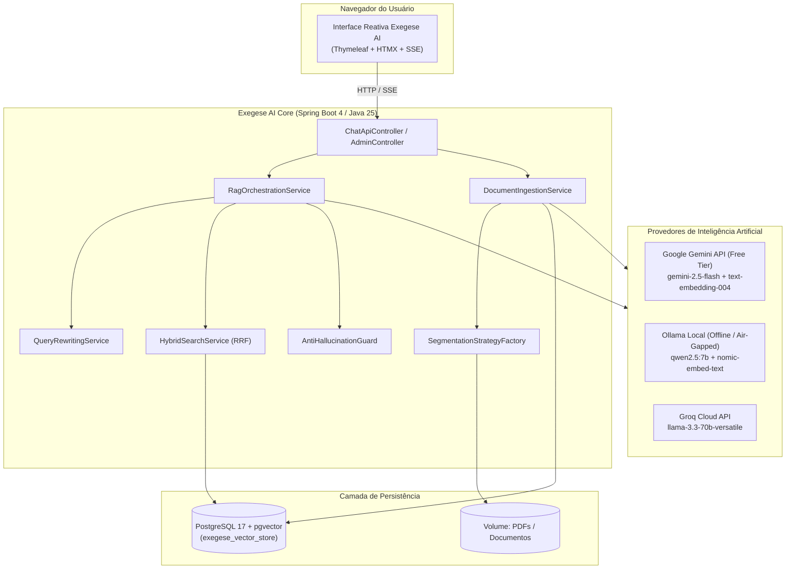

# PLANO DE IMPLEMENTAÇÃO TÉCNICA: EXEGESE AI
**Plataforma de Recuperação Aumentada por Geração (RAG) Especialista & Agnóstica a Acervos Documentais**
*Fundamentação Factual Estrita, Citação Canônica de Fontes e Tolerância Zero a Alucinações*

---

## 1. RESUMO EXECUTIVO

**Exegese AI** é uma plataforma corporativa de Inteligência Artificial Generativa baseada em arquitetura **Retrieval-Augmented Generation (RAG)** desenvolvida em **Java 25 (LTS)** e **Spring Boot 4.x (Spring Framework 7)**. O sistema foi concebido para ingerir, indexar e responder perguntas sobre **qualquer conjunto de documentos** (manuais técnicos, legislações, regulamentos, contratos, relatórios e normas operacionais), tendo como corpus de homologação e referência inicial o manual oficial **"Perguntas e Respostas do IRPF 2026" (Ano-Calendário 2025)** da Receita Federal do Brasil.

### 1.1 Significado e Identidade
O termo **Exegese** (do grego *exēgēsis*, "interpretação minuciosa e extração do sentido autêntico de um texto") sintetiza o compromisso central da solução: **nunca extrapolar ou inventar**. O modelo atua como um exegeta digital estrito, traduzindo as perguntas do usuário em buscas semânticas profundas e extraindo respostas amparadas 100% na letra dos documentos indexados.

### 1.2 Capacidades Fundamentais
1. **Multi-Coleção e Agnóstico a Formatos**: Suporte à segregação lógica de documentos por coleção (`collection_id`), domínio (`domain`) e versão (`version`), permitindo gerenciar simultaneamente acervos tributários, jurídicos, licitatórios ou operacionais.
2. **Chunking Adaptativo**: Estratégias especializadas de chunking — semântico canônico por pergunta/tópico para manuais estruturados (ex.: IRPF) e hierárquico por seções/parágrafos com overlap para documentos genéricos (leis, editais e relatórios).
3. **Busca Híbrida com RRF**: Fusão de densidade vetorial (pgvector HNSW) com busca léxica esparsa em português (PostgreSQL FTS `tsvector` com BM25) através de *Reciprocal Rank Fusion*.
4. **Interface Reativa Server-Side**: Front-end leve e moderno com **Thymeleaf + HTMX + SSE**, com suporte a streaming de tokens em tempo real e visualização de citações canônicas em popover/modal.
5. **Portabilidade Multi-Provedor**: Execução híbrida configurável via perfis Spring: **Google Gemini API** (Free Tier padrão), **Ollama** (100% local e seguro em rede isolada) ou **Groq**.

---

## 2. INFERÊNCIA DA ARQUITETURA MULTI-COLEÇÃO & ADRs

### 2.1 Matriz de Decisão Arquitetural

| Dimensão | Escolha para o Exegese AI | Justificativa |
| :--- | :--- | :--- |
| **Identidade do Sistema** | **Exegese AI** (`exegese-ai`) | Reflete a precisão exegética, rigor interpretativo e seriedade corporativa. |
| **Isolamento de Acervos** | **Multi-Tenant Lógico por Coleção** (`collection_id` nos metadados) | Permite que uma mesma instância atenda múltiplos domínios e departamentos sem replicação de infraestrutura. |
| **Estratégia de Ingestão** | **Pipeline Polimórfico de Chunking** (`ChunkingStrategyFactory`) | Aplica estratégia canônica para manuais estruturados (Q&A) e estratégia recursiva/hierárquica para PDFs normativos contínuos. |
| **Armazenamento Vetorial** | **PostgreSQL 17 + pgvector** | Permite consultas vetoriais com filtros relacionais compostos (`collection_id = ? AND metadata->>'year' = ?`). |
| **Framework RAG** | **Spring AI 1.0.x** | Padrão `ChatClient` com advisors fluentes e suporte a Virtual Threads do Java 25. |

### 2.2 Architectural Decision Records (ADRs)

#### ADR-001: Suporte a Múltiplas Coleções via Particionamento Lógico no PGVector
- **Contexto**: A plataforma atenderá múltiplos conjuntos documentais independentes (ex.: IRPF, Legislação Trabalhista, Contratos Administrativos).
- **Decisão**: Todos os vetores são armazenados na tabela `exegese_vector_store`, indexados por `collection_id` (UUID/slug) e campos JSONB.
- **Consequências**:
  - *Positivas*: Compartilhamento de infraestrutura, backups unificados e capacidade de cross-search quando configurado.
  - *Filtros*: As buscas semânticas sempre injetam predicates `WHERE collection_id = :targetCollection`.

#### ADR-002: Processamento Polimórfico de Documentos
- **Contexto**: Documentos diferentes possuem estruturas distintas (manuais de perguntas e respostas vs. códigos legislativos com artigos e incisos).
- **Decisão**: Implementar a interface `DocumentSegmentationStrategy` com especializações:
  - `StructuredQuestionSegmentationStrategy`: Identifica marcadores canônicos de Q&A (como no IRPF 2026).
  - `LegalSectionSegmentationStrategy`: Particiona por Artigos, Parágrafos e Incisos.
  - `GeneralDocumentSegmentationStrategy`: Chunking recursivo por parágrafos com overlap ajustável.

---

## 3. STACK TECNOLÓGICA & VERSÕES

| Componente | Versão | Papel |
| :--- | :--- | :--- |
| **Runtime** | **Java 25 (LTS)** | Virtual Threads nativas (`Thread.ofVirtual()`), Records, Pattern Matching |
| **Framework Core** | **Spring Boot 4.0.0-M1 / 3.4.2 LTS** | Núcleo de injeção por construtor, segurança e autoconfiguração |
| **RAG Engine** | **Spring AI 1.0.0-M6** | Orquestração de `ChatClient`, `VectorStore`, `Advisors` e `EmbeddingModel` |
| **Database** | **PostgreSQL 17.2 + pgvector 0.8.0** | Armazenamento relacional, vetorial HNSW (768d) e FTS com dicionário português |
| **Parsing PDF** | **Apache PDFBox 3.0.4** | Extração posicional e extração de metadados de PDFs |
| **UI Server-Side** | **Thymeleaf 3.1.3 + HTMX 2.0.4** | Renderização semântica, reatividade e streaming SSE |
| **Rate Limiter** | **Bucket4j 8.10.1** | Proteção de cotas por sessão/IP |
| **Testes** | **JUnit 5 + Testcontainers + WireMock** | Cobertura unitária e de integração em containers reais |

---

## 4. MODELO DE DADOS & ESQUEMA MULTI-COLEÇÃO

```sql
CREATE EXTENSION IF NOT EXISTS "uuid-ossp";
CREATE EXTENSION IF NOT EXISTS "vector";

-- Tabela de Coleções Documentais do Exegese AI
CREATE TABLE IF NOT EXISTS exegese_collection (
    id VARCHAR(64) PRIMARY KEY, -- e.g. 'irpf-2026', 'clt-2026', 'normas-internas'
    name VARCHAR(255) NOT NULL,
    description TEXT,
    segmentation_strategy VARCHAR(50) NOT NULL DEFAULT 'STRUCTURED_QA',
    created_at TIMESTAMP WITH TIME ZONE DEFAULT CURRENT_TIMESTAMP
);

-- Tabela Principal de Vetores e Chunks
CREATE TABLE IF NOT EXISTS exegese_vector_store (
    id UUID PRIMARY KEY DEFAULT uuid_generate_v4(),
    collection_id VARCHAR(64) NOT NULL REFERENCES exegese_collection(id) ON DELETE CASCADE,
    content TEXT NOT NULL,
    metadata JSONB NOT NULL,
    embedding VECTOR(768) NOT NULL,
    tsv TSVECTOR GENERATED ALWAYS AS (
        to_tsvector('portuguese', coalesce(metadata->>'title', '') || ' ' || content)
    ) STORED,
    created_at TIMESTAMP WITH TIME ZONE DEFAULT CURRENT_TIMESTAMP
);

-- Tabela de Idempotência Criptográfica por Chunk
CREATE TABLE IF NOT EXISTS exegese_chunk_checksum (
    chunk_hash VARCHAR(64) PRIMARY KEY,
    collection_id VARCHAR(64) NOT NULL REFERENCES exegese_collection(id) ON DELETE CASCADE,
    doc_identifier VARCHAR(100) NOT NULL,
    vector_id UUID REFERENCES exegese_vector_store(id) ON DELETE CASCADE,
    ingested_at TIMESTAMP WITH TIME ZONE DEFAULT CURRENT_TIMESTAMP
);

-- Índices Especializados
CREATE INDEX IF NOT EXISTS idx_exegese_vector_hnsw 
ON exegese_vector_store USING hnsw (embedding vector_cosine_ops)
WITH (m = 16, ef_construction = 64);

CREATE INDEX IF NOT EXISTS idx_exegese_vector_tsv 
ON exegese_vector_store USING gin (tsv);

CREATE INDEX IF NOT EXISTS idx_exegese_vector_collection 
ON exegese_vector_store (collection_id);

CREATE INDEX IF NOT EXISTS idx_exegese_vector_metadata 
ON exegese_vector_store USING gin (metadata jsonb_path_ops);
```

---

## 5. DIAGRAMAS DO SISTEMA EXEGESE AI

### 5.1 Diagrama de Arquitetura em Mermaid



---

## 6. SISTEMA DE CITATION & ANTI-ALUCINAÇÃO DO EXEGESE AI

### 6.1 System Prompt Parametrizável por Coleção
O prompt central do **Exegese AI** adapta-se dinamicamente ao nome e natureza da coleção ativa:

```text
Você é o Exegese AI, assistente especialista com fundamentação documental estrita na base de conhecimento "{collectionName}".

DIRETRIZES FUNDAMENTAIS:
1. FIDELIDADE DOCUMENTAL EXCLUSIVA: Responda unicamente a partir dos fatos presentes no "CONTEXTO RECUPERADO".
2. RECUSA EXPLÍCITA: Se a informação exata não constar expressamente nos trechos, responda exatamente:
   "Essa informação não consta nos documentos da coleção {collectionName}."
3. CITAÇÃO COMPLETA: Toda asserção deve acompanhar as fontes no formato:
   ---
   Fontes Consultadas:
   - Documento / Item: [Identificador e Título] (Página / Seção [Ref])
   - Fundamentação Legal / Técnica: [Normas citadas]
```

---

## 7. EXECUÇÃO & ARTEFATOS DO PROJETO

Os arquivos de documentação técnica completa, testes e instalador do **Exegese AI** encontram-se estruturados:
- Plano de Implementação Geral: [`docs/PLANO_IMPLEMENTACAO_EXEGESE_AI.md`](file:///d:/GIT/exegese_ai/docs/PLANO_IMPLEMENTACAO_EXEGESE_AI.md)
- Plano Especialista IRPF 2026: [`docs/PLANO_IMPLEMENTACAO_CHATBOT_RAG_IRPF.md`](file:///d:/GIT/exegese_ai/docs/PLANO_IMPLEMENTACAO_CHATBOT_RAG_IRPF.md)
- Artefato do IDE: [`plano_implementacao_exegese_ai.md`](file:///C:/Users/Rivelino/.gemini/antigravity-ide/brain/9eeeddd7-8f75-4c3a-98d9-76a6556ba2ce/plano_implementacao_exegese_ai.md)
