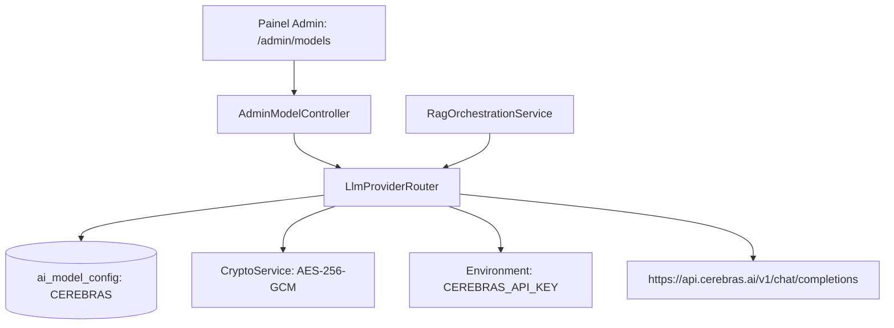

# Fase 16 — Plano de Implementação: Integração do Provedor de IA Cerebras (Cerebras Inference API)

**Projeto**: Exegese AI (`exegese-ai`)  
**Pacote Base**: `br.org.rivelino.exegese_ai`  
**Runtime**: Java 25 LTS | Spring Boot 4.1.1 | Spring AI 2.0.1 | PostgreSQL 17 + pgvector | AES-256-GCM  
**Data**: 2026-10-07  
**Autor**: Rivelino Patrício  

---

## 1. Contexto e Objetivos

A plataforma **Exegese AI** opera atualmente com suporte a 6 ecossistemas de modelos de inteligência artificial generativa (`GEMINI`, `CLAUDE`, `OPENAI`, `NEMOTRON`, `DEEPSEEK` e `OLLAMA_LOCAL`), gerenciados de forma dinâmica pelo [`LlmProviderRouter`](file:///d:/GIT/exegese_ai/src/main/java/br/org/rivelino/exegese_ai/service/LlmProviderRouter.java) com persistência na entidade [`AiModelConfig`](file:///d:/GIT/exegese_ai/src/main/java/br/org/rivelino/exegese_ai/domain/entity/AiModelConfig.java) e chaves protegidas em repouso por criptografia simétrica AES-256-GCM.

O objetivo da **Fase 16** é integrar o ecossistema de alta performance **Cerebras Inference** ([Documentação da API Cerebras](https://inference-docs.cerebras.ai/api-reference)) como o **7º provedor de inferência** nativo da plataforma.

A **Cerebras Inference API** disponibiliza capacidades de geração ultra-velozes (~3.000 tokens/segundo) via hardware Wafer-Scale Engine (WSE), com interface REST totalmente compatível com a especificação OpenAI Chat Completions (`/v1/chat/completions`), suportando modelos open-weights de ponta, tais como:
- `gpt-oss-120b` (Modelo de 120 bilhões de parâmetros otimizado para raciocínio estruturado e alta vazão);
- `qwen-3.8-27b` (Modelo denso de 27B parâmetros com suporte multimodal e geração de código);
- `llama-3.3-70b` (Modelo open-weights de 70B parâmetros para instrução).

---

## 2. Análise Arquitetural & Especificação Técnica

### 2.1. Especificação da API Cerebras
- **Endpoint Base**: `https://api.cerebras.ai/v1`
- **Autenticação**: Bearer Token no cabeçalho HTTP:
  ```http
  Authorization: Bearer <CEREBRAS_API_KEY>
  ```
- **Compatibilidade com Padrão OpenAI**:
  - `POST /v1/chat/completions`: Geração conversacional com suporte a streaming SSE (`stream: true`), controle de temperatura (`temperature`), limite de tokens (`max_completion_tokens` / `max_tokens`) e parâmetros de mensagens estruturadas (`system`, `user`, `assistant`).
  - `GET /v1/models`: Listagem de modelos disponíveis para validação de conectividade (`ping`).
- **Variável de Ambiente Padrão**: `CEREBRAS_API_KEY`.

### 2.2. Componentes e Camadas Impactadas



1. **Enum [`ModelProvider`](file:///d:/GIT/exegese_ai/src/main/java/br/org/rivelino/exegese_ai/domain/enums/ModelProvider.java)**:
   - Inclusão do literal `CEREBRAS`.
2. **Serviço [`LlmProviderRouter`](file:///d:/GIT/exegese_ai/src/main/java/br/org/rivelino/exegese_ai/service/LlmProviderRouter.java)**:
   - Registro no método `bootstrapProviders()`:
     ```java
     initProvider(ModelProvider.CEREBRAS, "Cerebras Inference", "gpt-oss-120b", "https://api.cerebras.ai/v1", false);
     ```
   - Resolução de credenciais no método `resolveApiKey(ModelProvider provider)`:
     ```java
     case CEREBRAS -> environment.getProperty("CEREBRAS_API_KEY");
     ```
   - Verificação de chave em `hasConfiguredKey(ModelProvider provider)`.
   - Teste de conectividade no método `pingModel(ModelProvider provider)`.
3. **Persistência & Banco de Dados ([`schema.sql`](file:///d:/GIT/exegese_ai/src/main/resources/schema.sql))**:
   - A coluna `provider VARCHAR(50) NOT NULL UNIQUE` já comporta a string `"CEREBRAS"`.
   - Operação de inserção de configuração default no bootstrap é idempotente (`findByProvider(provider)`).
4. **Arquivos de Configuração do Spring Boot**:
   - [`src/main/resources/application.properties`](file:///d:/GIT/exegese_ai/src/main/resources/application.properties): Adição de `cerebras.api-key=${CEREBRAS_API_KEY:}`.
   - [`src/main/resources/application-dev.properties`](file:///d:/GIT/exegese_ai/src/main/resources/application-dev.properties): Configuração para perfil de desenvolvimento.
   - [`src/test/resources/application-test.properties`](file:///d:/GIT/exegese_ai/src/test/resources/application-test.properties): Configuração para perfil de testes automatizados (`test`).
   - [`.env.example`](file:///d:/GIT/exegese_ai/.env.example): Adição da entrada `CEREBRAS_API_KEY=`.
5. **Interface Web Administrativa ([`models.html`](file:///d:/GIT/exegese_ai/src/main/resources/templates/admin/models.html))**:
   - Atualização do título/subtítulo para refletir os **7 Ecossistemas de Inferência** (anteriormente "6 ecossistemas").
   - O grid de cartões renderiza reativamente e automaticamente o novo cartão para Cerebras com formulário de parametrização, status de chave (`✓ Configurada` / `⚠ Não definida`), botão de tornar padrão e botão de ping.
6. **Suíte de Testes Automatizados ([`MultiProviderModelIntegrationTest.java`](file:///d:/GIT/exegese_ai/src/test/java/br/org/rivelino/exegese_ai/MultiProviderModelIntegrationTest.java))**:
   - Atualização do teste de bootstrap para validar a presença de 7 provedores (`assertThat(all).hasSize(7)`), incluindo `ModelProvider.CEREBRAS`.
   - Adição de testes de encriptação/decriptação de chave para o Cerebras e comutação dinâmica do modelo padrão para `CEREBRAS`.

---

## 3. Matriz de Arquivos a Serem Modificados

| Arquivo | Tipo | Descrição da Modificação |
| :--- | :--- | :--- |
| [`src/main/java/br/org/rivelino/exegese_ai/domain/enums/ModelProvider.java`](file:///d:/GIT/exegese_ai/src/main/java/br/org/rivelino/exegese_ai/domain/enums/ModelProvider.java) | Modificado | Adicionar o literal `CEREBRAS` ao enum de provedores. |
| [`src/main/java/br/org/rivelino/exegese_ai/service/LlmProviderRouter.java`](file:///d:/GIT/exegese_ai/src/main/java/br/org/rivelino/exegese_ai/service/LlmProviderRouter.java) | Modificado | Bootstrap do Cerebras (`initProvider`), mapeamento de `CEREBRAS_API_KEY` e ping. |
| [`src/main/resources/application.properties`](file:///d:/GIT/exegese_ai/src/main/resources/application.properties) | Modificado | Propriedade de fallback para `CEREBRAS_API_KEY`. |
| [`src/main/resources/application-dev.properties`](file:///d:/GIT/exegese_ai/src/main/resources/application-dev.properties) | Modificado | Configuração de desenvolvimento para o provedor Cerebras. |
| [`src/test/resources/application-test.properties`](file:///d:/GIT/exegese_ai/src/test/resources/application-test.properties) | Modificado | Variável de ambiente mock/fallback para a suíte de testes. |
| [`.env.example`](file:///d:/GIT/exegese_ai/.env.example) | Modificado | Documentação de `CEREBRAS_API_KEY=` no template de ambiente. |
| [`src/main/resources/templates/admin/models.html`](file:///d:/GIT/exegese_ai/src/main/resources/templates/admin/models.html) | Modificado | Atualização dos textos de cabeçalho para 7 ecossistemas de inferência. |
| [`src/test/java/br/org/rivelino/exegese_ai/MultiProviderModelIntegrationTest.java`](file:///d:/GIT/exegese_ai/src/test/java/br/org/rivelino/exegese_ai/MultiProviderModelIntegrationTest.java) | Modificado | Extensão das asserções de bootstrap para 7 provedores e testes de ciclo de vida do Cerebras. |
| [`GEMINI.md`](file:///d:/GIT/exegese_ai/GEMINI.md) | Modificado | Atualização da Diretriz 7 ("Multi-Provider AI Architecture") para contemplar os 7 ecossistemas. |

---

## 4. Checklist Detalhado de Implementação (Fase 16)

- [x] **Tarefa 16.1: Extensão do Domínio de Provedores (`ModelProvider`)**:
  - Declarar `CEREBRAS` no enum [`ModelProvider`](file:///d:/GIT/exegese_ai/src/main/java/br/org/rivelino/exegese_ai/domain/enums/ModelProvider.java).
  - Garantir integridade de serialização JPA `@Enumerated(EnumType.STRING)` com a tabela `ai_model_config`.
- [x] **Tarefa 16.2: Atualização do Roteador Dinâmico (`LlmProviderRouter`)**:
  - Adicionar bootstrap:
    - Provider: `ModelProvider.CEREBRAS`
    - Display Name: `"Cerebras Inference"`
    - Model Name: `"gpt-oss-120b"`
    - Base URL: `"https://api.cerebras.ai/v1"`
    - isDefault: `false`
  - Incluir chave no switch expression do método `resolveApiKey`:
    - `case CEREBRAS -> environment.getProperty("CEREBRAS_API_KEY");`
  - Validar tratamento no teste de conectividade `pingModel(ModelProvider provider)`.
- [x] **Tarefa 16.3: Configuração de Variáveis e Ambientes**:
  - Atualizar [`application.properties`](file:///d:/GIT/exegese_ai/src/main/resources/application.properties), [`application-dev.properties`](file:///d:/GIT/exegese_ai/src/main/resources/application-dev.properties) e [`application-test.properties`](file:///d:/GIT/exegese_ai/src/test/resources/application-test.properties).
  - Adicionar `CEREBRAS_API_KEY=` em [`.env.example`](file:///d:/GIT/exegese_ai/.env.example).
- [x] **Tarefa 16.4: Harmonização da Interface do Painel Administrativo**:
  - Atualizar textos informativos em [`src/main/resources/templates/admin/models.html`](file:///d:/GIT/exegese_ai/src/main/resources/templates/admin/models.html) de "Gestão dos 6 Ecossistemas" para "Gestão dos 7 Ecossistemas".
  - Verificar responsividade da grade de 7 cartões no layout Tailwind (`grid-cols-1 md:grid-cols-2 lg:grid-cols-3 xl:grid-cols-4`).
- [x] **Tarefa 16.5: Atualização e Extensão dos Testes de Integração**:
  - Atualizar [`MultiProviderModelIntegrationTest.java`](file:///d:/GIT/exegese_ai/src/test/java/br/org/rivelino/exegese_ai/MultiProviderModelIntegrationTest.java):
    - Validar `assertThat(all).hasSize(7)`.
    - Validar `assertThat(modelConfigRepository.findByProvider(ModelProvider.CEREBRAS)).isPresent()`.
    - Validar ciclo de criptografia AES-256-GCM com chave de teste para o Cerebras (`csk-...`).
    - Validar alternância do provedor ativo para `CEREBRAS` sem restart da aplicação.
    - Validar endpoint administrativo de ping para `CEREBRAS` via MockMvc.
- [x] **Tarefa 16.6: Atualização da Documentação e Diretrizes do Projeto**:
  - Atualizar diretriz 7 em [`GEMINI.md`](file:///d:/GIT/exegese_ai/GEMINI.md) para refletir os 7 ecossistemas suportados: Google Gemini, Anthropic Claude, OpenAI ChatGPT, NVIDIA Nemotron, DeepSeek AI, Ollama Local e Cerebras Inference.
- [x] **Tarefa 16.7: Execução Completa da Suíte de Testes e Homologação**:
  - Executar `mvn test` validando aprovação de 100% dos testes sem regressões (46/46 testes aprovados).

---

## 5. Critérios de Aceite

1. O provedor `CEREBRAS` deve ser inicializado automaticamente na tabela `ai_model_config` com metadados oficiais (`gpt-oss-120b`, `https://api.cerebras.ai/v1`).
2. A resolução de credenciais deve suportar tanto chaves cadastradas na interface administrativa (encriptadas com AES-256-GCM) quanto variáveis de ambiente (`CEREBRAS_API_KEY`).
3. O operador administrativo com perfil `ROLE_ADMIN` deve conseguir alterar a chave, o modelo ativo e o endpoint do Cerebras pelo Painel Web.
4. O Cerebras deve poder ser selecionado dinamicamente como o provedor padrão do sistema sem necessidade de reinicializar a aplicação.
5. A interface administrativa deve renderizar adequadamente os 7 cartões de provedores.
6. A suíte completa de testes automatizados (`mvn test`) deve obter 100% de sucesso.
