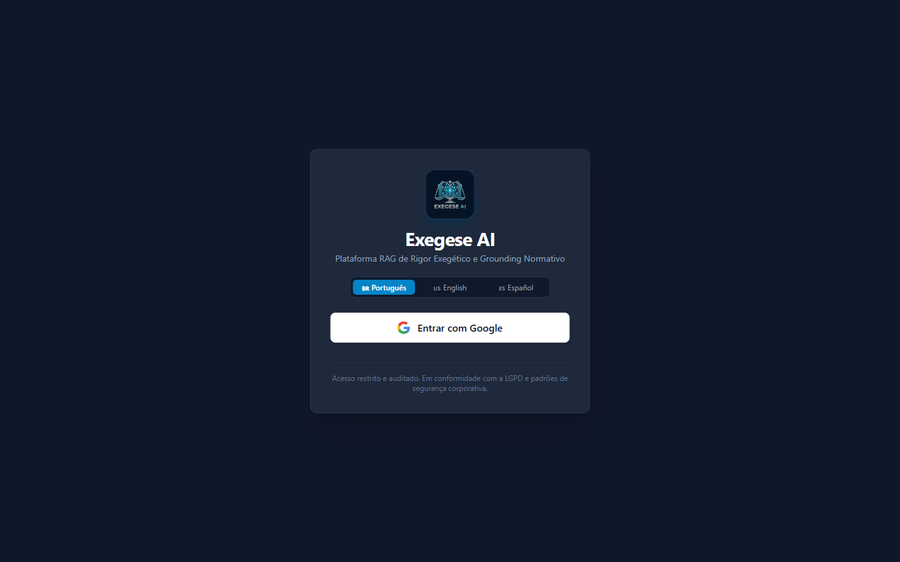
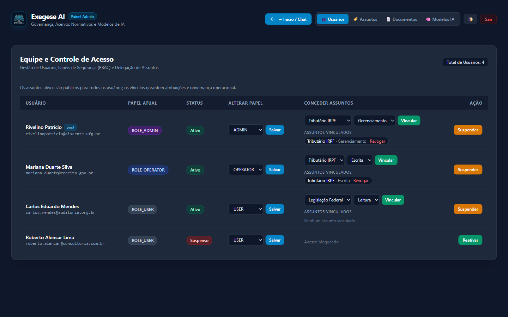
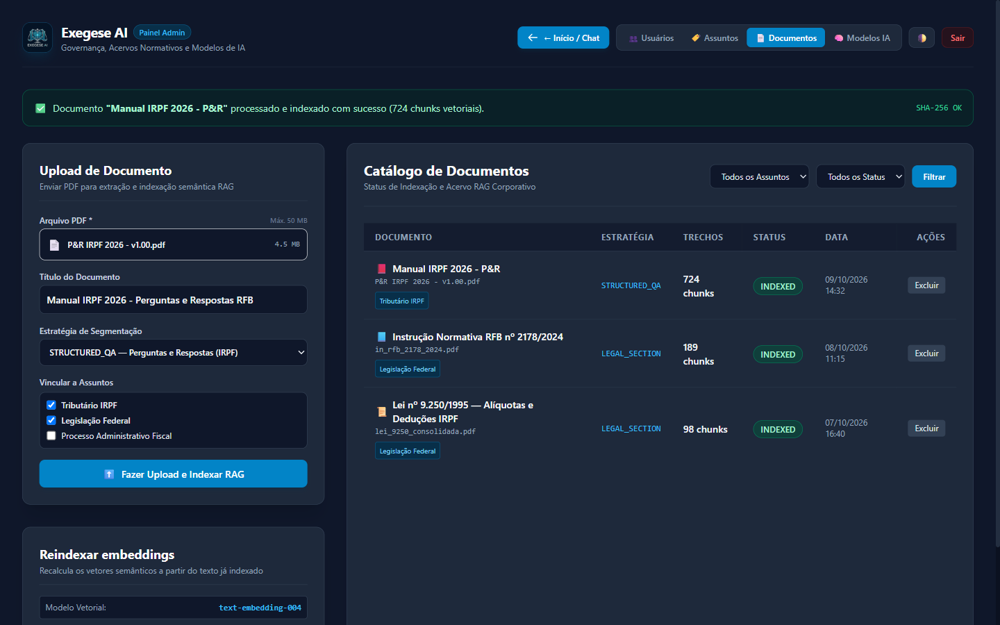
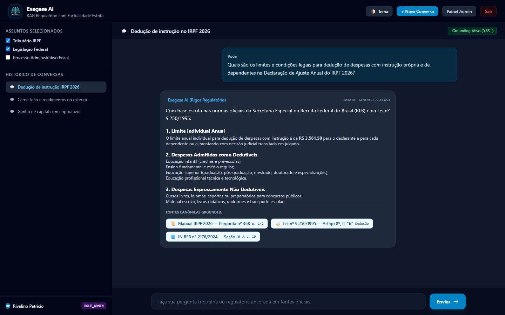
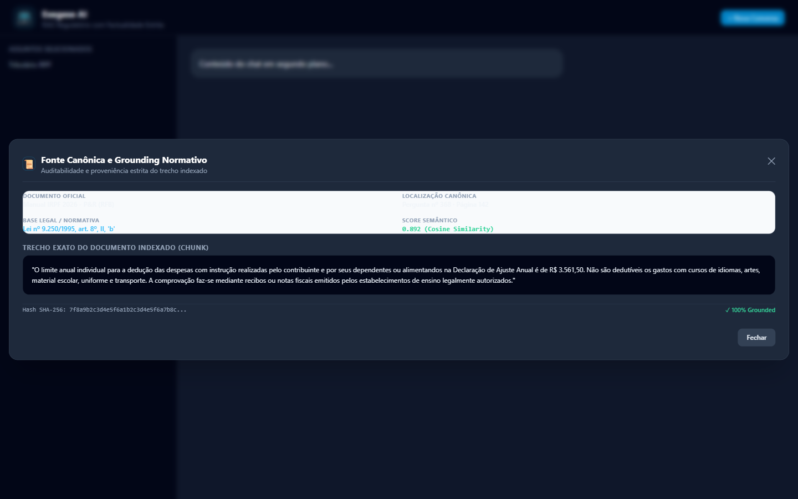

# Apresentação Operacional: Fluxos do Exegese AI

O **Exegese AI** é uma plataforma corporativa de RAG (Retrieval-Augmented Generation) voltada ao rigor normativo, factualidade estrita e auditoria regulatória. A aplicação opera com base em **Zero Alucinação**, garantindo que qualquer resposta gerada seja 100% ancorada em fontes oficiais.

Para visualizar a apresentação interativa em slides no navegador, abra o arquivo [`index.html`](file:///d:/GIT/exegese_ai/docs/presentation/index.html).

---

## 1. Fluxo de Login & Acesso Institucional

A porta de entrada do sistema é protegida e integrada a provedores de identidade corporativos, eliminando armazenamento inseguro de credenciais locais.

### Principais Características do Fluxo de Login:
- **Autenticação Federada Google OAuth2 / OIDC**: O usuário autentica-se com segurança utilizando sua identidade corporativa ou institucional Google.
- **Bootstrap Automático do Primeiro Administrador**: No primeiro acesso realizado pelo endereço configurado na variável `INITIAL_ADMIN_EMAIL`, o sistema concede automaticamente o papel `ROLE_ADMIN`.
- **Seletor de Idiomas Pré-Login (i18n)**: Suporte completo e dinâmico aos idiomas Português (Brasil) 🇧🇷, Inglês 🇺🇸 e Espanhol 🇪🇸 com persistência via cookie de sessão.
- **Proteção Hardened**: Políticas estritas de *Content-Security-Policy* (CSP), cabeçalhos *HSTS*, bloqueio de *clickjacking* (`frame-ancestors 'none'`) e conformidade com a LGPD.

---

## 2. Habilitação de Usuários & Governança de Acesso (RBAC)

O módulo de governança permite que administradores controlem permissões de acesso, papéis de segurança e a vinculação operacional a assuntos regulatórios.

### Principais Características da Habilitação de Usuários:
- **Matriz de Papéis (RBAC - Role-Based Access Control)**:
  - `ROLE_ADMIN`: Acesso irrestrito a todos os módulos, configurações de modelos LLM e gestão de usuários.
  - `ROLE_OPERATOR`: Permissão para upload de novos documentos normativos e curadoria de acervos.
  - `ROLE_USER`: Acesso às consultas e sessões de chat regulatório.
- **Ativação / Suspensão Imediata**: Administradores podem suspender ou reativar qualquer conta com um clique. A validação ocorre em tempo real via filtro de sessão (`AccountStatusFilter` com `UserAccountStatusCache`), revogando o acesso imediatamente sem exigir reinicialização do sistema.
- **Delegação de Assuntos**: Possibilidade de associar usuários específicos a acervos normativos (ex: *Tributário IRPF*, *Legislação Federal*) com níveis de permissão definidos (Leitura, Escrita, Gerenciamento).

---

## 3. Upload de Documentos & Ingestão Semântica RAG

O módulo de documentos é o coração da base de conhecimento da plataforma. Ele permite carregar arquivos PDF oficiais e realizar sua extração, segmentação e indexação vetorial.

### Principais Características do Pipeline de Ingestão:
- **Extração com Apache PDFBox 3.0.4**: Processamento robusto de documentos volumosos de até 50 MB (ex: manuais oficiais da Receita Federal).
- **Estratégias de Segmentação Polimórfica**:
  - `STRUCTURED_QA`: Projetada especificamente para manuais de Perguntas e Respostas (como o Manual IRPF 2026), dividindo cada pergunta e sua respectiva resposta em uma unidade semântica atômica.
  - `LEGAL_SECTION`: Estrutura o texto por Artigos, Parágrafos e Incisos legais.
  - `RECURSIVE`: Segmentação recursiva de textos normativos e pareceres gerais.
- **Idempotência & Deduplicação Criptográfica**: Cada trecho (chunk) possui um hash SHA-256 gerado a partir do seu conteúdo textual. Re-ingestões do mesmo documento preservam os registros existentes e impedem vetores duplicados.
- **Catálogo Geral & Reindexação de Embeddings**: Listagem completa dos documentos com status de processamento (`INDEXED`, `PROCESSING`, `UPLOADED`, `FAILED`), quantidade de chunks gerados e ferramenta de reindexação em lote via `text-embedding-004`.

---

## 4. Consultas Regulatórias via Chat & Factualidade Estrita

A interface principal de atendimento ao usuário oferece um ambiente conversacional com streaming em tempo real e foco total no rigor jurídico-fiscal.

### Principais Características das Consultas via Chat:
- **Filtragem de Assuntos em Tempo Real**: O usuário seleciona no sidebar os assuntos normativos desejados. A busca vetorial no PostgreSQL (`pgvector`) filtra estritamente por `subject_id IN (...)`.
- **Streaming por Server-Sent Events (SSE)**: As respostas dos modelos são transmitidas token a token com cursor de digitação contínuo, entregando agilidade sem latência perceptível.
- **Política de Zero Alucinação (Threshold 0.65)**: Se a similaridade por cosseno do trecho recuperado for inferior a 0.65, o assistente declara formalmente a inexistência de base normativa catalogada, recusando-se a especular.
- **Chips de Citações Canônicas**: Cada resposta traz botões interativos contendo o título do documento, número da questão ou artigo e a página oficial.

---

## 5. Auditoria de Citação Canônica & Rastreabilidade de Evidências

Ao clicar em qualquer citação canônica presente na resposta da IA, a plataforma abre um modal de transparência exegética.

### Informações Exibidas na Auditoria Canônica:
- **Documento de Origem**: Identificação formal do arquivo publicado pelo órgão regulador.
- **Localização Canônica**: Indicação exata de número de pergunta, seção e página do PDF original.
- **Base Legal Aplicável**: Dispositivos legais de fundamentação (leis, decretos, instruções normativas).
- **Trecho Literal Indexado (Chunk Grounded)**: O texto exato capturado da fonte e fornecido ao modelo LLM para a síntese da resposta.
- **Métricas de Confiabilidade**: Pontuação de similaridade de cosseno (ex: `0.892`) e hash SHA-256 de integridade.

---

## 6. Resumo da Arquitetura Tecnológica

| Componente | Tecnologia | Papel no Sistema |
| :--- | :--- | :--- |
| **Backend Core** | Spring Boot 4.1.1 + Java 25 Native | Execução concorrente de alta performance com Virtual Threads |
| **Camada de IA** | Spring AI 2.0.1 + Roteador Multi-Provedor | Orquestração dinâmica de Gemini, Claude, OpenAI, Cerebras e Ollama |
| **Banco Vetorial** | PostgreSQL 17 + extensão `pgvector` | Armazenamento de embeddings semânticos e consultas relacionais N:N |
| **Processador PDF** | Apache PDFBox 3.0.4 | Extração e segmentação polimórfica (QA / Artigos / Geral) |
| **Interface / Frontend** | Thymeleaf + Tailwind CSS + Vanilla JS + SSE | UI limpa, autoritativa, acessível (WCAG) e responsiva |
| **Gateway & Segurança** | Proxy SWAG (NGINX) + Fail2ban + SSL Let's Encrypt | Terminação TLS, proteção perimetral e roteamento seguro |
